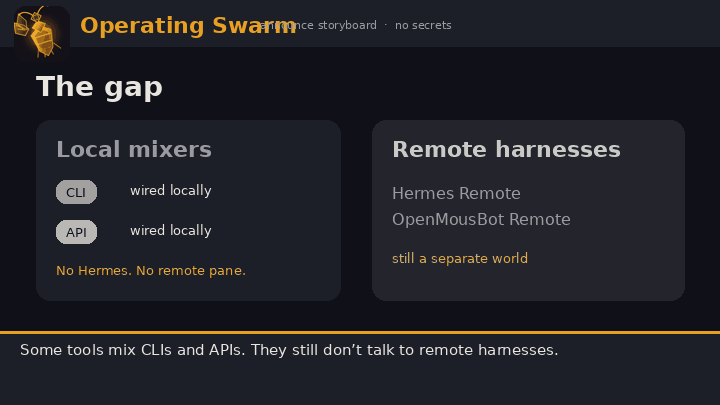
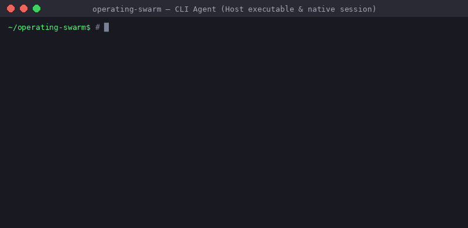
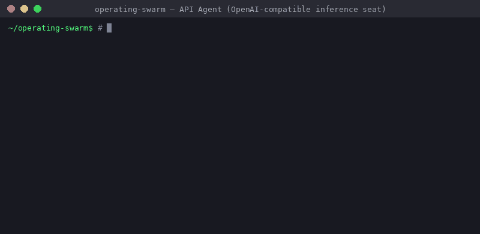
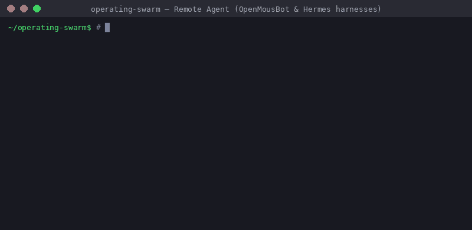
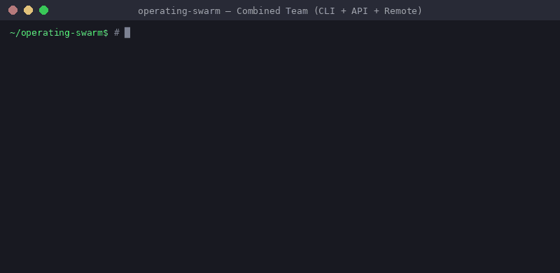

# Open Swarm

<div align="center">

</div>

Brand marks live under [`assets/brand/`](assets/brand/): **minimal** for the tab favicon and PWA icons, **geometric** for in-app WebUI chrome, and **cyber-swarm** for marketing / website fanfare ([#768](https://github.com/matthewhand/open-swarm/issues/768)).

**Open Swarm** is a Grok-like WebUI and an OpenAI-compatible API that seats four kinds of agents — **CLI**, **API** (true inference), **Blueprint** (programmatic / openai-agents), and **Remote** (Hermes / OpenMousBot / Rakazo / Herdr) — and composes them with **handoff** and **agent-as-tool**. The same blueprint runs from `swarm-cli` and from `/v1/chat/completions`.

**WebUI is first-class:** left rail + the selected agent’s chat. Other clients (SDK, curl, Open WebUI, and `swarm-cli tui` — the interactive terminal client of that same API, [REQ-111](https://github.com/matthewhand/open-swarm/issues/481)) hit the same seats at `/v1/chat/completions` and `/v1/responses`. `swarm-cli tui` opens an AGENTS rail + live chat (hydrate, send + stream, sessions) over the WebUI’s REST + SSE. Every client is one API — no second runtime, no remote Herdr SSH.

AI enthusiasts juggle many frameworks; some combine CLIs and APIs, but still do not talk to **remote harnesses** (Hermes, OpenMousBot as remote, …). Open Swarm is a **Grok-agnostic** Grok-Bot-like UI **and** a bridge — task one place, coordinate across CLI, API, remotes, and local blueprints.

<p align="center">
  
</p>

Announce copy, storyboard, and recapture checklist: [docs/ANNOUNCE.md](docs/ANNOUNCE.md) (REQ-136 / [#529](https://github.com/matthewhand/open-swarm/issues/529)). Asset path for this hero and the later CLI / API / remotes / combined kit: [`docs/assets/readme/`](docs/assets/readme/README.md) ([#456](https://github.com/matthewhand/open-swarm/issues/456)).

Direction: [docs/VISION.md](docs/VISION.md). Vocabulary: [docs/GLOSSARY.md](docs/GLOSSARY.md).

## Demos

Compact walkthroughs of open-swarm's core agent capabilities — from individual CLI, API, and Remote seats to a unified team combining all three in one flow.

| Kind / Story | What it demonstrates | Preview |
|---|---|---|
| **CLI Agent** | Host executable running in a native terminal session (`grok`, `agy`, `opencode`) |  |
| **API Agent** | True inference seat queried directly via the OpenAI-compatible HTTP completions API |  |
| **Remote Agent** | External agentic harnesses (**OpenMousBot**, **Hermes**, **Rakazo**, **Herdr**) |  |
| **Combined Team** | The open-swarm differentiator: one flow coordinating **CLI + API + Remote** via openai-agents handoff |  |

> A historical terminal loop (one blueprint as CLI + API) is preserved at [`docs/demo/cli-and-api.gif`](docs/demo/cli-and-api.gif).

---

## WebUI (start here)

Product chrome is the Grok-like SPA: rail, remotes, sessions, Settings sheet. `/` and `/chat` are that chrome. Django trailing-slash pages (`/blueprint-library/`, `/settings/`, `/sessions/`, …) stay the operator dump — not the pitch.

```bash
git clone https://github.com/matthewhand/open-swarm.git
cd open-swarm
uv sync --all-extras
cp .env.example .env          # set OPENAI_API_KEY, API_AUTH_TOKEN, DJANGO_SECRET_KEY
cp swarm_config.example.json swarm_config.json   # optional local SoT; secrets stay ${VAR} in .env
make frontend                 # builds webui/frontend/dist/
docker compose up --build     # API + local Postgres (not Neon / not SQLite)
# open http://localhost:8000
```

Compose’s durable DB is the `postgres` service. Set `DATABASE_URL` for any
cloud Postgres. Neon is test/CI only — [docs/DATABASE.md](docs/DATABASE.md).

Without `dist/`, `/` falls back to Django templates. Rebuild after SPA pulls. Auth: [docs/AUTH.md](docs/AUTH.md) (websocket needs a session cookie; bearer does not auth WS).

---

## Short history

- **2024-12** — Started as a derivative of OpenAI’s experimental [Swarm](https://github.com/openai/swarm); Django REST API the same week.
- **2026-02** — First git tag `0.0.1` (no GitHub Release, no PyPI `0.0.1`).
- **2026-04** — React Web UI.
- **2026-06** — MoA, CLI fusion, `/v1/responses`. Last **published** cut: **v0.5.4** (2026-06-19). PyPI summary still says “Orchestrating AI Agent Swarms with Django.”
- **2026-07+** — Remotes, Team handoff rosters, Herdr, Grok-like WebUI chrome — **on `main`, not in 0.5.4**.
- **2026-09** — Kinds lock: CLI | API | Blueprint | Remote. Team = Blueprint subtype. WebUI first-class. Built on the [openai-agents SDK](https://github.com/openai/openai-agents-python).

---

## Kinds (locked)

Four user-facing kinds. **Team is not a fifth kind.**

| Kind | Meaning |
|---|---|
| **CLI** | Host executable (`grok`, `agy`, `claude`, `gemini`, `opencode`, …). Native session. |
| **API** | **True inference seat** — OpenAI-compatible chat completions (base URL / model / key-env). Not a graph. |
| **Blueprint** | **Programmatic recipe** — openai-agents handoffs, MoA, custom Python. May *use* inference underneath; the seat is the recipe. Same id via CLI and API only — blueprints do not ship a webpage. The Grok-like WebUI is the product chrome. |
| **Remote** | Another agentic harness. Implementations: **Hermes**, **OpenMousBot**, **Rakazo**, **Herdr** (and nested Open Swarm). Variants are adapters, not extra kinds. Herdr is SSH-shaped, not another HTTP remote. |

**Team** = a **Blueprint subtype**: a roster plus openai-agents **handoff / agent-as-tool** so CLI, API, Blueprint, and Remote members can see and talk. Do not call `/v1/teams` aliases a Team — those are **Profiles** (LLM-profile aliases).

**Honest mid-flight ([#652](https://github.com/matthewhand/open-swarm/issues/652) / [ADR-006](docs/adr/006-api-vs-blueprint-kinds.md)):** on `main` today, stored `api` is still the leftover “not CLI, not remote” bucket (mostly recipes). There is not yet a first-class “wire this endpoint” seat. Target: rename those seats to `blueprint`, then introduce a true `api` inference seat. Prefer the four names above in new copy.

---

## Why openai-agents

The differentiator is a **programmatic graph** — not “let chat figure it out,” and not “many concurrent seats” (Grok Bot / Rakazo / OpenMousBot). openai-agents **handoff / agent-as-tool** can enforce a forced BA → Engineer → Tester sequence, or a circular Skeptic punt-back.

**Limit (up front):** that graph runs **inside Blueprint seats** (today’s leftover `api` bucket). We **cannot inject** openai-agents into **CLI** or **Remote** harnesses — those **stay native** sessions. Cross-kind teams still work: a Blueprint coordinator can sit with a Grok CLI and a Hermes Remote.

### Two ways to build a team

**Under the hood** a team/workflow is a **Python blueprint class** ([ADR-005](docs/adr/005-kind-bases.md)). That is the power-user path.

**Happy path:** ask **Support** in natural language — “Create a BA → Engineer → Tester workflow.” Support persists a usable seat. You do **not** write Python. Code stays hidden unless you choose **View / edit code**. The product bootstraps more of itself this way (REQ-158 / #567). Guided path + checklist (GitHub-only): [docs/SUPPORT_NL_BLUEPRINTS.md](docs/SUPPORT_NL_BLUEPRINTS.md).

Mermaid, kind bases, and the `:8001` seed live on [docs/DEVELOPER.md](docs/DEVELOPER.md). Worked configs: [docs/examples/openai-agents-handoff-graphs/](docs/examples/openai-agents-handoff-graphs/README.md) (REQ-156 / #564). Demo roster names (Mode A kind-clear vs Mode B personas): [docs/SHOWOFF_DEMO_AGENTS.md](docs/SHOWOFF_DEMO_AGENTS.md) (REQ-135 / #526). Kind-base ADR: [ADR-005](docs/adr/005-kind-bases.md) (REQ-159 / #570).

---

## Install (version honesty)

| Source | Fact |
|---|---|
| **`main` (this repo)** | Current product: WebUI chrome, remotes, Team rosters, four-kind lock. Prefer clone. |
| **PyPI `open-swarm`** | Latest **0.5.4** (2026-06-19). Same as GitHub Release **v0.5.4**. |
| **PyPI / `pyproject.toml` summary** | Still “Orchestrating AI Agent Swarms with Django.” Classifier is **Alpha**. That published wheel does **not** include Grok chrome, remotes catalog, or combined-team work landed after June. |
| **GitHub Release title** | `v0.5.4 — django_chat resolves its LLM profile` — historical; not the 2026-09 pitch. |

```bash
# What main actually runs
git clone https://github.com/matthewhand/open-swarm.git
cd open-swarm
uv sync --all-extras
```

`pip install open-swarm` is the June 2026 cut. Do not expect this README’s kinds or WebUI from that wheel.

Python >= 3.10. Node >= 22 only if you build the WebUI.

---

## Run from the operator CLI / API

```bash
export OPENAI_API_KEY="sk-..."

# CLI kind — discover installed agentic CLIs
uv run swarm-cli cli-agents --init --write --check-auth
uv run swarm-cli launch cli_agent --message "What CLIs can you see?"

# Blueprint kind — same recipe as an OpenAI `model` id
uv run swarm-cli launch codey --message "Explain this repo's structure"

# Remote kind — catalog is empty until you add one (OpenMousBot / Hermes / Rakazo / Herdr)
uv run swarm-cli remotes
# uv run swarm-cli remotes place <id>

# OpenAI-compatible door (after the WebUI / compose steps above)
curl -sf http://localhost:8000/v1/models | jq .
curl -sf http://localhost:8000/v1/chat/completions \
  -H "Content-Type: application/json" \
  -H "Authorization: Bearer ${API_AUTH_TOKEN}" \
  -d '{"model": "cli_agent", "messages": [{"role":"user","content":"ping"}]}' | jq .
```

`model` selects which seat / recipe handles the request. Streaming is supported. Full CLI reference: [USERGUIDE.md](./USERGUIDE.md). Remotes: [docs/REMOTE_HARNESSES.md](docs/REMOTE_HARNESSES.md). Herdr: [docs/HERDR.md](docs/HERDR.md). CLI wrap / fusion (not the first team story): [docs/CLI_FUSION.md](docs/CLI_FUSION.md). MoA consensus (not the first team story): [docs/MOA.md](docs/MOA.md).

### Pinokio (local sideload)

Open Swarm is **not** in the Pinokio public catalog. In Pinokio, add the git URL only (Download from URL / sideload) — do not search Discover:

```
https://github.com/matthewhand/open-swarm.git
```

Then **Install** → **Start** → **Open App**. Compose sets `SWARM_RUNTIME=sandbox-home` (REQ-45). Pinokio requires root `pinokio.js`; install/start/update scripts live under `pinokio/`.

---

## Links

- [docs/ANNOUNCE.md](docs/ANNOUNCE.md) — launch spiel + hero GIF (REQ-136 / #529)
- [docs/VISION.md](docs/VISION.md) — where we are going (kinds, WebUI, remotes)
- [docs/GLOSSARY.md](docs/GLOSSARY.md) — kinds, Team vs Profiles vs roster
- [USERGUIDE.md](./USERGUIDE.md) — `swarm-cli` tasks
- [docs/REMOTE_HARNESSES.md](docs/REMOTE_HARNESSES.md) · [docs/HERDR.md](docs/HERDR.md)
- [docs/AUTH.md](docs/AUTH.md) · [CONFIGURATION.md](./CONFIGURATION.md) (`swarm_config.example.json`)
- [FEATURE_STATUS.md](./FEATURE_STATUS.md) · [ROADMAP.md](./ROADMAP.md)
- [docs/DEVELOPER.md](docs/DEVELOPER.md) — gateway, `/v1/responses`, dated history, contribution pointers
- [CONTRIBUTING.md](./CONTRIBUTING.md)

Recipes and pattern diagrams stay in [docs/EXAMPLES.md](docs/EXAMPLES.md) and [docs/ORCHESTRATION_PATTERNS.md](docs/ORCHESTRATION_PATTERNS.md) — they are not the front door.

---

## Status

**Alpha** (`pyproject.toml` / PyPI classifier). `main` is ahead of published **0.5.4**. Core CLI, OpenAI-compatible API, websocket chat, and the Grok-like WebUI are working and covered by keyless pytest plus frontend unit tests. Honest gaps (true API inference seat, live mem0, MCP server mode, desktop installer): [FEATURE_STATUS.md](./FEATURE_STATUS.md).

## Acknowledgements

Open Swarm began as an extension of OpenAI’s experimental [Swarm](https://github.com/openai/swarm) and migrated to the [openai-agents SDK](https://github.com/openai/openai-agents-python) for agents, tools, and handoffs.

## License

MIT — see [LICENSE](LICENSE). Attribution and vendored-asset notices live in [NOTICE](NOTICE).

## Contributing

Issues and PRs welcome. See [CONTRIBUTING.md](./CONTRIBUTING.md) and [docs/DEVELOPER.md](docs/DEVELOPER.md).
