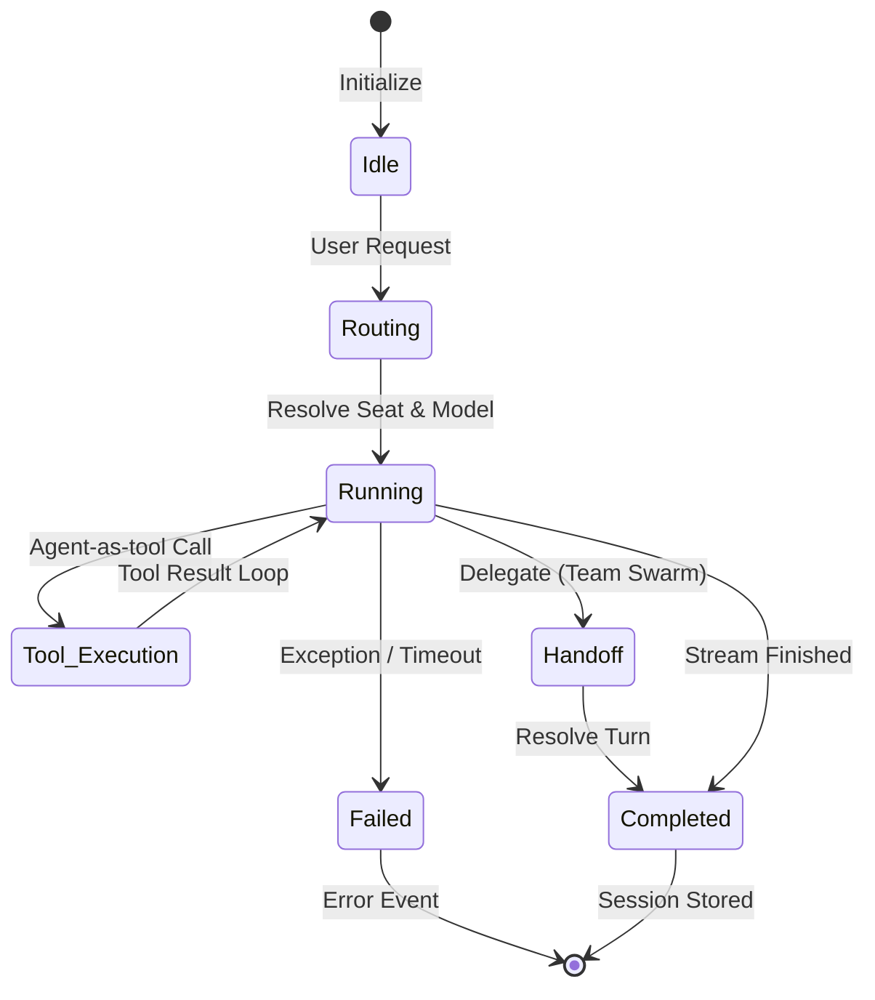

# Agent lifecycle — create, archive, restore, purge (REQ-154)

Issue: [#562](https://github.com/matthewhand/open-swarm/issues/562). Pairs with Support onboarding [#530](https://github.com/matthewhand/open-swarm/issues/530) (REQ-137) — Support still walks the first-run journey, and can now **grow or trim the roster via tools**, not only `list_create_paths`.

No Neon. No secrets. No live demo-port seed.

## Who gets the tools

v1 tools attach on **API-kind** Chat / `/v1/chat/completions` runs.

| Caller | `create_agent` / `archive_agent` / `restore_agent` / `list_archived_agents` |
|--------|-----------------------------------------------------------------------------|
| **Support** (`role=support`) | Yes — global onboarder. Same tools whether the seat is `support` or `starter-support`. |
| **CoS** (`chief_of_staff` / `cos` / `chief`) on an **API** seat | Yes — same tool set. Optional `team_id` adds the new member to that roster. |
| **CoS** on a **CLI** seat | No — CLI harness does not attach function tools in v1. Use Support, an API CoS, or the Add-agent UI. |
| **Everyone else** (engineer, gate, skeptic, default, …) | No |

Created seats always stamp **`role=default`**. This path cannot mint another Support, CoS, gate, or skeptic.

## Create

`create_agent(name, kind, …)` kinds: `cli` | `api` | `remote` | `blueprint`.

| Kind | Store | Safe defaults |
|------|--------|----------------|
| `api` | `blueprint_library.json` custom row | `rail: true`, `user_created: true`, `source: support-lifecycle`, `role: default` |
| `cli` | same | plus required `command` (binary/name the rail can list) |
| `blueprint` | same | starter `ApiKindBase` Python if `blueprint_code` is empty |
| `remote` | `swarm_config.json` `remotes.<kind>` | env-var **name** only (`api_key_env`). Refuses plaintext keys |

Secret-shaped text (vendor key prefixes, PATs, Bearer tokens) is refused. Tool results never echo secrets.

Reserved ids (Support / gate / skeptic / shipped demo catalog) cannot be created or archived this way.

## Archive (soft-delete)

`archive_agent(agent_id)` stamps `archived: true` + `archived_at` (UTC ISO) + `archived_by`.

Effects:

* Hidden from the default AGENTS rail (`custom_item_is_rail_seat` / remotes `configured_remote_ids`)
* Peer mailbox treats the id as archived (`target_archived`)
* Recoverable with `restore_agent` / `list_archived_agents` until purge

You cannot archive yourself or a protected role seat.

## Purge (~30 days)

```text
python manage.py purge_archived_agents          # dry-run
python manage.py purge_archived_agents --apply  # hard-delete due rows
```

Retention: `SWARM_ARCHIVED_AGENT_RETENTION_DAYS` (default **30**). `<=0` means “due immediately” when `--days` / env says so.

`--include-unstamped` also deletes archived rows that have no `archived_at` (left off by default).

### Chats / prefs policy

| Artifact | On archive | On purge |
|----------|------------|----------|
| Catalog seat (custom library / remotes) | Soft-hidden | **Hard-deleted** |
| Chat JSON (`SWARM_CHAT_DIR`) | Kept | **Kept** — follows Settings `SWARM_CHAT_MAX_AGE_DAYS` (default 90 → trash, never auto hard-delete). Opening a purged id does not recreate a rail seat. |
| Hidden Bots / favourites prefs | Unchanged | **Ids stripped** from the Django preference bag |
| Team roster membership | Unchanged | **Member rows stripped** |
| SPA `localStorage` pins/hidden | May linger until next prefs sync | Client cache only |

## Audit

Each create / archive / restore appends a status transcript line on the **caller’s** `chat_store` thread (`Created agent {id}`, `Archived agent {id}`, `Restored agent {id}`). Logs go through `redact_sensitive_data`.

## Code

`swarm.core.agent_lifecycle`. Wired next to the peer mailbox on Chat WS + completions. Tests: `tests/core/test_agent_lifecycle.py`, `tests/unit/test_req154_lifecycle.py`. Own-diff CI: `.github/workflows/req154-lifecycle.yml`.

---

## Execution Lifecycle (State Machine)

Beyond roster CRUD, each agent turn traverses a state machine from idle standby to routing, active streaming, tool calls, and handoffs:

*Interactive diagram:* [docs/diagrams/agent-lifecycle-state-diagram.html](diagrams/agent-lifecycle-state-diagram.html) · Visual gallery: [docs/diagrams/](diagrams/README.md)


