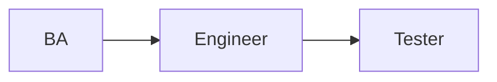
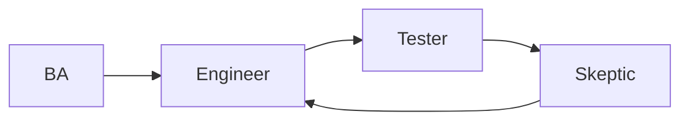
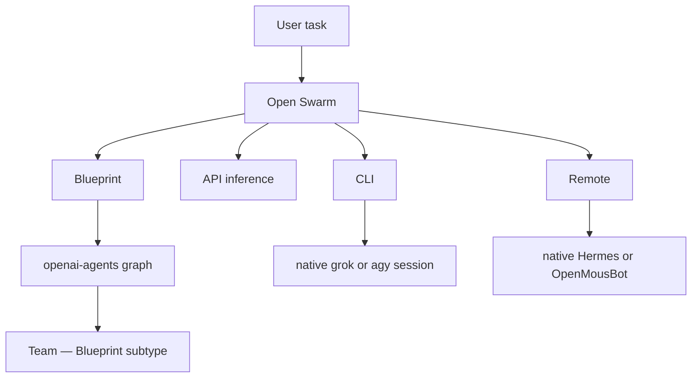
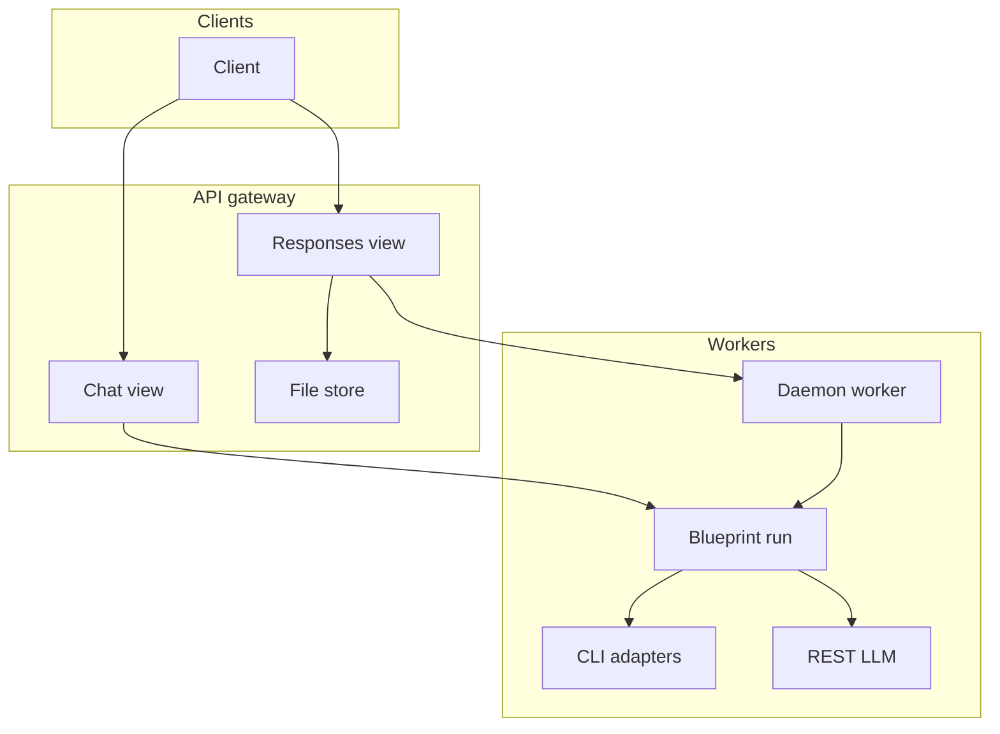
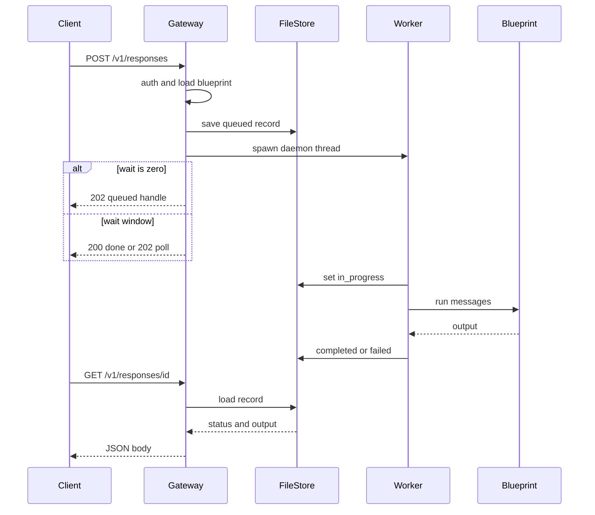
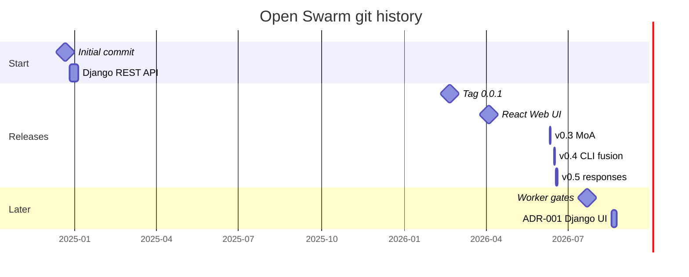

# Developer notes

Operator / contributor internals that used to live on the README. Product
pitch and kinds stay in [README.md](../README.md) and [VISION.md](./VISION.md)
([#782](https://github.com/matthewhand/open-swarm/pull/782) leads; README sells).

- Setup, tests, PR checklist: [CONTRIBUTING.md](../CONTRIBUTING.md)
- Tech stack: [DEVELOPMENT.md](../DEVELOPMENT.md)
- Visual architecture diagrams: [docs/diagrams/](diagrams/README.md)
- Blueprint authoring: [DEVELOPER_GUIDE.md](./DEVELOPER_GUIDE.md)
- Async `/v1/responses`: [ASYNC_RESPONSES.md](./ASYNC_RESPONSES.md)

No secrets. No LAN inventory.

---

## Why openai-agents (and four kinds)

openai-agents lets us **define any workflow** with handoff / as-tool edges.
LLM-only freestyle cannot reliably enforce topology.

- **Forced sequence** — BA → Engineer → Tester because each agent has
  **only one handoff** to the next. BA cannot skip to Tester.
- **Circular / punt-back** — the last Skeptic can hand off back to Engineer.

**Limit:** that graph runs **inside Blueprint seats only**. We cannot inject
openai-agents into **CLI** or **Remote** harnesses — those stay native.
**API** (true inference) is chat-completions, not a graph.







Worked configs, Mode A/B demo names, tests that lock the edges, and
`:8001` seed steps (no secrets):
[docs/examples/openai-agents-handoff-graphs/](./examples/openai-agents-handoff-graphs/README.md)
(REQ-156 / [#564](https://github.com/matthewhand/open-swarm/issues/564)).
Showoff naming SoT: [SHOWOFF_DEMO_AGENTS.md](./SHOWOFF_DEMO_AGENTS.md)
(REQ-135 / [#526](https://github.com/matthewhand/open-swarm/issues/526)).
Visual taxonomy & architecture stack: [docs/diagrams/](diagrams/README.md) ([taxonomy tree](diagrams/agent-taxonomy-tree-diagram.html) · [architecture stack](diagrams/architecture-diagram.html)).

---

## Package layout

```
.
├── src/swarm/                 # Django app + framework core
│   ├── core/                  # CLI, API launcher, discovery, kind bases
│   ├── views/                 # /v1/* and operator pages
│   └── blueprints/            # Bundled Blueprint recipes
├── webui/frontend/            # React SPA (rail + chat). dist/ is gitignored
├── tests/                     # pytest (keyless via SWARM_TEST_MODE)
├── docs/                      # Guides, ADRs, proofs
├── docker-compose.yml         # API + baked SPA + local Postgres (REQ-123)
└── pyproject.toml             # Package metadata (open-swarm 0.5.4)
```

XDG: config `~/.config/swarm/swarm_config.json`. Env vars:
[CONFIGURATION.md](../CONFIGURATION.md).

---

## Dev setup, tests, CI

```bash
uv sync --all-extras
make frontend                          # Node >= 22; optional for backend-only work
uv run pytest -q --timeout=120
uv run python manage.py check
uv run ruff check src tests            # clean on files you touch
```

- Tests run keyless via `SWARM_TEST_MODE`.
- **CI goal is green `main`.** `Python Tests` on 3.10 / 3.11 / 3.12 must
  collect and pass. Sibling `vitest` job: `npm ci` then `npm test`
  (REQ-171C-7 / [#616](https://github.com/matthewhand/open-swarm/issues/616)).
- Intentional HOLD: `golden-journey` in `visual-regression.yml` (`if: false`,
  REQ-89 [#446](https://github.com/matthewhand/open-swarm/issues/446)).
  Do not re-enable that job to recover Vitest.
- Conventional commits: `feat(webui):`, `docs:`, `test:`, …

Full PR rules: [CONTRIBUTING.md](../CONTRIBUTING.md).

---

## Gateway vs workers

The API process is the gateway: `swarm.core.swarm_api` starts uvicorn on
`swarm.asgi:application`. Default is one uvicorn worker
(`SWARM_UVICORN_WORKERS=1`; `swarm.core.concurrency.resolved_uvicorn_workers`
refuses more unless `SWARM_ENFORCE_SINGLE_WORKER` is false). Inflight slots
for async work are process-local (`SWARM_MAX_INFLIGHT`). Long `/v1/responses`
jobs run in a daemon thread (`_spawn_worker` in `swarm.views.responses_views`),
not extra uvicorn workers. The blueprint then calls host CLI adapters or
REST/LLM profiles.



---

## Request sequence

`POST /v1/responses` (`ResponsesView.post` in `swarm.views.responses_views`):
authenticate, resolve the blueprint from `model`, persist a queued record
(`swarm.core.responses_store`), spawn the daemon worker, then return 200 if
the wait window hits completion or 202 to poll. `GET /v1/responses/{id}`
reads the store. Chat `background:true` reuses the same worker
(`ChatCompletionsView._handle_background_chat`).



---

## Dated history (git evidence)

Real dates only (git). The changelog `0.1.0` row dated 2024-01-01 is not a
tag and is omitted. The README keeps one-liners; this table is the evidence.



| Date | What | Evidence |
|---|---|---|
| 2024-12-21 | Initial commit | git root commit |
| 2024-12-26 | Django REST API | commit `c3a092c4` |
| 2026-02-20 | Tag 0.0.1 | git tag (no GitHub Release, no PyPI `0.0.1`) |
| 2026-04-04 | React Web UI | commit `9077902b` |
| 2026-06-11 | v0.3.0 MoA | tag `v0.3.0` |
| 2026-06-16 | CLI fusion | commit `976cbd49` |
| 2026-06-18 | `/v1/responses` | commit `50492380` |
| 2026-06-19 | v0.5.4 | tag `v0.5.4` — last published PyPI / GitHub Release |
| 2026-07-22 | Worker gates | commit `ff014180` — `main` only |
| 2026-08-18 | ADR-001 | commit `3d870d62` — `main` only |
| 2026-09 | Four-kind lock + WebUI-first README | [ADR-006](./adr/006-api-vs-blueprint-kinds.md), [#785](https://github.com/matthewhand/open-swarm/pull/785) / [#791](https://github.com/matthewhand/open-swarm/issues/791) |

---

## Frontend rebuild

`webui/frontend/dist/` is gitignored. After pulling SPA changes:

```bash
make frontend
# or: ./scripts/build_frontend.sh
```

Node >= 22. Tests that capture `/` and `/chat` require `dist/`.

---

## Kind bases vs user-facing kinds

Support and new recipes should subclass `ApiKindBase` / `CliKindBase` /
`RemoteKindBase` from `swarm.core.kind_bases` — not raw `BlueprintBase` for
most cases. `BlueprintBase` stays the low-level parent.

User-facing kinds are **CLI | API | Blueprint | Remote**
([ADR-006](./adr/006-api-vs-blueprint-kinds.md)). ADR-006 amends ADR-005’s
`ApiKindBase` slot: that template hosts programmatic graphs (target name
`BlueprintKindBase`); a true API seat is inference-only and is not a
`BlueprintBase`. Until Phase 1/2, classifiers still say `api` for recipes.
Today vs target + diagram: [ADR-005](./adr/005-kind-bases.md)
(REQ-159 / [#570](https://github.com/matthewhand/open-swarm/issues/570)).

## SPA preview listener (visual QA / :8001)

For LAN sign-off when you need the built SPA (`#root` + hashed assets) without
relying on django `runserver` alone, serve `webui/frontend/dist` with Vite
preview. On ubuntu-max the agreed port is **8001** (LAN `0.0.0.0`). **Do not**
bind **8000** (LiteLLM / other host services).

```bash
./scripts/build_frontend.sh          # Node >= 22
./scripts/start_spa_preview.sh       # default 0.0.0.0:8001
# override: SPA_PREVIEW_HOST=127.0.0.1 SPA_PREVIEW_PORT=8001 ./scripts/start_spa_preview.sh
```

Prove:

```bash
curl -sS http://127.0.0.1:8001/ | grep -E 'id="root"|Open Swarm|/assets/'
```

Logs/PID default under `~/grok-logs/spa-preview-8001.{log,pid}`. Record the
served git SHA (`webui/frontend/dist/.preview-sha`) when tip does not build.
