# Orchestration Patterns

Operating Swarm exposes each multi-agent orchestration pattern as a **blueprint** — a
`model` id you select from any OpenAI client. This page gives a sequence diagram
for each, its status, and the field-standard pattern it mirrors (the same set
Microsoft's Agent Framework names: sequential, concurrent, handoff, group-chat,
Magentic-One).

All diagrams are GitHub-rendered Mermaid. Backends shown (`gemini`, `claude`,
`grok`) are illustrative — any configured CLI fills any role.

> **The bundled blueprints are *examples*, not the product.** Operating Swarm is a
> **composition system**: you define your own personas and teams (via config or
> Django [`/agent-creator/`](../FEATURE_STATUS.md); the SPA Builder route is
> unmounted) and choose *how* consensus is invoked. The patterns below are
> the architectural primitives you compose from — see
> [Composing your own](#composing-your-own) and
> [Consensus invocation: always vs gated](#consensus-invocation--always-vs-gated).

| Blueprint | Pattern | Status |
|---|---|---|
| [`cli_agent`](#cli_agent--single-backend) | single agent + failover | ✅ built |
| [`cli_fusion`](#cli_fusion--concurrent-panel--judge) | concurrent (always consensus) | ✅ built |
| [`cli_orchestrator`](#cli_orchestrator--handoff--escalation) | handoff / **gated** consensus | ✅ built |
| [`cli_map`](#cli_map--map-reduce) | map-reduce | ✅ built |
| [`cli_pipeline`](#cli_pipeline--sequential-refinement) | sequential | ✅ built |
| [`cli_roundtable`](#cli_roundtable--group-chat-debate) | group chat | ✅ built |
| [`cli_planner`](#cli_planner--magentic-one-ledger) | Magentic-One | ✅ built |
| [`hybrid_team` / `hybrid_swarm`](#hybrid--rest-coordinator--cli-consensus) | REST + CLI mixed | ✅ built |
| [`persona_council`](#persona-council--diverse-lens-consensus) | diverse-lens consensus | ✅ built |

---

## Composing your own

The blueprints ship as worked examples; the framework's intent is that **you
assemble teams**. A team is three choices:

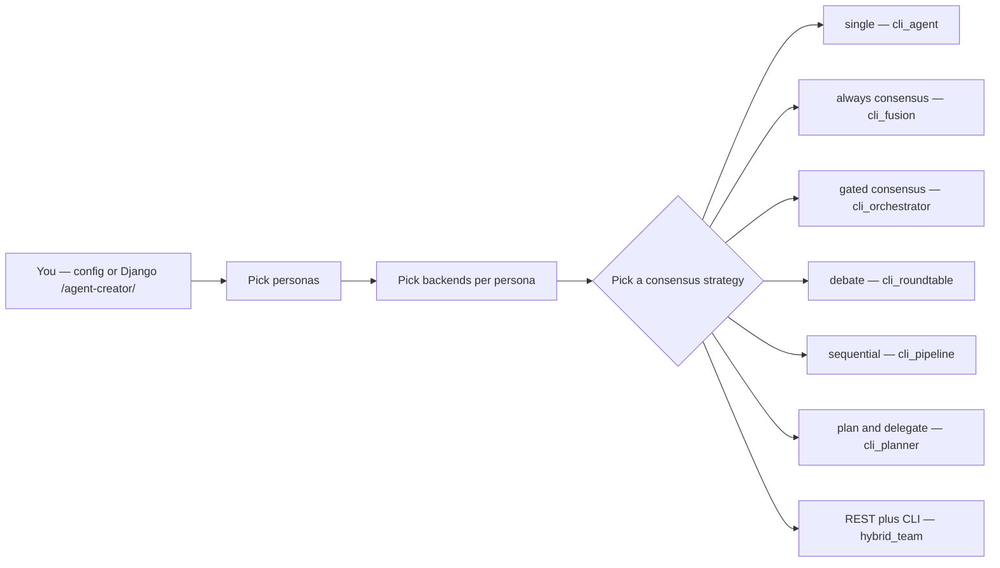

A **persona** is just a backend plus a system-prompt lens. The same machinery
that runs a joke-named team runs a council of real expert lenses — only the
prompts change.

---

## Consensus invocation: always vs gated

The architectural fork that matters most: **is consensus always paid, or does a
router decide it's worth it?** Operating Swarm supports both, because the underlying
openai-agents framework lets a routing/orchestration agent *decide whether to
hand off* to a consensus panel.

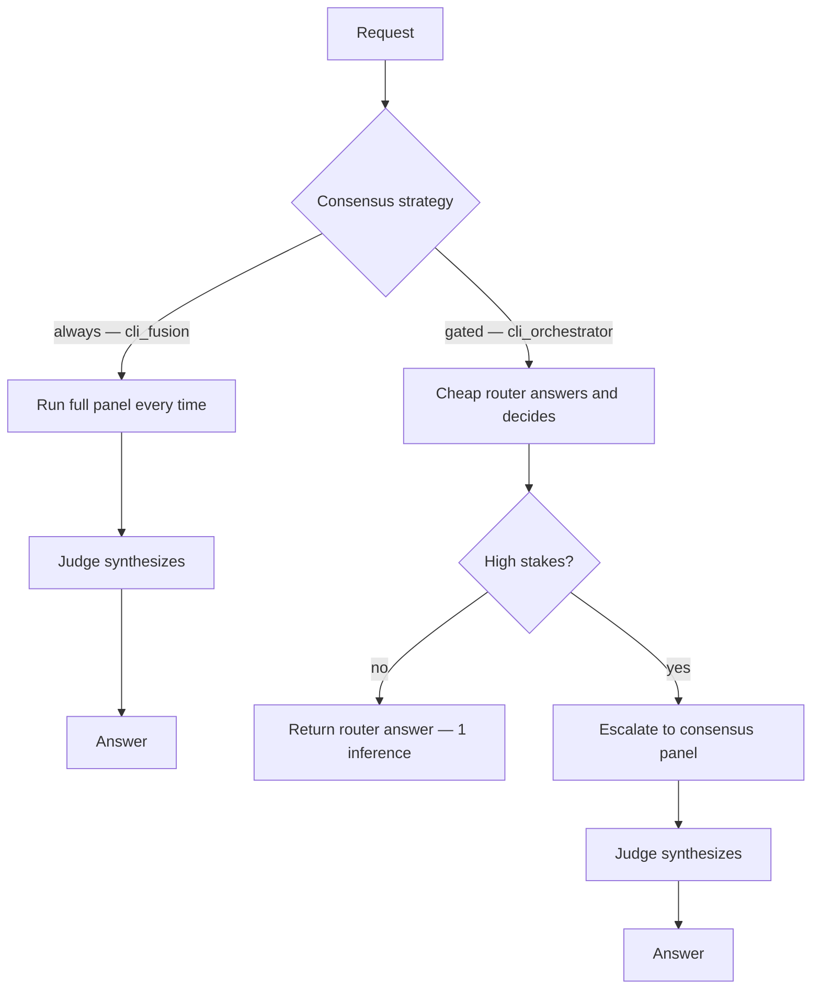

**Always** (`cli_fusion`) maximizes confidence on every call. **Gated**
(`cli_orchestrator`) is the agentic-handoff model: spend one cheap inference,
and only pay for consensus when the question is correctness-critical or
contested. Same panel, different *trigger*.

---

## `cli_agent` — single backend ✅

Expose one CLI over the API, with an ordered failover chain so a dead or
unauthenticated backend hands off to the next.

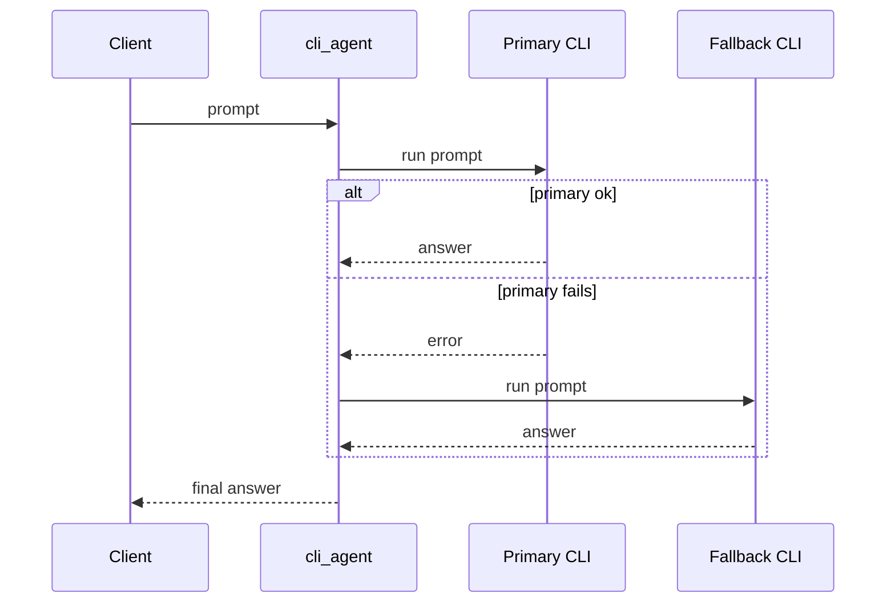

---

## `cli_fusion` — concurrent panel + judge ✅

Fan one prompt to a panel of CLIs **in parallel**, then a judge compares (not
concatenates) their answers and synthesizes one, optionally iterating a bounded
master-plan loop. Survivors carry the round if a panelist dies.

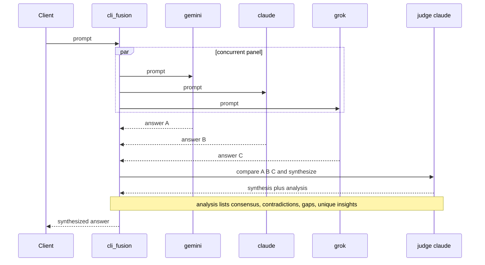

Live proof: [`docs/proofs/tri_cli_fusion_run.txt`](./proofs/tri_cli_fusion_run.txt).

---

## `cli_orchestrator` — handoff / escalation ✅

A cheap router CLI answers directly and decides whether the question is
high-stakes. Routine questions cost a single inference; only contested ones
escalate to a full consensus panel.

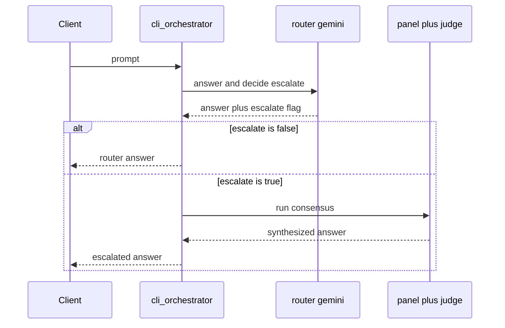

Live proof: [`docs/proofs/orchestrator_escalation_run.txt`](./proofs/orchestrator_escalation_run.txt).

---

## `cli_map` — map-reduce ✅

Split one task into independent subtasks, distribute them across worker CLIs in
parallel (round-robin), and reduce the results into one answer.

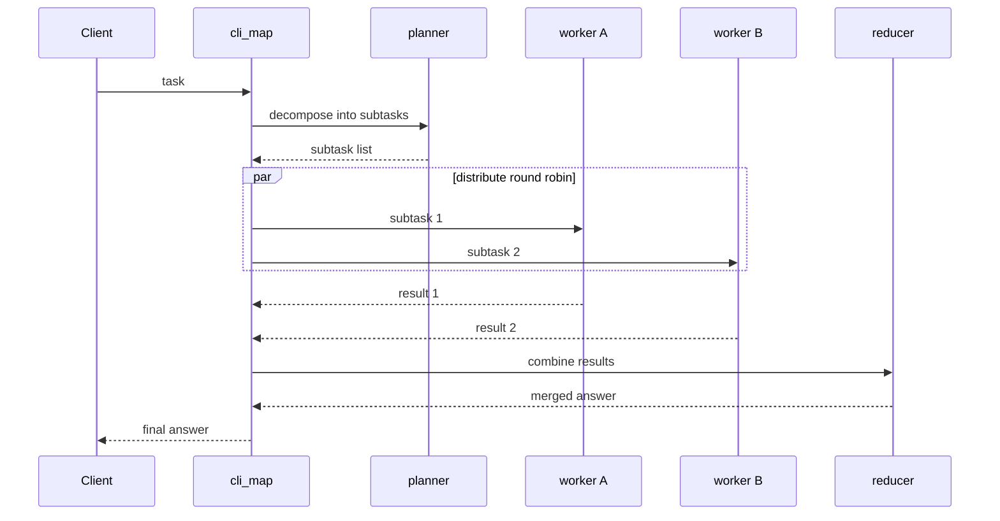

---

## `cli_pipeline` — sequential refinement ✅

A staged chain where each CLI refines the previous stage's output. Different
backends play to their strengths in order — for example a fast model drafts, a
strong model reviews, a third polishes. Distinct from `cli_fusion`: stages are
**sequential and dependent**, not a parallel panel.

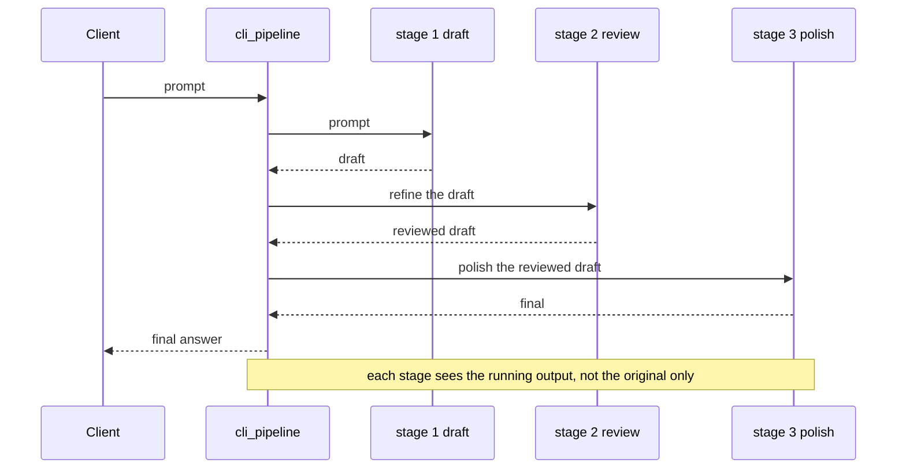

---

## `cli_roundtable` — group-chat debate ✅

Several CLIs **debate in a shared transcript** across bounded rounds. Each round
every debater sees the others' latest positions; a moderator decides whether to
run another round or conclude, then synthesizes. Distinct from `cli_fusion`:
debaters react to each other across rounds, not just answer once.

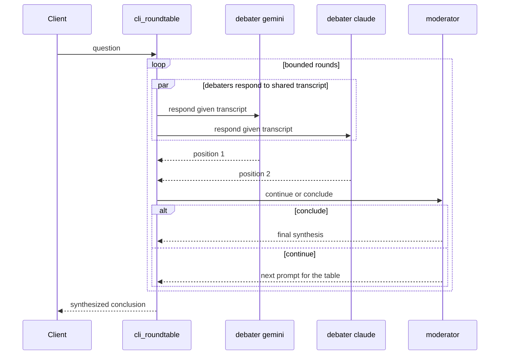

---

## `cli_planner` — Magentic-One ledger ✅

A planner maintains a **task ledger**, delegates subtasks to specialist CLIs,
inspects results, and **re-plans on stall** up to a bound before synthesizing.
Distinct from `cli_map`: planning is iterative and reactive, not a single
decompose-then-reduce.

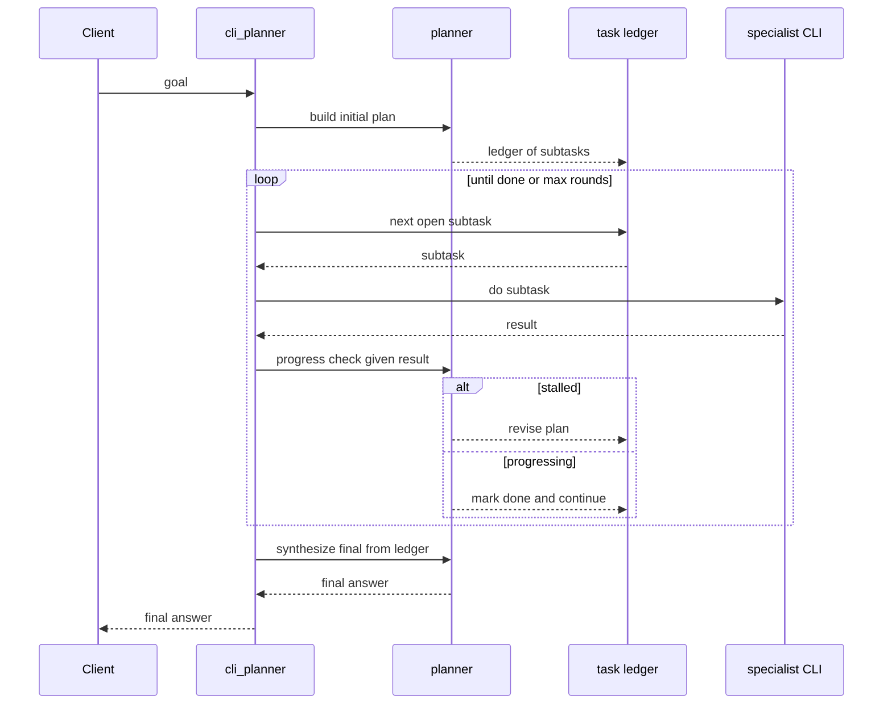

---

## Hybrid — REST coordinator + CLI consensus ✅

`hybrid_team` / `hybrid_swarm` mix the two worlds: a **REST/LLM coordinator** (an
openai-agents `Agent`) reasons, then **delegates mid-run** to CLI personas and a
consensus panel — both exposed to it as *function tools*. This is the agentic
handoff in its fullest form: the model itself decides to reach for a CLI persona
or to call for consensus.

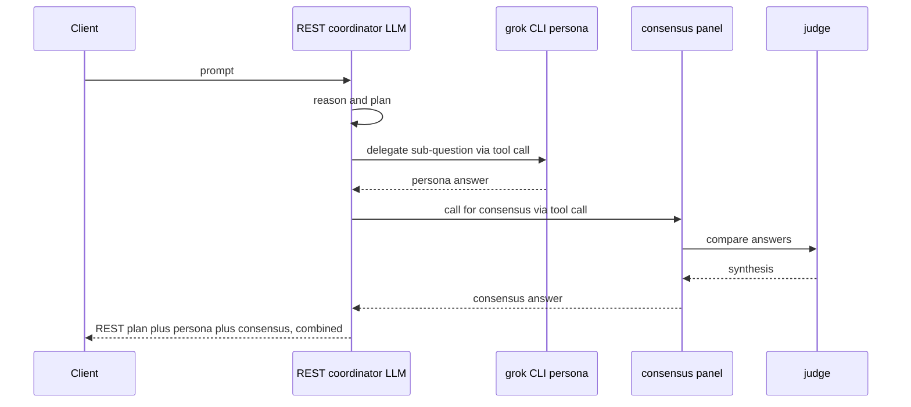

Verified live — one response carried all three: `REST plan: … / grok persona:
Berlin / Consensus: Berlin`.

---

## Persona council — diverse-lens consensus ✅

`persona_council` is a panel where each member is the same backend wearing a
different **expert lens** (a system-prompt persona), fanned out in parallel, then
reconciled. Consensus comes from *perspective diversity*, not redundancy — the
judge reports agreement, genuine disagreement, and a synthesized position with
the trade-offs named. Built-in councils (`ethics`, `science`, `psych`,
`decision`, `red_team`) need no config; pick one with `params.council`, pass an
explicit `personas` roster, or add your own in a `persona_council` config block.

Verified live (`council: ethics` on claude): the judge reported *"four of the
five lenses converge… Kantian, Virtue, Rawlsian, and Care all reject
pre-programmed sacrifice"* — agreement and the utilitarian tension, both named.

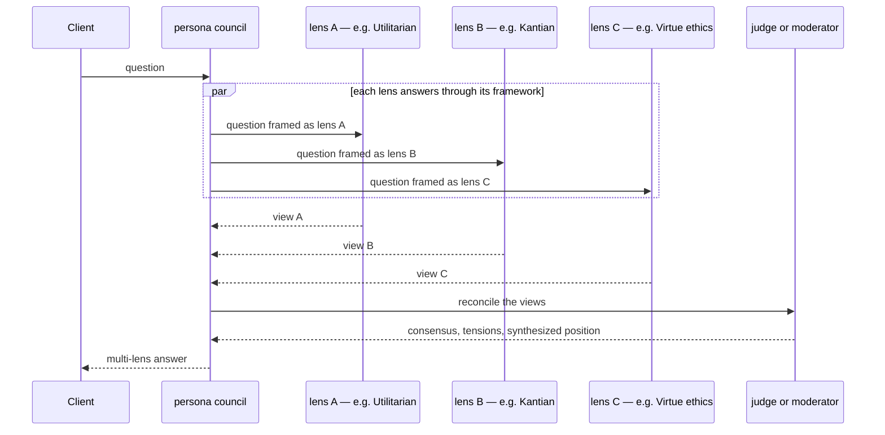

Swap the roster for any domain: philosophers, scientists, psychologists,
economists, a security red-team. The lenses are **data** (config presets), not
code.

---

## Choosing a pattern

| If you want | Use |
|---|---|
| One CLI, with a backup if it is down | `cli_agent` |
| The best single answer from several models | `cli_fusion` |
| Cheap by default, rigorous only when it matters | `cli_orchestrator` |
| To split a big task across workers and merge | `cli_map` |
| Staged refinement, draft then review then polish | `cli_pipeline` |
| Models to argue toward a conclusion | `cli_roundtable` |
| A planner to drive specialists toward a goal | `cli_planner` |
| An LLM that reasons, then reaches for CLI personas + consensus | `hybrid_team` / `hybrid_swarm` |
| Consensus from diverse expert lenses, not redundant runs | `persona_council` (`params.council`) |
| Your own personas + your own consensus rule | config preset / Django `/agent-creator/` (SPA Builder unmounted) |

See [VISION.md](./VISION.md) for how these fit the larger picture, and
[CLI_FUSION.md](./CLI_FUSION.md) for configuration of the built blueprints.
