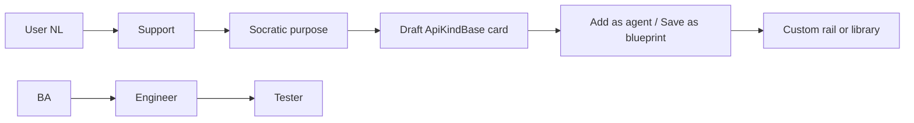

# Support builds blueprints in natural language (REQ-158)

Issue SoT: [REQ-158 #567](https://github.com/matthewhand/open-swarm/issues/567).

**Intent:** Sell the power-user Python path **and** the NL path. Open Swarm
bootstraps more of itself via **Support**.

**Name:** the onboarder is **Support** (same seat as REQ-137 / #530). Not a
second bot.

---

## Two paths (same seat)

| Path | Who writes Python? | What you see |
|------|--------------------|--------------|
| **Happy path** | Nobody. Ask Support. | A usable team/workflow. Code hidden. Optional **View code**. |
| **Power user** | You, or Support when you ask to see it. | An `ApiKindBase` (or CLI/remote kind base) Python class. |

**Under the hood** a blueprint/team is a Python class — usually
`ApiKindBase` (ADR-005). That is how openai-agents handoff / as-tool graphs
are defined. You do not need to look at that class to get a working team.

---

## Guided path (GitHub-only — no live preview host)

This is the announce / GIF story. GitHub-only. No preview host. No secrets.

1. Open Chat on **Support** (empty thread).
2. Click **Create a team** for a Socratic purpose question, or **Create a
   BA → Engineer → Tester workflow** to skip to a draft.
3. Support designs from team docs (ADR-005 `ApiKindBase`) and returns a
   **draft** card. You did **not** write Python. Nothing is on the rail yet.
4. The card shows the graph (`BA → Engineer → Tester`) plus **Add as agent**
   (persist, rail, switch seat) and **Save as blueprint** (persist, stay on
   Support).
5. Python is **hidden**. Click **View code** only if you want the
   generated `ApiKindBase` class (ties to #564 / `sdlc_handoff`).

Recorded checklist (source-locked by `tests/unit/test_req158_nl_blueprints.py`
and the Vitest card):

- [x] User message is natural language — no `class`, no `def`, no fenced Python.
- [x] Underspecified “create a team” emits one Socratic ```question.
- [x] Specified NL / purpose answer drafts via `create_blueprint_from_nl` (`persist=False`).
- [x] Card CTAs are **Add as agent** and **Save as blueprint**.
- [x] Result `userWrotePython` is false.
- [x] Default UI has no `<textarea>` / `pre` of the generated module.
- [x] **View code** reveals the generated class.
- [x] Graph edges are BA → Engineer, Engineer → Tester (REQ-156 example).
- [x] No live preview host, no secrets, no Neon.

---

## Example: Support creates the #564 handoff

User:

> Create a BA → Engineer → Tester workflow

Support (abridged):

> Drafted **BA → Engineer → Tester** from your answers and our team docs
> (ADR-005 `ApiKindBase`). You did not write Python.
>
> **Add as agent** puts it on the rail. **Save as blueprint** keeps it in
> the library.
> Graph: BA → Engineer → Tester
>
> Under the hood this is a Python `ApiKindBase` blueprint class. Code stays
> hidden unless you choose **View code**.

That is the same topology as
[`docs/examples/openai-agents-handoff-graphs/sdlc-pipeline.json`](./examples/openai-agents-handoff-graphs/sdlc-pipeline.json)
and the `sdlc_handoff` recipe. Support copies the idea into a **new**
custom seat so the product builds more of itself.



---

## Deviation vs #562 (REQ-154)

#562 (Support/CoS **create + archive** agents, ~30d purge) is still open.
This slice ships **Support-only NL blueprint/team create**. Support drafts
(`create_blueprint_from_nl`, `persist=False`). Persist is the card CTA
(`POST /v1/blueprints/custom/` → `build_custom_rail_item`).

Not in this slice: CoS create parity, archive / soft-delete, purge job.
Those stay on #562.

---

## Related

- Support onboarder: [REQ-137 #530](https://github.com/matthewhand/open-swarm/issues/530)
- openai-agents graphs: [REQ-156 #564](https://github.com/matthewhand/open-swarm/issues/564)
- Kind bases: [ADR-005](./adr/005-kind-bases.md) (REQ-159)
