# Operating Swarm: A User Journey

A walkthrough of Operating Swarm from a fresh checkout to running agent teams —
on the command line, in the web UI, and over the OpenAI-compatible API.
Blueprints are CLI/API recipes only; the Grok-like SPA is the product web UI.

Every terminal block below is real output captured on a development machine,
and every screenshot in [`docs/screenshots/`](./screenshots/) was captured from
a live local server by [`scripts/capture_user_journey.py`](../scripts/capture_user_journey.py).
Where a page shows demo, placeholder, or empty-state data, the caption says so.

> Screenshots last regenerated **2026-09-16** with Playwright
> (`scripts/capture_user_journey.py`) against a live local server. Captures
> reflect that environment’s data (empty states and login-gated chat are
> called out in captions). The `os-cli list` transcript below was
> refreshed **2026-09-16** (fresh XDG dirs); other CLI blocks further down
> remain older canned captures from `main`.

> **Documentation map:** [USERGUIDE.md](../USERGUIDE.md) is the `os-cli`
> reference, this file is the end-to-end story,
> [GUIDED_TOUR.md](./GUIDED_TOUR.md) is the screenshot-per-page visual tour of
> the web UI (Django operator shell + lightweight SPA dashboard/chat), and
> [SCREENSHOTS.md](./SCREENSHOTS.md) is the capture registry.

---

## 1. Install

```bash
git clone https://github.com/matthewhand/operating-swarm.git
cd operating-swarm
uv sync --all-extras          # or: pip install -e .[dev]

# Configure an LLM key for real agent runs (not needed for the tour below)
export OPENAI_API_KEY="sk-..."
```

This guide uses the project virtualenv directly (`.venv/bin/...`); if you use
`uv`, prefix the same commands with `uv run` instead.

## 2. Meet the CLI

Operating Swarm ships agent teams as **blueprints**. Blueprints are **CLI/API only**
— they do not ship a webpage; the Grok-like WebUI is the product chrome.
`os-cli list` inventories **package directories** under
`src/swarm/blueprints/` plus any installed executables / user sources (fresh
checkout below — bundled rows, including the non-runnable `common` helpers
folder):

```text
$ .venv/bin/os-cli list
--- Installed Blueprint Executables (in /home/user/.local/share/swarm/bin) ---
(No installed blueprint executables found in /home/user/.local/share/swarm/bin)
Try 'os-cli install-executable <blueprint_name>' or see 'os-cli list --available'.

--- Bundled Blueprints (available from package) ---
- fs_introspect (entry: blueprint_fs_introspect.py)
- hybrid_swarm (entry: blueprint_hybrid_swarm.py)
- cli_planner (entry: blueprint_cli_planner.py)
- hybrid_team (entry: blueprint_hybrid_team.py)
- moa (entry: blueprint_moa.py)
- cli_fusion (entry: blueprint_cli_fusion.py)
- cli_recurse (entry: blueprint_cli_recurse.py)
- gawd (entry: blueprint_gawd.py)
- cli_pipeline (entry: blueprint_cli_pipeline.py)
- geese (entry: geese_cli.py)
- dynamic_team (entry: blueprint_dynamic_team.py)
- poets (entry: poets_cli.py)
- cli_agent (entry: blueprint_cli_agent.py)
- stewie (entry: blueprint_stewie.py)
- rue_code (entry: rue_code_cli.py)
- chucks_angels (entry: blueprint_chucks_angels.py)
- persona_council (entry: blueprint_persona_council.py)
- cli_map (entry: blueprint_cli_map.py)
- moa_orchestrator (entry: blueprint_moa_orchestrator.py)
- chatbot (entry: blueprint_chatbot.py)
- jeeves (entry: jeeves_cli.py)
- cli_orchestrator (entry: blueprint_cli_orchestrator.py)
- zeus (entry: zeus_cli.py)
- common (entry: progress.py)
- whiskeytango_foxtrot (entry: blueprint_whiskeytango_foxtrot.py)
- suggestion (entry: suggestion_cli.py)
- codey (entry: codey_cli.py)
- hybrid_moa (entry: blueprint_hybrid_moa.py)
- cli_ensemble (entry: blueprint_cli_ensemble.py)
- cli_roundtable (entry: blueprint_cli_roundtable.py)

--- User Blueprint Sources (in /home/user/.local/share/swarm/blueprints) ---
(No user blueprint sources found in /home/user/.local/share/swarm/blueprints)
You can add blueprints by copying their source folders to this directory.
```

Those **31** CLI rows are **not** the same count as the web UI:

| Surface | What it counts | This regen |
| --- | --- | --- |
| `os-cli list` (Bundled) | Package dirs under `src/swarm/blueprints/` (includes non-discoverable `common`) | **31** |
| Blueprint Library `/blueprint-library/` | `discover_blueprints()` keys (canonical ids + discovery aliases) | **49** available; first paint **12 of 49** (`blueprint-library.png`) |
| SPA `/` | Grok-like rail + chat (not a count dashboard) | `landing.png` does **not** show API totals |

### Try a blueprint without an API key (`SWARM_TEST_MODE`)

`SWARM_TEST_MODE=1` makes blueprints emit deterministic, canned output — the
same mechanism the 600+ test suite uses to run keyless. It also makes
`os-cli install` write a fast shell shim instead of compiling a PyInstaller
binary:

```text
$ SWARM_TEST_MODE=1 .venv/bin/os-cli install jeeves
Installing blueprint 'jeeves' as executable...
  Source: /home/user/open-swarm/src/swarm/blueprints/jeeves
  Entry Point: blueprint_jeeves.py
  Output Executable: /home/user/.local/share/swarm/bin/jeeves
Test-mode shim installed at: /home/user/.local/share/swarm/bin/jeeves

$ SWARM_TEST_MODE=1 .venv/bin/os-cli launch jeeves --message "What time is it?"
Launching 'jeeves' with: /home/user/.local/share/swarm/bin/jeeves --message What time is it?
--- jeeves Output ---
[SWARM_CONFIG_DEBUG] Trying: /home/user/open-swarm/swarm_config.json
[SWARM_CONFIG_DEBUG] Loaded: /home/user/open-swarm/swarm_config.json

--- 'jeeves' finished (Return Code: 0) ---
```

Each blueprint also has a direct CLI entry point. In test mode Jeeves renders
its full spinner-and-result-box UX (this is the canned test output, not a real
LLM answer):

```text
$ SWARM_TEST_MODE=1 .venv/bin/python -m swarm.blueprints.jeeves.jeeves_cli --message "What time is it?"
[SPINNER] Polishing the silver
╭──────────────────────────── Searching Filesystem ────────────────────────────╮
│ 🔍 Matches so far: 1                                                         │
│ [SPINNER] Polishing the silver                                               │
│                                                                              │
╰──────────────────────────────────────────────────────────────────────────────╯
[SPINNER] Generating.
╭──────────────────────────── Searching Filesystem ────────────────────────────╮
│ 🔍 Matches so far: 2                                                         │
│ [SPINNER] Generating.                                                        │
│                                                                              │
╰──────────────────────────────────────────────────────────────────────────────╯
[SPINNER] Generating..
╭──────────────────────────── Searching Filesystem ────────────────────────────╮
│ 🔍 Matches so far: 3                                                         │
│ [SPINNER] Generating..                                                       │
│                                                                              │
╰──────────────────────────────────────────────────────────────────────────────╯
[SPINNER] Generating...
╭──────────────────────────── Searching Filesystem ────────────────────────────╮
│ 🔍 Matches so far: 4                                                         │
│ [SPINNER] Generating...                                                      │
│                                                                              │
╰──────────────────────────────────────────────────────────────────────────────╯
[SPINNER] Running...
╭──────────────────────────── Searching Filesystem ────────────────────────────╮
│ 🔍 Matches so far: 5                                                         │
│ [SPINNER] Running...                                                         │
│                                                                              │
╰──────────────────────────────────────────────────────────────────────────────╯
```

With a real key configured (`OPENAI_API_KEY` plus `swarm_config.json` LLM
profiles), drop `SWARM_TEST_MODE` and the same commands run real agents.

## 3. Tour the web UI

Start the Django server in development mode. `ENABLE_WEBUI=true` enables the
template-rendered pages (teams, launcher, library, creator, settings):

```bash
ENABLE_WEBUI=true DJANGO_DEBUG=true .venv/bin/python manage.py runserver 8000
```

> With `DJANGO_DEBUG=true` and no `API_AUTH_TOKEN`, API auth stays **off**
> (server warns). Production is the opposite: leave `DJANGO_DEBUG` unset/false
> and set `DJANGO_SECRET_KEY`, `DJANGO_ALLOWED_HOSTS`, and `API_AUTH_TOKEN`
> (or `SWARM_ALLOW_NO_AUTH=true` if an external layer gates access) — see
> [CONFIGURATION.md](../CONFIGURATION.md).

### Landing page — `/`

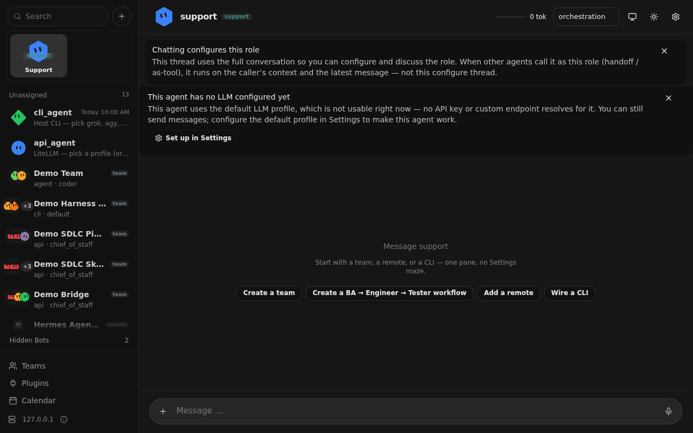

When the React frontend has been built (`webui/frontend/dist/` exists), `/`
serves the **Grok-like product chrome** (left rail + selected agent’s chat —
same ChatPage as `/chat`). This capture: **Support** selected, kickstart
chips, composer; **not** a Teams/Blueprints/Models count dashboard. See the
count-bridge table in §2 (`os-cli list` **31** dirs ≠ library **49** /
**12 of 49**). Recaptured after `npm run build` on **2026-09-16**. Bare
`/teams`, `/blueprints`, `/settings`, and `/agent-creator` **redirect** to
Django (`/teams/launch/`, `/blueprint-library/`, `/settings/`,
`/agent-creator/`) — `spa-*.png` captures document those redirect landings
(sticky “Redirected: …” banner). `/chat` is the same chrome. See the
page-by-page [guided tour](./GUIDED_TOUR.md). Without
`webui/frontend/dist/`, `/` falls back to Django templates; the Django pages
below are the operator dump either way.

### Teams admin — `/teams/`

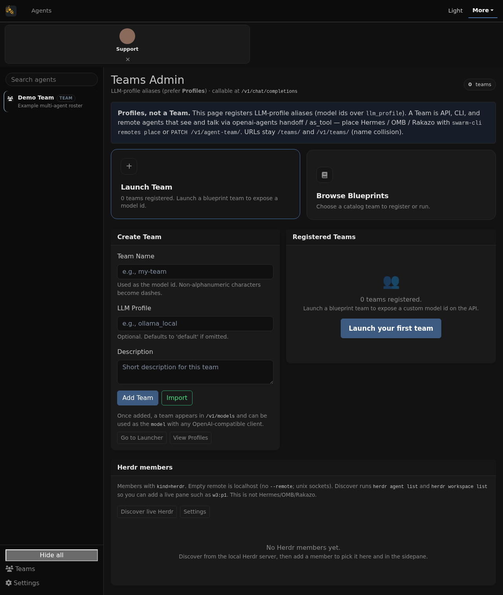

**Login required** (same operator session as Settings / Sessions). Register
named teams that become OpenAI-compatible *models*. The "Registered Teams"
table is empty here because this is a fresh development database. Once added,
a team appears in `/v1/models` and can be used as the `model` field with any
OpenAI client. Export at `/teams/export` is also login-gated.

### Team launcher — `/teams/launch/`

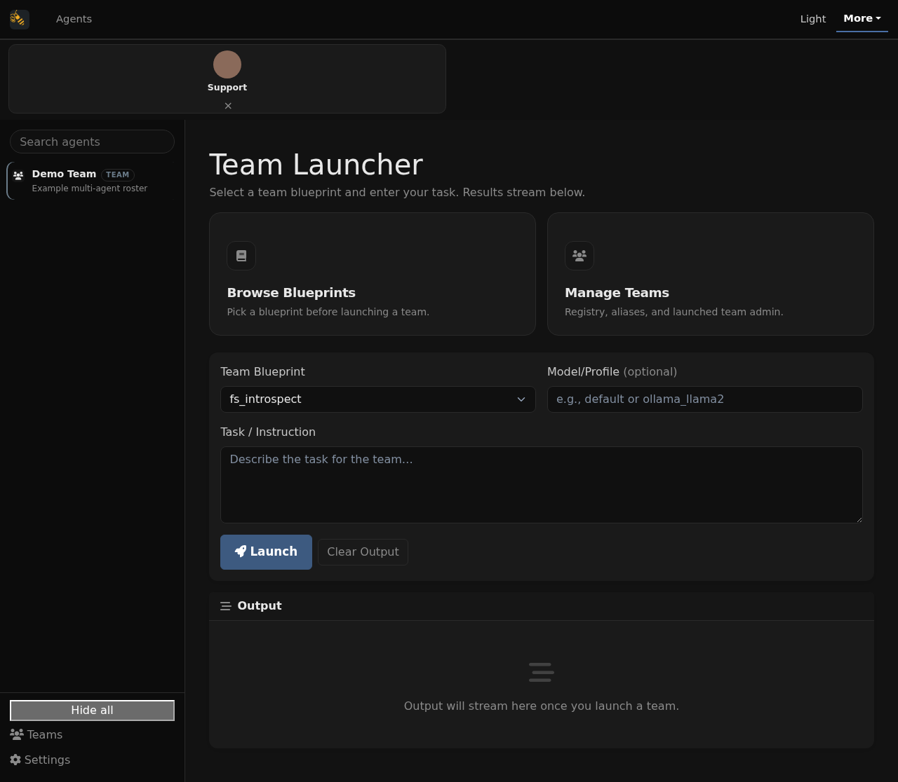

Pick a team blueprint (the launcher lists bundled CLI/API recipes such as
`fs_introspect`, `hybrid_swarm`, `hybrid_team`, … — the capture shows
**`fs_introspect`** selected, the first dropdown option), type a task, and
stream the team's output in the browser. The output panel is empty until you
launch. Blueprints do not mount a second chat UI; product Chat is `/` + `/chat`.

### Blueprint library — `/blueprint-library/`

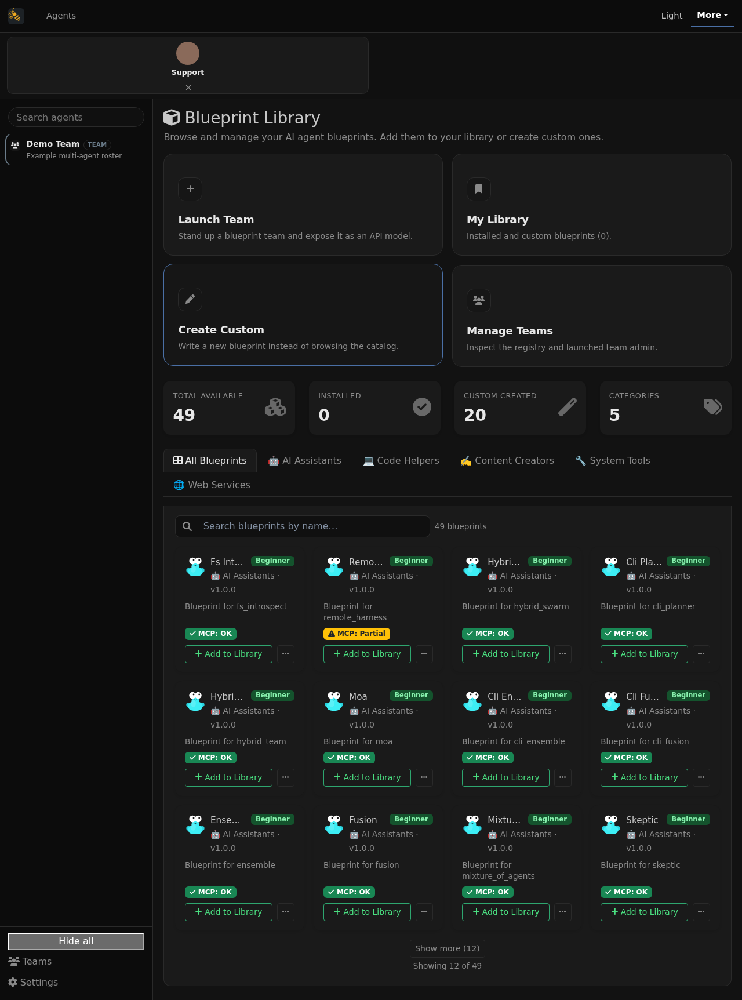

**Login required.** Browse discoverable blueprints with per-blueprint MCP
status badges (async check; this capture shows ready green checkmarks
labeled **MCP: OK** on each card, not a checking spinner). Summary tile
**Available: 49** is `discover_blueprints()` (not `os-cli list`’s 31 dirs).
The grid is **paginated** on first paint (**Showing 12 of 49** + **Show
more**). Add/remove, the creator form, and avatar generation are operator
mutators and also require login.

### My blueprints — `/blueprint-library/my-blueprints/`

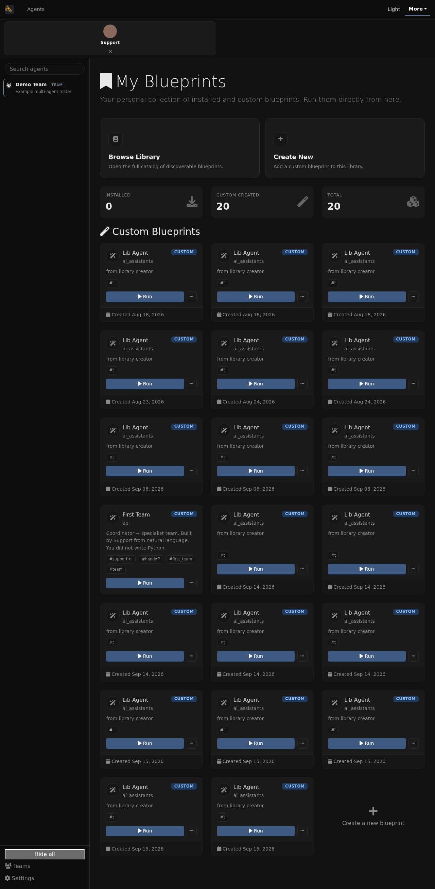

**Login required.** Your personal collection of installed and custom
blueprints. This capture shows Installed **0** and Custom Created **20**
(mostly **Lib Agent** cards from the library creator, plus **First Team**)
and a **Create a new blueprint** card — not an empty fresh library.

### Agent creator — `/agent-creator/`

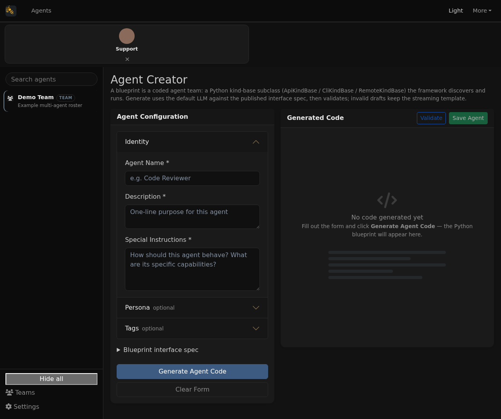

GET page is public; **generate / validate / save require login**. Build a
custom agent persona with **progressive disclosure**: **1 Identity** (name,
description, special instructions) open by default; **2 Optional Persona**
and **3 Optional Tags** collapsed. The right-hand panel **Generate Blueprint**
/ **Validate** actions save the resulting Python blueprint code.

### Settings dashboard — `/settings/`

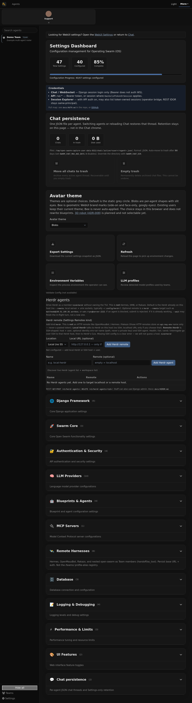

**Login required.** Configuration management grouped by category (Django,
Swarm core, auth, LLM providers, blueprints/agents, MCP servers, database,
logging, performance, UI features), with a configuration-progress meter and
import/export of the environment. This capture’s meter is **40 of 47** /
**85%** (product setting groups with defaults — not the old empty **0 of 0**
fixture). Title: **Operating Swarm (OS)**. Chat persistence shows **0** chats.

### Login page — `/accounts/login/`

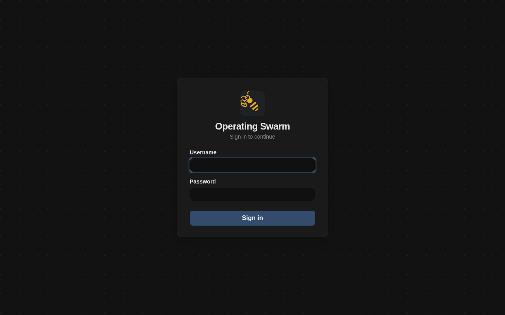

The login form (**Operating Swarm** wordmark + bee mark). Both `/accounts/login/` and `/login/` are wired to the
`custom_login` view (CSRF required on POST; `next` is restricted to rooted
same-origin paths). Logging in unlocks the Django operator shell — Teams
admin/export, Blueprint library / My blueprints / creator mutators,
Settings, Sessions — and the SPA chat websocket (anonymous chat connections
close **4401**). Session cookie ≠ REST Bearer; full map in
[AUTH.md](./AUTH.md). Public without a session: landing SPA, Team launcher
(`/teams/launch/`), LLM profiles (`/profiles/`), Agent Creator GET
(`/agent-creator/`), and the login form itself. Journey capture and e2e
visual suites log in through this form when a page redirects.

### Session explorer — `/sessions/`

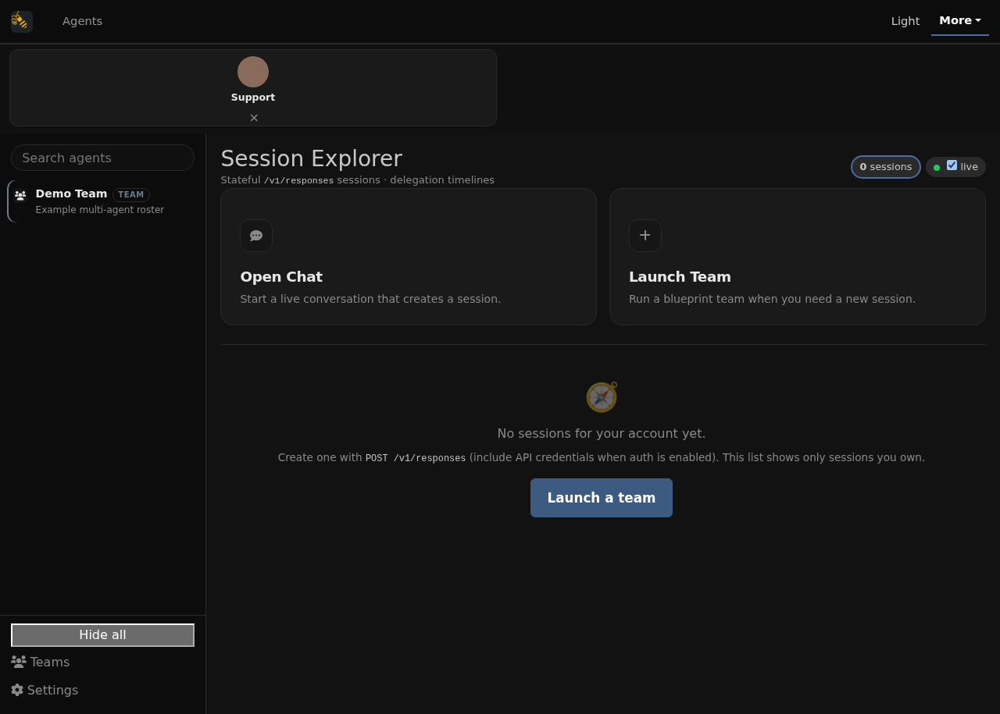

**Login required.** Fresh-db empty state: **0 sessions**, a **live**
auto-refresh toggle, and “No sessions for your account yet… This list shows
only sessions you own.” Status filter chips and the newest-N
truncation banner show once sessions exist (and when the list is truncated
to the default limit of 50). See also [GUIDED_TOUR.md](./GUIDED_TOUR.md) and
[SESSION_EXPLORER.md](./SESSION_EXPLORER.md).

### Session detail — `/sessions/resp_journey_seed/`

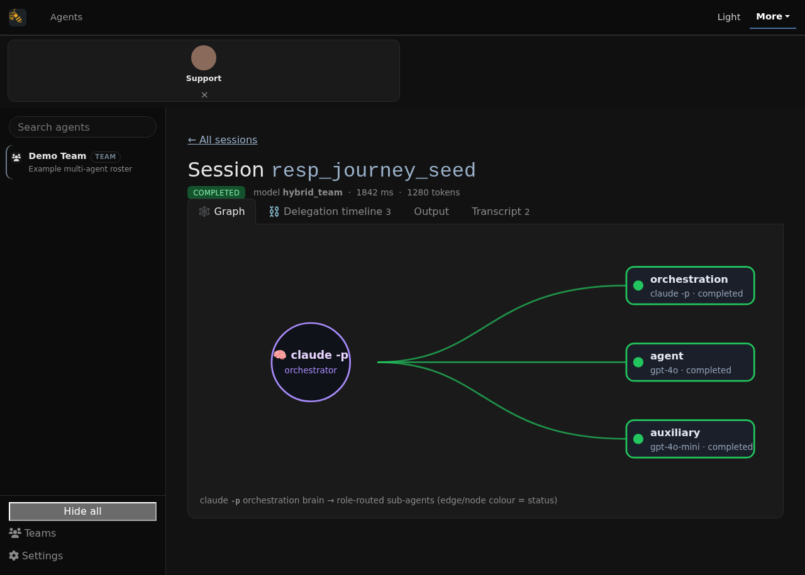

Seeded journey fixture (`resp_journey_seed`), **not** a live `hybrid_team` or
`POST /v1/responses` run. After the empty list capture,
[`scripts/capture_user_journey.py`](../scripts/capture_user_journey.py) writes
a minimal `hybrid_team`-shaped record into an isolated `SWARM_RESPONSES_DIR`
and screenshots the real Django Graph / timeline UI. The chrome is live; only
the JSON is synthetic. Full honesty note:
[SESSION_EXPLORER.md](./SESSION_EXPLORER.md).

### LLM profiles — `/profiles/`

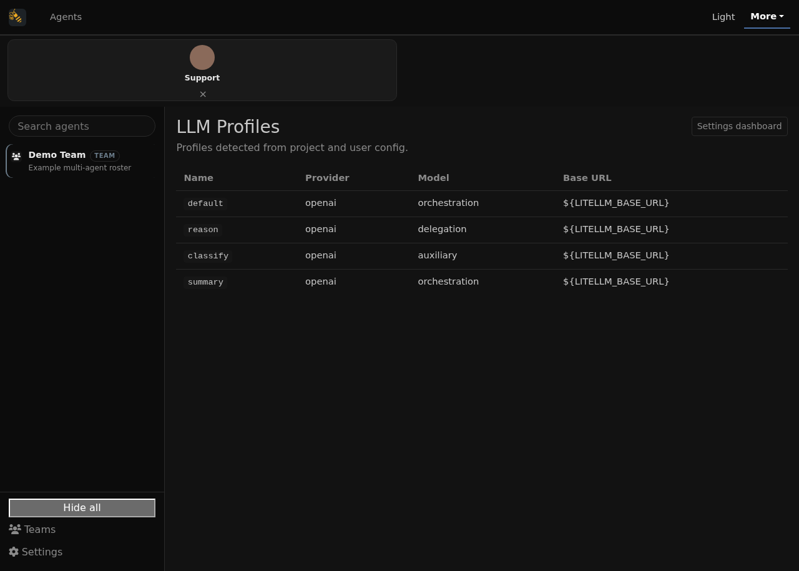

Detected LLM profiles from project and user config (openai, anthropic,
google, ollama, lmstudio, openrouter, …) with Provider / Model / Base URL /
Source / Enabled columns. Nested under **Settings → LLM profiles** in the
primary nav (Settings dropdown active in this capture). Enable or disable
providers under Settings → LLM Providers.

### Pages not captured as distinct products

* **Bare SPA dual routes** (`/teams`, `/blueprints`, `/settings`,
  `/agent-creator`) — they redirect to Django; covered by `spa-*.png`
  redirect captures, not separate products.
* **`/webui/`** — legacy template; redirects to `/` for old bookmarks.


## 4. Use it as an OpenAI-compatible API

Everything in the web UI is also an API. List blueprints as *models*
(output truncated; real capture from a local `DJANGO_DEBUG=true` server —
no `API_AUTH_TOKEN`, so no Bearer header):

```text
$ curl -s http://localhost:8000/v1/models | python -m json.tool
{
    "object": "list",
    "data": [
        {
            "id": "chatbot",
            "object": "model",
            "created": 1781045533,
            "owned_by": "open-swarm"
        },
        {
            "id": "gawd",
            "object": "model",
            "created": 1781045533,
            "owned_by": "open-swarm"
        },
        ...
    ]
}
```

Chat with a blueprint using any OpenAI client — the `model` field selects the
blueprint. Same open-auth local setup as above (no Bearer). When
`API_AUTH_TOKEN` *is* set, `ENABLE_API_AUTH` turns on and every `/v1/*` call
needs `Authorization: Bearer ${API_AUTH_TOKEN}` (missing/wrong → 403):

```bash
# Local debug, no token configured (matches the /v1/models capture above):
curl -s http://localhost:8000/v1/chat/completions \
  -H "Content-Type: application/json" \
  -d '{"model": "suggestion", "messages": [{"role":"user","content":"Say hello"}]}'

# When API_AUTH_TOKEN is set on the server:
curl -s http://localhost:8000/v1/chat/completions \
  -H "Content-Type: application/json" \
  -H "Authorization: Bearer ${API_AUTH_TOKEN}" \
  -d '{"model": "suggestion", "messages": [{"role":"user","content":"Say hello"}]}'
```

The response is a standard OpenAI chat-completion envelope. Captured on this
dev machine *without* a valid upstream LLM key, so the assistant content is an
error string — shown here to illustrate the envelope honestly:

```json
{
  "id": "chatcmpl-76e9038c-616e-45fd-930e-a1abf5448b1e",
  "object": "chat.completion",
  "created": 1781045545,
  "model": "suggestion",
  "choices": [
    {
      "index": 0,
      "message": {
        "role": "assistant",
        "content": "An error occurred: Error code: 401 - {'error': {'message': 'Incorrect API key provided: ...'}}"
      },
      "logprobs": null,
      "finish_reason": "stop"
    }
  ],
  "usage": {"prompt_tokens": 0, "completion_tokens": 0, "total_tokens": 0},
  "system_fingerprint": null
}
```

Configure a working LLM profile (`OPENAI_API_KEY` or a local Ollama profile in
`swarm_config.json`) and the same request returns real agent output.
Streaming (`"stream": true`) is supported.

## 5. Regenerating this guide

The screenshots are maintained by a self-contained, re-runnable script:

```bash
.venv/bin/pip install playwright
.venv/bin/playwright install chromium
.venv/bin/python scripts/capture_user_journey.py
```

[`scripts/capture_user_journey.py`](../scripts/capture_user_journey.py):

1. starts its own Django dev server on port **8321**
   (`DJANGO_DEBUG=true ENABLE_WEBUI=true manage.py runserver 8321 --noreload`)
   and waits for readiness;
2. runs migrations, creates a throwaway superuser via `manage.py shell -c`,
   and logs in up front — the chat websocket consumer only accepts
   authenticated sessions, and logged-in pages render more realistically;
3. visits each page in its `PAGES` list (the React SPA routes plus the Django
   template pages) in headless Chromium at **1280x800** and writes full-page
   PNGs to `docs/screenshots/<kebab-name>.png`, overwriting the previous
   capture (SPA pages require a built `webui/frontend/dist/`);
4. skips (never fakes) any page that returns 4xx/5xx, then kills the server
   and prints a `captured/skipped` summary.

After re-running it, update the captions in this file and in
[`GUIDED_TOUR.md`](./GUIDED_TOUR.md) if pages changed, and move superseded
screenshots to `docs/screenshots/archive/` (same filename) per the convention
in the [screenshot registry](./SCREENSHOTS.md).
The terminal transcripts in section 2 and 4 can be refreshed by re-running the
commands shown and pasting the new output.
