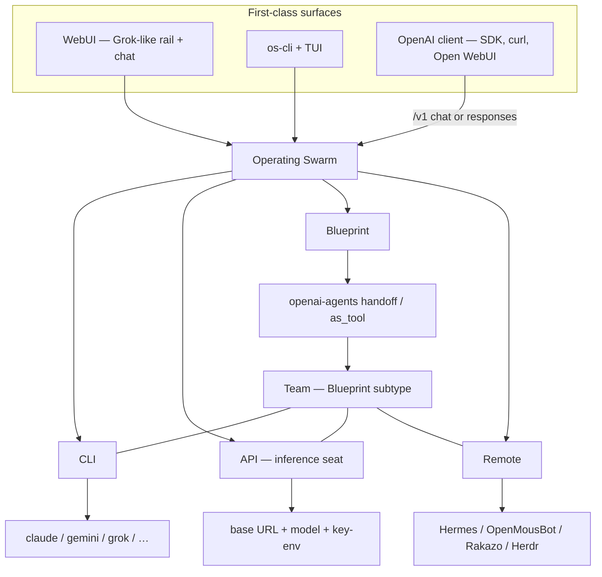

# Operating Swarm — Vision

> **One sentence:** Operating Swarm is a Grok-like WebUI and an OpenAI-compatible
> API that seats four kinds of agents — **CLI**, **API** (true inference),
> **Blueprint** (programmatic / openai-agents), and **Remote** (Hermes /
> OpenMousBot / Rakazo / Herdr) — and composes them with **handoff** and
> **agent-as-tool**. The same blueprint runs from `os-cli` and from
> `/v1/chat/completions`.

This document is the front door. It states where we are going, then gives an
**honest** account of what is true on `main` now. The root
[README](../README.md) **sells** this lock (WebUI-first, four kinds, Team =
Blueprint subtype — [#791](https://github.com/matthewhand/open-swarm/issues/791)
shape). For pattern mechanics with
sequence diagrams, see [ORCHESTRATION_PATTERNS.md](./ORCHESTRATION_PATTERNS.md).
For per-feature evidence see [FEATURE_STATUS.md](../FEATURE_STATUS.md); for the
nested checklist see [ROADMAP.md](../ROADMAP.md). Vocabulary:
[GLOSSARY.md](./GLOSSARY.md).

---

## The vision

The agent world is not one CLI and not one SDK. People already run **host
CLIs** (`claude`, `gemini`, `grok`, `codex`, …), **OpenAI-compatible
inference** (a base URL, a model, a key-env), **coded recipes** (handoff
graphs, MoA, custom Python), and **other harnesses** (Hermes, OpenMousBot,
Rakazo, Herdr, another Operating Swarm). Those seats do not share a chrome, and
they do not share a graph.

Operating Swarm closes that gap on three axes:

1. **Seat** — four user-facing kinds (Matthew lock): **CLI | API | Blueprint |
   Remote**. Each kind is a different *how this agent runs*, not a different
   product.
2. **Compose** — openai-agents **handoff / `as_tool`** so members can see and
   talk. A **Team** is that composition (a Blueprint subtype), not a fifth
   kind. Grok Bot / Rakazo / OpenMousBot can run many concurrent seats; they
   do not host this programmatic graph. **Support** can build that team from
   natural language (REQ-158); under the hood it is still a Python
   `ApiKindBase` class.
3. **Surface** — a **Grok-like WebUI** (rail, remotes, sessions) is
   first-class, and the same work is reachable as an OpenAI-compatible API
   (`/v1/chat/completions`, `/v1/responses`, `/v1/models`) and as `os-cli`.
   The CLI TUI (`os-cli tui`, [REQ-111](https://github.com/matthewhand/open-swarm/issues/481)
   / [ADR-012](./adr/012-swarm-cli-tui.md)) is another **client of that API**,
   not a second runtime and not Herdr’s SSH TUI.

The thesis: **you do not need one model, one CLI, or one harness to be best
at everything.** You need a cheap inference seat to triage, a strong CLI or
remote when the work is native to that tool, and a blueprint when the
topology must be enforced. Operating Swarm is the place that wires those together
without pretending they are the same kind.

Announce spiel (Grok-agnostic UI + remote harness bridge):
[ANNOUNCE.md](./ANNOUNCE.md) (REQ-136 / [#529](https://github.com/matthewhand/open-swarm/issues/529)).

---

## Kinds (Matthew lock)

| Kind | Meaning | What you create |
|---|---|---|
| **CLI** | Host executable (`grok`, `agy`, `claude`, `gemini`, …). Native session. | Name, command, optional folder. |
| **API** | **True inference seat** — OpenAI-compatible chat completions. Not a graph. | Name, base URL, model, key-env name (or an existing LLM profile). |
| **Blueprint** | **Programmatic recipe** — `BlueprintBase` / openai-agents handoffs, MoA, custom Python. May *use* inference underneath; the seat is the recipe. | Pick or write a recipe. Same id via CLI and API. |
| **Remote** | **Abstract harness.** Another agentic framework. Implementations: **Hermes**, **OpenMousBot**, **Rakazo**, **Herdr** (and nested Operating Swarm). Variants are adapters, not extra top-level kinds. | Kind + base URL (+ auth-env name). |

Kinds are **how a seat runs**. Strategies on a Blueprint (MoA, persona swarm,
`cli_fusion`, `sdlc_handoff`, …) are **not** new kinds. See
[ADR-006](./adr/006-api-vs-blueprint-kinds.md) and
[ADR-005](./adr/005-kind-bases.md). Remote as one interface:
[#680](https://github.com/matthewhand/open-swarm/issues/680).

### Honest mid-flight: stored `api` is still the leftover bucket

**Target** is the four-kind table above. **On `main` today** the user-facing
classifiers are still **API | CLI | Remote**. Stored `api` means “not CLI,
not remote”: coded blueprints, personality/swarm designs, and the Add-agent
“API” form (which writes a custom `BlueprintBase`) all classify as API.
There is **no** first-class “wire this OpenAI-compat endpoint” seat yet.

[#652](https://github.com/matthewhand/open-swarm/issues/652) / ADR-006:
**rename** those leftover `api` seats to `blueprint`, then **introduce** a
true `api` inference seat. Phase 0 (this ADR) is on tree; Phase 1 UI and
Phase 2 runtime are still open. Until they land, UI copy still says “API”
for recipes. Prefer the target names in **new** docs.

Add-agent tabs on `main` are still **CLI | API | Remote**
([#640](https://github.com/matthewhand/open-swarm/issues/640)). The fourth
tab is the #652 follow-through, not a fifth kind.

---

## Team is a Blueprint subtype

A **Team** is a roster plus openai-agents **handoff / agent-as-tool** so
CLI, API, Blueprint, and Remote members can see and talk. It is **not** a
fifth kind.

- Composition store: `team_rosters.json` / `GET /v1/team-rosters/` /
  `PATCH /v1/agent-team/`. Nested child roster is `kind=team` + `team_id`
  (a member row, still not a harness).
- Remotes join as placed members (`consult_hermes`, `consult_omb`,
  `consult_rakazo`, `consult_swarm`). Herdr is a Remote implementation, not
  a sibling of Remote.
- Django `/teams/` and `/v1/teams/` are **Profiles** (LLM-profile aliases
  via `DynamicTeamBlueprint`). Do not call those aliases a Team.

See [GLOSSARY.md](./GLOSSARY.md) and [TEAM_ISOLATION.md](./TEAM_ISOLATION.md).

---

## WebUI is first-class

The product chrome is a **Grok-like** left rail + the selected agent’s chat
(`/` and `/chat`): Search palette, favourite tiles, remotes, sessions,
Settings sheet. `/agents` is the Agent Router (own chrome). This is not an
afterthought to “wrap CLIs behind `/v1`.”

Operator dumps stay on Django trailing-slash routes (`/blueprint-library/`,
`/agent-creator/`, `/settings/`, `/sessions/`, `/teams/launch/`, …)
([ADR-001](./ADR-001-primary-ui.md)). Bare `/teams`, `/blueprints`,
`/settings`, `/agent-creator` redirect there. Do not remount deleted SPA
operator pages.

Honesty: Grok-Bot chrome is **partial** (session cookie for websocket; bearer
does not auth WS; anonymous sockets close **4401**). Screenshot recapture
and virtualized history are still open. Evidence:
[FEATURE_STATUS.md](../FEATURE_STATUS.md) §4–5.

---

## Differentiator

**openai-agents handoff / agent-as-tool**, and **the same blueprint via CLI
and API**.

| What others do | What Operating Swarm does |
|---|---|
| Grok Bot / Rakazo / OpenMousBot: many **concurrent seats** in one chrome | One programmatic **graph** (forced sequence, circular skeptic, as-tool specialists) **inside Blueprint seats** |
| CLI wrappers that only expose one binary | CLI is a kind; fusion/MoA patterns are blueprints you can also `curl` |
| “Teams” as a second product noun | Team = Blueprint composition, runnable as `os-cli launch …` or `model:` on `/v1/chat/completions` |

Limit (up front): the graph runs **inside Blueprint seats** (today’s leftover
`api` bucket). CLI and Remote stay **native sessions** — we do not inject
openai-agents into those harnesses. A cross-kind Team still works: a
Blueprint coordinator can sit with a Grok CLI and a Hermes Remote.

Worked graphs: [openai-agents-handoff-graphs](./examples/openai-agents-handoff-graphs/README.md)
(REQ-156). Kind templates: [ADR-005](./adr/005-kind-bases.md).

---

## What is built today

Status marks: ✅ working · 🟡 partial · 📋 planned. This is **not** a second
source of truth — rows point at [FEATURE_STATUS.md](../FEATURE_STATUS.md).
Published package cut is **0.5.4**; `main` is ahead. No hosted Fly / live
SaaS product is claimed here.

| Capability | Status | Notes |
|---|---|---|
| OpenAI-compatible API — `/v1/chat/completions` (+SSE), `/v1/models`, stateful `/v1/responses` | ✅ | Same `model` id as `os-cli launch` |
| Blueprint discovery + `BlueprintBase.run` + openai-agents SDK | ✅ | Handoff graphs: `sdlc_handoff` + tests |
| Kind-base stubs (`ApiKindBase` / `CliKindBase` / `RemoteKindBase`) | ✅ | Docs + Support prefer these; wizard still emits `BlueprintBase` |
| CLI kind — adapter, autodiscovery, auth probe, session resume | ✅ | `cli_agent` and the CLI-fusion / MoA family |
| CLI orchestration examples (`cli_fusion`, `cli_orchestrator`, `cli_map`, `cli_pipeline`, `cli_roundtable`, `cli_planner`) | ✅ | Patterns + [proofs](./proofs/); `cli_fusion` is also a MoA alias |
| Remote catalog (opt-in) — Hermes / OpenMousBot / Rakazo / Herdr / nested swarm | 🟡 | Hermes list/send ✅; OMB HTTP ✅; Rakazo list/send 🟡 (Better Auth via `RAKAZO_SESSION_COOKIE` / `RAKAZO_API_KEY` env); Herdr CLI ✅. Not a concurrent-seat clone. |
| Team roster + place remotes + isolation | 🟡 | `/v1/agent-team/`, `/v1/team-rosters/`; Django `/teams/` stays Profiles |
| WebUI — Grok-like SPA chrome + Django operator | 🟡 | First-class product; WS needs session cookie |
| Skills (`SKILL.md`) + inference profiles | ✅ | Discover `skills/**/SKILL.md`; attach via `skill` / `skills` on CLI and today's Blueprint-backed API seats; chat chips + popup. Not a kind. True inference-only API: N/A until ADR-006 Phase 2. [docs/SKILLS.md](./SKILLS.md) |
| Tool capabilities → MCP provider | 🟡 | Client works; `ENABLE_MCP_SERVER` is still a flag |
| Cross-conversation memory (mem0) | 🟡 | Wired, not validated against a live mem0 |
| True **API** inference seat (no `BlueprintBase`) | 📋 | ADR-006 Phase 2; today’s “API” tab writes a blueprint |
| Desktop zip (pywebview) | 📋 | [ADR-003](./adr/003-desktop-packaging.md) — no installer |
| `os-cli tui` (REQ-111 / #481) | 🟡 | [ADR-012](./adr/012-swarm-cli-tui.md). Interactive client of the same API. Landed: `--once` ASCII dump (CI), Textual rail with kind sections, Bearer REST + honest API-down, `GET /chat/thread/` hydrate, REST SSE send + streaming, composer, `n`/`s` sessions. Wave 3b (WS cookie jar) decided-skip — REST SSE covers the SPA-chat seats. Wave 4a documented interactive front door + 4b `/` rail search/filter. |
| Hosted Fly / public live demo | — | **Not claimed.** Deploy workflow exists; this doc does not sell a running cloud. |

### Proof the CLI path is real (not mocks)

Re-runnable transcripts under [`docs/proofs/`](./proofs/):

- **Cross-CLI consensus** — `gemini` + `claude` + `grok`, a `claude` judge, ~27 s. [`tri_cli_fusion_run.txt`](./proofs/tri_cli_fusion_run.txt)
- **Routing / escalation** — cheap router, panel only when high-stakes. [`orchestrator_escalation_run.txt`](./proofs/orchestrator_escalation_run.txt)
- **Tool calling** — `gemini` / `claude` read a real `pyproject.toml`. [`tool_calling_run.txt`](./proofs/tool_calling_run.txt)
- **Pipeline / roundtable / planner** — sequential, debate, Magentic-One-style ledger in the same proofs directory.

Those proofs show **CLI + Blueprint** orchestration. They do not prove a
hosted SaaS, a true API inference seat, or live remotes on this writer’s
network.

---

## What remains (honest)

- **#652 Phase 1/2** — Add-agent / rail / runtime split: leftover `api` →
  `blueprint`; new `api` = inference only. Do not close #652 from this
  docs PR.
- **#680** — Remote stays one kind; Hermes / OpenMousBot / Rakazo / Herdr
  implement [`RemoteHarness`](./adr/011-remote-harness.md) (ADR-011). Herdr is
  not a fifth kind.
- **README** — WebUI-first front door + `docs/DEVELOPER.md` is
  [#791](https://github.com/matthewhand/open-swarm/issues/791), not the old
  #466 rewrite (that cut already landed in
  [#785](https://github.com/matthewhand/open-swarm/pull/785)). This file
  leads; README sells.
- **SPA depth** — virtualized history ([ADR-004](./adr/004-virtualized-chat-history.md))
  planned; computer-control chrome is a stub ([ADR-007](./adr/007-local-computer-control.md));
  golden-journey screenshots on HOLD.
- **MCP server mode** (`ENABLE_MCP_SERVER`) — flag warns; blueprints are not
  MCP tools until the bridge is ported.
- **Memory** — mem0 opt-in, not live-validated; `langmem` / `papr` are
  placeholders.
- **Desktop** — ADR only; no installer.
- **CLI TUI (#481)** — Waves 0–3a landed: `os-cli tui` is an interactive
  rail + chat client of the same REST/SSE API (hydrate, send + stream,
  sessions); `--once` dump stays for CI. Wave 3b (cookie jar) decided-skip in
  [ADR-012](./adr/012-swarm-cli-tui.md). Not Herdr SSH.

Do not treat [ROADMAP.md](../ROADMAP.md) as rewritten here. Granular rows
stay on FEATURE_STATUS / ROADMAP.

---

## How the pieces fit

A Blueprint may *call* an API seat or a CLI underneath; the **seat kind**
stays Blueprint. Adding a CLI or a remote does not invent a new kind.

---

## Design principles

1. **Four kinds, named honestly.** CLI, API (inference), Blueprint
   (programmatic), Remote (abstract). Team is composition, not a kind.
2. **Same blueprint, two doors.** `os-cli launch <id>` and
   `model: "<id>"` on the OpenAI-compatible API are the same recipe.
3. **WebUI is a product, not a demo.** Grok-like chrome, remotes, and
   sessions are in scope; Django remains the operator dump.
4. **Credentials stay out of the repo.** CLI auth stays with the CLI.
   API / Remote records store **env-var names**, not secrets
   ([ADR-002](./adr/002-config-ownership.md)).
5. **Honest status.** Partial is marked partial; planned is marked planned;
   no Fly / live claims without a URL you can hit. Proofs are transcripts
   you can re-run.
6. **Graceful degradation.** A dead panelist or remote must not sink a
   round; failures are surfaced, not swallowed.

---

## See also

- [README.md](../README.md) — sells this lock (WebUI-first / #791 shape). This file leads.
- [GLOSSARY.md](./GLOSSARY.md) — kinds, Team vs Profiles, roles
- [ORCHESTRATION_PATTERNS.md](./ORCHESTRATION_PATTERNS.md) — sequence diagrams
- [CLI_FUSION.md](./CLI_FUSION.md) — CLI adapters and fusion examples
- [REMOTE_HARNESSES.md](./REMOTE_HARNESSES.md) — Hermes / OpenMousBot / Rakazo / nested swarm
- [HERDR.md](./HERDR.md) — Herdr as a Remote implementation
- [ADR-001](./ADR-001-primary-ui.md) — Django operator; SPA `/` + `/chat` (+ `/agents` router)
- [ADR-005](./adr/005-kind-bases.md) · [ADR-006](./adr/006-api-vs-blueprint-kinds.md) — kind bases; API ≠ Blueprint
- [AUTH.md](./AUTH.md) — Bearer vs session, WS 4401
- [ROADMAP.md](../ROADMAP.md) · [FEATURE_STATUS.md](../FEATURE_STATUS.md) — granular status
- [docs/archive/](./archive/) — superseded architectures, kept for the record
