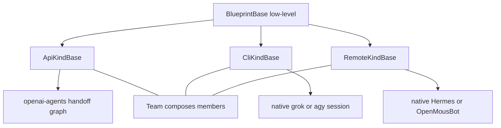

# ADR-005: Three kind bases (API / CLI / remote)

- **Status:** Accepted for docs + Support (2026-09-04)
- **Date:** 2026-09-04
- **Issue:** [#570](https://github.com/matthewhand/open-swarm/issues/570) (REQ-159)
- **Related:** [#564](https://github.com/matthewhand/open-swarm/issues/564) (REQ-156 openai-agents graphs), [#567](https://github.com/matthewhand/open-swarm/issues/567) (NL builders), [GLOSSARY](../GLOSSARY.md), [openai-agents-handoff-graphs](../examples/openai-agents-handoff-graphs/README.md)
- **Supersedes:** none. Complements [ADR-001](../ADR-001-primary-ui.md) (UI chrome) and [ADR-002](./002-config-ownership.md) (config SoT).

**Decision:** Bake **three first-class kind bases** as the templates Support
and NL builders subclass. `BlueprintBase` stays the low-level programmable
unit. Do **not** invent a fourth harness from the raw base in the common case.

Names (this ADR): `ApiKindBase`, `CliKindBase`, `RemoteKindBase` in
`swarm.core.kind_bases`.

No secrets. No Neon.

---

## Issue quote (REQ-159)

**Intent:** One mental model for humans and agents that generate workflows.

**Success (this Issue):**

1. ADR with diagram; today vs target templates.
2. Optional stubs: three documented bases under a stable import path (can be follow-up PR).
3. Support skill/instructions prefer the three kind bases.
4. Cross-link README/#564. Fixes this Issue.

**Constraints:** ADR look-only OK first. No secrets. No Neon.

---

## 1. Today (what the code does)

CLI / API / remote are **harness kinds** (roster `kind`, Support
`session_kind`, remotes catalog). They are **not** yet the class you
subclass.

| Surface | Evidence |
|---------|----------|
| Almost every blueprint | `class X(BlueprintBase)` under `src/swarm/blueprints/` |
| Support starter + coder | `blueprint_support.py` `STARTER_BLUEPRINT_PYTHON` / `BLUEPRINT_CODER_INSTRUCTIONS` teach raw `BlueprintBase` |
| Shared author brief | `swarm.core.blueprint_spec.BLUEPRINT_AGENT_BRIEF`: “Do not invent a different base class.” |
| Wizard / library / agent-creator codegen | Emit `BlueprintBase` (`swarm_cli.wizard_cmd`, `generate_blueprint_code`, `agent_creator_views`) |
| Discovery | `issubclass(..., BlueprintBase)` — kind bases work because they *are* `BlueprintBase` |

Honesty: `cli_agent` / `remote_harness` / `sdlc_handoff` already *behave* like
the three kinds, but they still inherit `BlueprintBase` directly.

---

## 2. Target

| Template | Kind | What it is for | Gets the programmatic graph? |
|----------|------|----------------|------------------------------|
| `ApiKindBase` | `api` | OpenAI-compatible / blueprints; handoff / as-tool graphs | **Yes — only this kind fully hosts them** |
| `CliKindBase` | `cli` | Discover/add CLI, native session, optional wrap | No — native CLI session |
| `RemoteKindBase` | `remote` | Consult Hermes / OpenMousBot / Herdr / … | No — native remote harness |

**Teams** compose members across kinds (REQ-156 Demo Bridge). Support NL
create (REQ-158 / #567) persists an `ApiKindBase` seat from plain language;
the user does not write that class unless they **View / edit code**. Support and NL
builders (#567) know `BlueprintBase` **and** the three kind bases; they
**default to a kind template**.

Support’s own seat may stay on `BlueprintBase` (product guide, not a generated
workflow). The **code it writes for users** subclasses a kind base.

---

## 3. Decision details

1. **Stable import:** `from swarm.core.kind_bases import ApiKindBase, CliKindBase, RemoteKindBase`.
2. **Stubs in this PR** stamp `kind` and hold the docstring contract. No new
   runtime graph engine here — that lives on API blueprints (`sdlc_handoff`).
3. **Discovery unchanged:** kind bases are `BlueprintBase` subclasses, so
   `discover_blueprints` keeps working.
4. **Creator validator** accepts a kind base **or** `BlueprintBase` so Support
   examples paste. Wizard / library emit paths stay `BlueprintBase` until a
   follow-up (listed below).
5. **No fourth harness** without a new ADR.

---

## 4. Follow-up (not this PR)

- Wizard, Blueprint Library `generate_blueprint_code`, and agent-creator
  templates emit `ApiKindBase` (or the matching kind) by default.
- Incremental migrate of in-tree recipes (`sdlc_handoff` → `ApiKindBase`,
  `cli_*` → `CliKindBase`, `remote_harness` → `RemoteKindBase`).
- NL builder (#567) consumes the same brief.

> **Addendum (2026-09-14, REQ-851 / #203):** §4 landed. Emitters share
> `base_class_for_kind()` in `swarm.core.kind_bases` and default to a kind
> base; the listed in-tree recipes were migrated (API seats with custom
> non-graph `run()` overrides deferred). Discovery unchanged.

---

## 5. Rejected alternatives

| Option | Why not |
|--------|---------|
| Keep teaching only `BlueprintBase` | Support invents a fourth harness; kinds stay folklore |
| Four+ bases (MoA, hybrid, …) | Those are strategies on top of a kind, not new harnesses |
| Force-migrate every in-tree blueprint now | Out of scope; ADR + Support + stubs are enough to `Fixes` #570 |

---

## 6. Cross-links

- [docs/DEVELOPER.md — Why openai-agents](../DEVELOPER.md#why-openai-agents-and-four-kinds) (REQ-156 / #564; mermaid parked off the README in #791); four user-facing kinds: [ADR-006](./006-api-vs-blueprint-kinds.md)
- [openai-agents-handoff-graphs](../examples/openai-agents-handoff-graphs/README.md)
- [GLOSSARY — Harness type / Kind base](../GLOSSARY.md)
