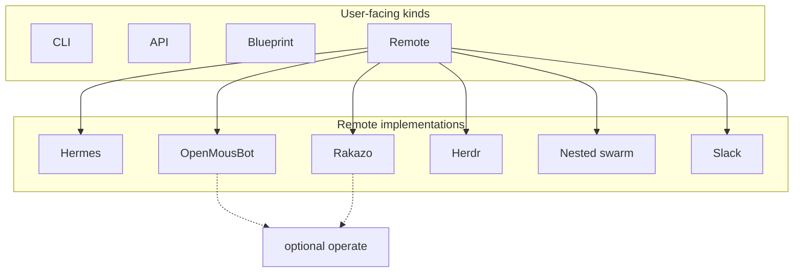

# ADR-011: Remote is an abstract harness spec

- **Status:** Accepted for protocol + catalog (2026-09-06)
- **Date:** 2026-09-06
- **Issue:** [#680](https://github.com/matthewhand/open-swarm/issues/680) (REQ-203)
- **Related:** [#652](https://github.com/matthewhand/open-swarm/issues/652) / [ADR-006](./006-api-vs-blueprint-kinds.md) (four user-facing kinds), [#570](https://github.com/matthewhand/open-swarm/issues/570) / [ADR-005](./005-kind-bases.md) (`RemoteKindBase`), [#463](https://github.com/matthewhand/open-swarm/issues/463) (Herdr SSH), [#645](https://github.com/matthewhand/open-swarm/issues/645) / [ADR-007](./007-local-computer-control.md) (computer operate)
- **Amends:** ADR-006 — Remote stays one of four kinds; variants are plugins, not extra kinds. ADR-005 — `RemoteKindBase` is the Blueprint template; this ADR names the **runtime** harness contract those remotes implement.
- **Supersedes:** none.

**Decision:** **Remote** is an abstract harness interface (`RemoteHarness`). Hermes, OpenMousBot, Rakazo, Herdr, and nested open-swarm **implement** it. Four user-facing kinds remain **CLI | API | Blueprint | Remote**. Herdr is a Remote implementation, not a fifth kind.

Live verbs today: **health / list / send**. Computer-control remotes (OMB, Rakazo) expose optional **operate** as a capability; the verbs stay stubs until ADR-007 Phase 3. Herdr transport is CLI locally and SSH remotely — not HTTP like the others.

No secrets. No Neon. No live `:8001`.

---

## Issue quote (REQ-203)

**Intent:** One Remote contract (place/list/send/status/… + optional computer) so new harnesses plug in without new top-level kinds; Herdr stays Remote, not a sibling of Remote.

Concrete remotes implement it:

| Implementation | Notes |
|----------------|--------|
| **Hermes** | HTTP remote harness |
| **OpenMousBot (OMB)** | HTTP + computer-control affordances |
| **Rakazo** | HTTP + Docker sandbox computer path |
| **Herdr** | CLI / `herdr --remote`, SSH-shaped ([#463](https://github.com/matthewhand/open-swarm/issues/463)) — still a Remote impl |
| **Nested open-swarm** | Network remote (own process/DB) |
| **Slack (NemoHermes)** | Slack Web API; channel threads as sessions (`channel_id:thread_ts`). Opt-in. |

---

## 1. Today (before this ADR)

`swarm.core.remotes` already health-probes and `operate`s list/send per impl via private `_hermes_*` / `_omb_*` / `_rakazo_*` / `_herdr_*` / `_swarm_*` functions. There was **no typed protocol**. Settings catalog `{id, label}` was the impl picker. Classifiers treated bare `herdr` as leftover **API**. Add-agent Remote tab offered OpenMousBot vs “Generic Remote Agent” and labelled the tab `Remote (OpenMousBot)`.

Roster rows may still store `kind=herdr` as an **impl discriminator**. That is not a user-facing harness kind.

---

## 2. Target

| Surface | Contract |
|---------|----------|
| User-facing kind | Always `remote` |
| Impl discriminator | `hermes` \| `omb` \| `rakazo` \| `herdr` \| `swarm` \| `slack` |
| Protocol | `swarm.core.remote_harness.RemoteHarness` |
| Required verbs | `health`, `list`, `send` |
| Optional operate | Computer-control (OMB / Rakazo). Stubbed: `computer-status` / `computer-screenshot` return `gap=computer_operate_unwired` |
| Herdr extra | `interrogate` over local CLI or SSH. Transport `cli` (SSH hop when `herdr_mode=ssh`) |

Stable import: `from swarm.core.remote_harness import RemoteHarness, implementation_catalog, is_remote_impl_id`.

Existing `check_health` / `operate` stay the public I/O. Thin `BoundRemoteHarness` wrappers bind the current adapters. Do not break persist, opt-in catalog, or HTTP/SSH paths.

---

## 3. Classifier lock

`classify_agent_kind` / `classifyAgentKind` / `AGENT_TYPES` stay **api | cli | remote**. No `herdr` fifth type.

| Input | Result |
|-------|--------|
| explicit `herdr` / `hermes` / `omb` / `rakazo` | `remote` |
| `herdr:w3:p1` | `remote` |
| stored design kind `swarm` | **api** (persona/swarm recipe — not the nested remote) |
| remotes catalog id `swarm` / alias `open-swarm` | Remote **impl**, not a classifier fifth kind |

`agent_type_for_kind("herdr")` → `remote`.

---

## 4. UI

| Surface | Rule |
|---------|------|
| Add-agent tabs | Still CLI \| API \| Remote (Blueprint tab is ADR-006 Phase 1). Remote **type** lists impls. No Herdr tab. |
| Settings → Remotes | `kinds[].id` = impl; `kinds[].kind` = `remote`. |
| Shared chrome | Treat remotes uniformly. Impl-specific panes only where capabilities mark it (Herdr SSH, later computer). |

OpenMousBot product name stays **OpenMousBot** (id `omb`). Never “OMB” in UI copy.

---

## 5. Rejected alternatives

| Option | Why not |
|--------|---------|
| Fifth user-facing kind `herdr` | Issue lock: Herdr implements Remote. |
| One HTTP shape for every remote | Herdr is CLI/SSH. Lie if we pretend otherwise. |
| Wire OMB/Rakazo computer HTTP now | ADR-007 Phase 3. This ADR only **exposes** optional operate. |
| Rename stored roster `kind=herdr` in this PR | Impl discriminator; mailbox/rail already key on it. Classifiers map it to Remote. |

---

## 6. Cross-links

- [REMOTE_HARNESSES.md](../REMOTE_HARNESSES.md) — implementation table
- [ADR-006](./006-api-vs-blueprint-kinds.md) — four kinds
- [ADR-007](./007-local-computer-control.md) — computer operate later
- [HERDR.md](../HERDR.md) — SSH-shaped hop
- [GLOSSARY](../GLOSSARY.md) — harness kind / Herdr member
- [REQ-814](../requirements/REQ-814.md) — Slack (NemoHermes) threads as sessions

---

## 7. Amendment: Slack (NemoHermes) threads as sessions

**Issue:** [open-swarm-private#97](https://github.com/matthewhand/open-swarm-private/issues/97) (REQ-814).

Slack is a **Remote implementation**, not a fifth kind and not a Hermes `channel=` flag.

| Question | Decision |
|----------|----------|
| New `impl` id vs Hermes `channel=slack` | New catalog id **`slack`**. Hermes HTTP (`/health`, `/v1/models`, `/api/sessions`, `/v1/runs`) is a different transport from Slack Web API (Socket Mode bot + app tokens on the NemoHermes gateway). Mixing them would lie about health/list/send. |
| Slack APIs vs Hermes gateway APIs | Talk to **Slack Web API** directly (`auth.test`, `conversations.list` / `history` / `replies`, `chat.postMessage`). Do not clone NemoHermes source. NemoHermes is the bot in the thread; Open Swarm is another Web API client. |
| Session id | `{channel_id}:{thread_ts}` (e.g. `C0123456789:1712345678.123456`). Reuses `RemoteSession.channel` / `thread_ts` and `sanitize_cli_session_id`. |
| New RemoteHarness verbs? | **No.** `health` / `list` / `send` already cover it. `capabilities.sessions=True`. The published SDK protocol already lists Slack threads as sessions; no private-only protocol change. |
| Blueprint | In-tree adapter in `swarm.core.remotes` + `BoundRemoteHarness`, same as AnythingLLM. `RemoteKindBase` stays the Blueprint template; `remote_harness` operates via `remotes.operate`. Not a plugin package. |

Opt-in catalog (REQ-59). Secrets as env-var **names** only (`SLACK_BOT_TOKEN`). Send never mints a new thread (`gap=slack_thread_required`). Four kinds stay CLI \| API \| Blueprint \| Remote.
