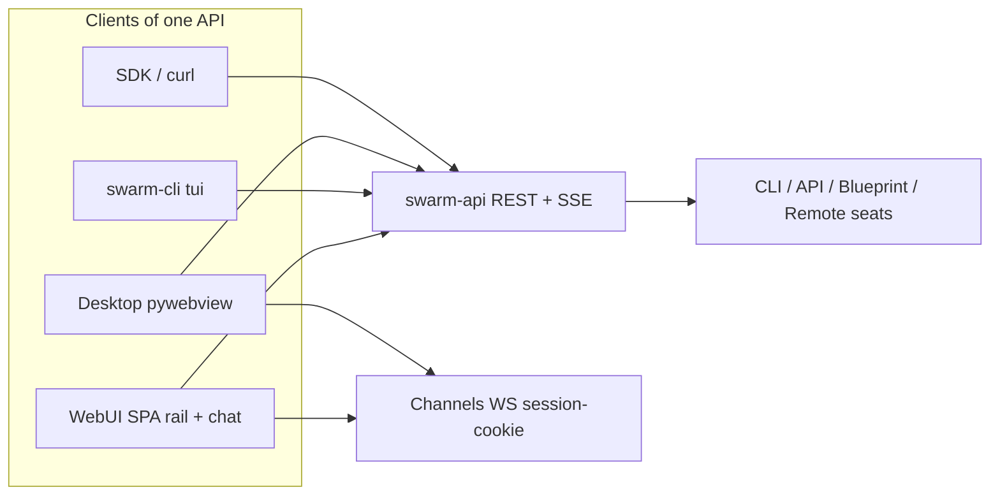

# ADR-012: swarm-cli TUI — Herdr-like rail + chat over the same API as WebUI

- **Status:** Accepted for Wave 0 (docs + thinnest scaffold; no feature parity)
- **Date:** 2026-09-06
- **Issue:** [#481](https://github.com/matthewhand/open-swarm/issues/481) (REQ-111) — Wave 0
- **Related:** Herdr remotes [#463](https://github.com/matthewhand/open-swarm/issues/463) / [HERDR.md](../HERDR.md), README direction [#466](https://github.com/matthewhand/open-swarm/issues/466), session picker [#468](https://github.com/matthewhand/open-swarm/issues/468) / [#469](https://github.com/matthewhand/open-swarm/issues/469), desktop [#554](https://github.com/matthewhand/open-swarm/issues/554) / [ADR-003](./003-desktop-packaging.md), GIF [#529](https://github.com/matthewhand/open-swarm/issues/529) / [#456](https://github.com/matthewhand/open-swarm/issues/456), ADR-011 collision renumbering [#888](https://github.com/matthewhand/open-swarm/issues/888)
- **Supersedes:** none. Complements [ADR-001](../ADR-001-primary-ui.md) (SPA chrome) and ADR-003 (desktop is another client of the same API).
- **Does not close the programme MVP.** Child Issues own Waves 1–N. This ADR + scaffold close **Wave 0 only**.

**Decision:** Terminal users get the same **agent-centric chat product** as the SPA: a **left agent rail** and a **main chat pane**, driven by the existing Open Swarm HTTP REST (+ SSE) API. Do **not** reimplement the agent runtime inside the TUI process. Do **not** SSH into Herdr or embed Herdr’s own TUI.

Wave 0 ships the ADR, a `swarm-cli tui` stub that lists rail seats via the live API and paints a placeholder chat pane, plus child Issues for implementer waves (max 2–3 per wave).

No secrets. No Neon. No live `:8001` / FF host.

---

## Issue quote (REQ-111)

**Intent:** Terminal users get the same agent-centric chat product as the SPA, driven by the existing Open Swarm API, not a parallel blueprint-only mental model.

**Success (programme — child Issues slice):**

1. **TUI chrome (Herdr-inspired):** Left pane = agent/team/remote list; main pane = active session transcript + composer. Keyboard-first (`j`/`k` or arrows, Enter to select, `n` new session later).
2. **API-backed v1:** Existing REST (+ WS if already used by SPA) against a running `swarm-api` — same auth token / base URL as WebUI. No in-process agent runtime for v1.
3. **Parity slice (mvp):** List agents, select one, load/send messages on that agent’s active session, see streaming or polled replies honestly. `swarm-cli launch` / `install` remain as subcommands.
4. **Honest degrade:** API down → clear error; no fake local agents.
5. **Docs:** README / Vision one-liner: CLI TUI is a client of the API (link this Issue).
6. **Delivery process:** Phase 0 look-only + scaffold; Phase 1–N max 2–3 implementers per wave; own-diff CI; golden-journey HOLD (#446) ignored.

**Constraints:** Do not replace `swarm-cli launch` overnight. Distinct from remote Herdr management (SSH-shaped). Stack choice in Phase 0. No secrets. No Neon.

**Owner:** Open Swarm (CoS) coordinates Cursor team; engineer seats on child Issues; Matthew signs off MVP in terminal.

---

## 1. Today (what the code does)

| Surface | Evidence |
|---------|----------|
| `swarm-cli` | Typer app `swarm.core.swarm_cli:app` — `launch`, `install`, `remotes`, `cli-agents`, `wizard`, … **No interactive agent rail.** Historical front door is blueprint execution. |
| SPA chrome | `AgentSidebar` + `ChatPage`: left rail + selected agent’s chat ([ADR-001](../ADR-001-primary-ui.md)). |
| Rail seats | `GET /v1/blueprints/` (`rail: true` / kind `cli`\|`api`\|`herdr`), `GET /v1/cli-agents/` `.rail`, `GET /v1/remotes/` `.configured`, `GET /v1/team-rosters/`, `GET /v1/herdr-agents/`. Default-deny catalog ([REQ-170](../requirements/REQ-170.md)). |
| Chat send (SPA) | Django Channels `ws://<host>/ws/ai-demo/<conversation_id>/` — **session cookie only**. Bearer does **not** auth WS ([AUTH.md](../AUTH.md); anonymous close **4401**). |
| Chat hydrate (SPA) | `GET /chat/thread/` (JSON-first / DB backfill). |
| Chat send (API clients) | `POST /v1/chat/completions` (+ SSE). Bearer or session. |
| Herdr | Member `kind=herdr`. Local = this host’s `herdr` CLI; remote = **SSH-shaped** ([HERDR.md](../HERDR.md)). Open Swarm does **not** own Herdr’s TUI. |
| Desktop | Another **pane of glass** over the same API ([ADR-003](./003-desktop-packaging.md)). Not this TUI. |

Honesty: `swarm-cli launch <blueprint>` still runs a recipe **in-process**. That is a different door. The TUI must not become a second runtime.

---

## 2. Target (product shape)

| Pane | Wave 0 | MVP (children) |
|------|--------|----------------|
| **Left rail** | List seats from the same REST the SPA uses; dump ASCII | Textual list: `j`/`k`, Enter, kind sections, search later |
| **Main pane** | Placeholder copy (“Wave 1 loads/sends”) | Hydrate `GET /chat/thread/`; composer; stream replies |
| **Runtime** | None in-process | None in-process |
| **`launch` / `install`** | Unchanged | Stay as subcommands; TUI becomes the documented *interactive* front door |

This TUI is **open-swarm’s own client**. It is not:

- Herdr’s pane TUI (agy / pi / grok inside Herdr)
- `swarm-cli remotes operate herdr` (SSH hop)
- Desktop packaging (ADR-003)

Herdr patterns worth **copying visually** (look-only; screenshots / product feel, not a Python import of Herdr):

- Left column of named agents, one selected
- Main column is the conversation with that agent
- Keyboard-first navigation

Do **not** import `herdr` as a UI library. Cloud CI must still mock `herdr` ([HERDR.md](../HERDR.md)).

---

## 3. API map the TUI needs

Same host and token as WebUI (`SWARM_API_BASE`, `API_AUTH_TOKEN` / `SWARM_API_KEY`). Default base is **`http://127.0.0.1:8000`** (compose / `swarm-api` default). Do **not** hardcode `:8001` (oracle / FF host).

| Need | SPA today | TUI v1 |
|------|-----------|--------|
| List rail seats | `GET /v1/blueprints/` + `GET /v1/cli-agents/` + `GET /v1/remotes/` + `GET /v1/team-rosters/` + `GET /v1/herdr-agents/` | Wave 0: blueprints (rail filter) + cli-agents `.rail` + remotes `.configured`. Wave 1 adds teams + Herdr members. |
| Auth REST | `Authorization: Bearer` and/or session cookie | Bearer from env var **name** resolved at runtime. Never persist a raw key. |
| Hydrate transcript | `GET /chat/thread/?…` | Wave 2. Same query the SPA uses. |
| Send + stream | WS `/ws/ai-demo/<id>/` (cookie) **or** `POST /v1/chat/completions` SSE | **Wave 2 sends via REST SSE + Bearer.** WS needs a Django session; that is a later child (login / cookie jar), not v1. |
| New session | `n` / session picker (#469) | Wave 3. |

**Honest degrade:** transport error or non-2xx on the required list call → exit non-zero with `API unreachable at {base}` (or the HTTP status). Empty rail is allowed (opt-in catalogs). Inventing “demo” agents is forbidden.

---

## 4. Stack recommendation (one pick)

| Option | Pros | Cons |
|--------|------|------|
| **Textual** (Python) | Same language as `swarm-cli`; Rich ecosystem already in-tree; `App.run_test()` without a TTY; optional extra so core install stays thin | New optional dep in Wave 1 |
| Bubble Tea (Go) | Excellent TUIs | Second language + second binary; fights `swarm-cli` entry |
| Embed / wrap Herdr TUI | Familiar chrome | Wrong product; SSH-shaped remotes; CI must not talk to a live Herdr TUI |
| Raw `curses` / Rich Live only | No new dep | We would rebuild widgets Textual already has |

**Pick: Textual** as the Wave 1+ interactive toolkit, declared as an optional extra (`[tui]`) when Wave 1 lands. Wave 0 **does not** add that dependency — the scaffold is a `--once` ASCII dump so CI stays lockfile-stable and TTY-free.

Rejected: baking Go, or treating Herdr as the TUI host.

---

## 5. Wave 0 scaffold (this PR)

Stable import: `from swarm.tui import list_rail_agents, render_scaffold`.

| Piece | Path | Behaviour |
|-------|------|-----------|
| HTTP client | `swarm.tui.client` | `httpx` GET the three list endpoints; rail filter matches `webui/frontend/src/lib/railSeats.ts` |
| ASCII chrome | `swarm.tui.layout` | Left rail + placeholder chat pane |
| CLI | `swarm-cli tui --once` | Default for Wave 0. `--base-url`, `--agent`, `--json` |
| Dual entry | `launch` / `install` | Untouched |

---

## 6. Child Issues (Waves 1–N)

GitHub Issues remain SoT. Each child `Fixes` **itself**. Max **2–3** implementers per wave; squash before the next wave. Own-diff CI only. No Neon. No secrets. No `:8001`.

Filed from this Wave 0 (PR #873). Each child `Fixes` itself:

| Wave | Issue | Title |
|------|-------|-------|
| 1 | [#874](https://github.com/matthewhand/open-swarm/issues/874) | W1a Textual chrome |
| 1 | [#875](https://github.com/matthewhand/open-swarm/issues/875) | W1b Rail list parity |
| 1 | [#876](https://github.com/matthewhand/open-swarm/issues/876) | W1c Auth + honest API-down |
| 2 | [#877](https://github.com/matthewhand/open-swarm/issues/877) | W2a Hydrate `/chat/thread/` |
| 2 | [#878](https://github.com/matthewhand/open-swarm/issues/878) | W2b REST SSE send |
| 2 | [#879](https://github.com/matthewhand/open-swarm/issues/879) | W2c Composer + stream display |
| 3 | [#880](https://github.com/matthewhand/open-swarm/issues/880) | W3a New session + list |
| 3 | [#881](https://github.com/matthewhand/open-swarm/issues/881) | W3b Optional WS cookie path |
| 4 | [#882](https://github.com/matthewhand/open-swarm/issues/882) | W4a Docs front door |
| 4 | [#883](https://github.com/matthewhand/open-swarm/issues/883) | W4b Rail search / filter |

### Wave 1 — chrome + honest list (3)

**W1a — Textual chrome: rail + pane + j/k/Enter**

- **Intent:** Interactive Herdr-like layout without chat send.
- **Success:** Optional `[tui]` extra; `swarm-cli tui` opens Textual app; left list + main placeholder; `j`/`k`/arrows move, Enter selects, `q` quits; `--once` still dumps ASCII for CI.
- **Constraints:** No runtime. No Herdr SSH. No Neon. No secrets.
- **Owner:** Cursor implementer (1).

**W1b — Rail list parity with the SPA**

- **Intent:** Same seats as `AgentSidebar`, same default-deny catalog.
- **Success:** Merge `blueprints` (rail filter) + `cli-agents.rail` + `remotes.configured` + `team-rosters` + `herdr-agents`; kind sections CLI / API / Blueprint / Remote; dedupe by id; empty catalogs stay empty.
- **Constraints:** Do not list `GET /v1/blueprints/` recipes unless `rail: true` (or kind `cli`/`api`/`herdr`). No `:8001`. Mock HTTP in tests.
- **Owner:** Cursor implementer (1).

**W1c — Auth + honest API-down**

- **Intent:** Same token / base URL contract as WebUI REST.
- **Success:** `SWARM_API_BASE` + `API_AUTH_TOKEN` / `SWARM_API_KEY`; 401/403 named; connection failure named; zero invented agents.
- **Constraints:** Env-var **names** only in docs. No cookie jar yet. No Neon.
- **Owner:** Cursor implementer (1).

### Wave 2 — load / send (3)

**W2a — Hydrate transcript via `GET /chat/thread/`**

- **Intent:** Selecting a rail seat shows that agent’s real thread, not a blank lie.
- **Success:** Same hydrate path as SPA (REQ-171A-4). REST failure → explicit error, keep any non-empty cache; first miss is an error state.
- **Constraints:** Coordinate #604. No fail-open empty. No Neon.
- **Owner:** Cursor implementer (1).

**W2b — Send + stream via REST SSE (`/v1/chat/completions`)**

- **Intent:** v1 send uses Bearer like every other API client.
- **Success:** Composer send posts completions with `model` / agent id the SPA would use; SSE chunks render; API down is honest.
- **Constraints:** Do **not** require WS session cookie for v1. WS login/cookie-jar is Wave 3/4. No in-process blueprint `run()`.
- **Owner:** Cursor implementer (1).

**W2c — Composer + streaming display**

- **Intent:** Main pane is a real transcript + input, still keyboard-first.
- **Success:** Type, Enter to send, visible user echo + streaming assistant; no fake local tokens.
- **Constraints:** No feature parity with SPA (no plugins, speech, mailbox UI). Own-diff tests with mocked SSE.
- **Owner:** Cursor implementer (1).

### Wave 3 — sessions (2)

**W3a — New session (`n`) + session list**

- **Intent:** Match SPA “select / new session” (#469 / REQ-105) for the TUI.
- **Success:** `n` starts a new conversation id; list existing sessions for the selected agent; resume loads that thread.
- **Constraints:** Coordinate #468/#469. CLI-native resume stays REQ-52 — do not conflate.
- **Owner:** Cursor implementer (1).

**W3b — Optional WS path (session cookie)**

- **Intent:** Only if REST SSE is insufficient for a seat the SPA can chat with.
- **Success:** Documented login / cookie-jar; WS 4401 is an honest error; bearer still never “auth” WS.
- **Constraints:** Do not weaken AUTH.md. Skip this child if Wave 2 SSE covers MVP seats.
- **Owner:** Cursor implementer (1).

**Outcome (Wave 3 — skipped by its own gate):** Waves 2b/2c already send and stream over REST SSE (`POST /v1/chat/completions`, Bearer) for every seat the SPA chats with over WS — Blueprint CLI/API seats are Bearer-REST sendable in the TUI, so the “only if REST SSE is insufficient” condition never fired. No login / cookie-jar is added to TUI v1: `GET /chat/thread/` hydrate failures on a Bearer-only shell stay a named, honest login-gated error, and AUTH.md (Bearer REST vs session WS) is untouched. WS 4401 handling for a TUI client would be an additive later child if a seat ever requires the websocket path.

### Wave 4 — docs + polish (2)

**W4a — TUI as documented interactive front door**

- **Intent:** Dual entry until docs say TUI is the primary *interactive* path; `launch` remains.
- **Success:** README / USERGUIDE / VISION one-liners; GIF later (#456 / #529) can cover TUI.
- **Constraints:** Do not delete `launch`. No live `:8001` screenshots from CI.
- **Owner:** Cursor implementer (1).

**W4b — Rail search / filter**

- **Intent:** `/` or typeahead filter like SPA Search (later-OK in the umbrella).
- **Success:** Filter rail by name; Esc clears; empty filter shows full list.
- **Constraints:** No new API. Mock-only tests.
- **Owner:** Cursor implementer (1).

**Outcome (Wave 4 — landed):** `/` opens a live name/id filter over the rail — typing narrows (case-insensitive substring on seat name or id, section headers pruned when their seats drop out), backspace edits, `Enter` picks the highlighted filtered seat (the filter closes and the full rail returns), and `Esc` clears + restores the whole list. While the filter is open the chat chords (`j`/`k`/`n`/`s`/`q`) type into the query instead of firing; arrows and `Enter` still move and select. Purely local — no new API, headless-mock tests only.

---

## 7. Rejected alternatives

| Option | Why not |
|--------|---------|
| In-process `BlueprintBase.run` inside the TUI | Second runtime; drifts from WebUI |
| Wrap Herdr’s TUI / SSH to a Herdr host | Different product; REQ-100 already owns that hop |
| Go / Bubble Tea binary | Splits `swarm-cli`; Wave 0 must stay in this repo |
| Textual as a hard core dep in Wave 0 | Lockfile + install cost before interactivity exists |
| Close #481 as full MVP from this PR | Success 1–4 are not landed. Wave 0 only. |

---

## 8. Cross-links

- [AUTH.md](../AUTH.md) — Bearer REST vs session WS
- [HERDR.md](../HERDR.md) — SSH-shaped remotes; not this TUI
- [VISION.md](../VISION.md) — TUI is a client of the API
- [FEATURE_STATUS.md](../../FEATURE_STATUS.md) §2 CLI
- [websocket_chat.md](../websocket_chat.md)
