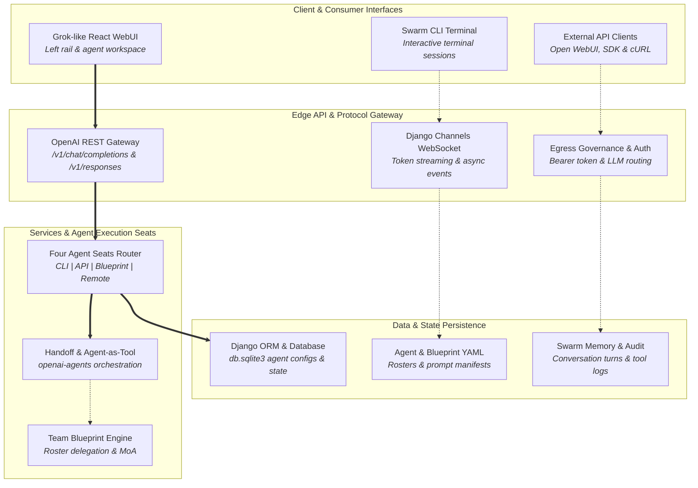
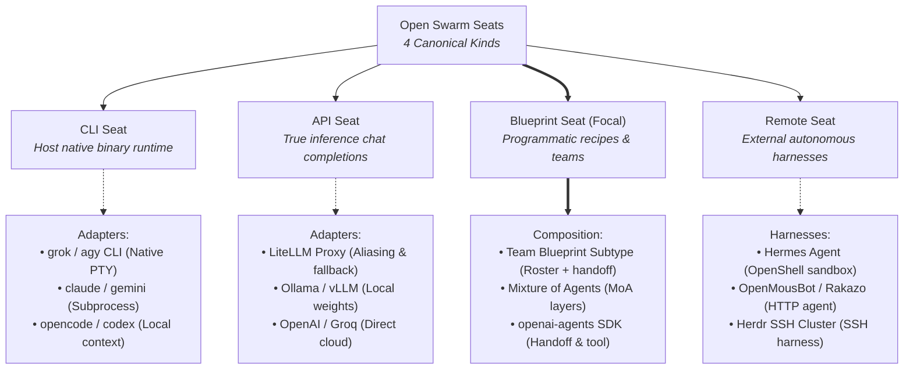
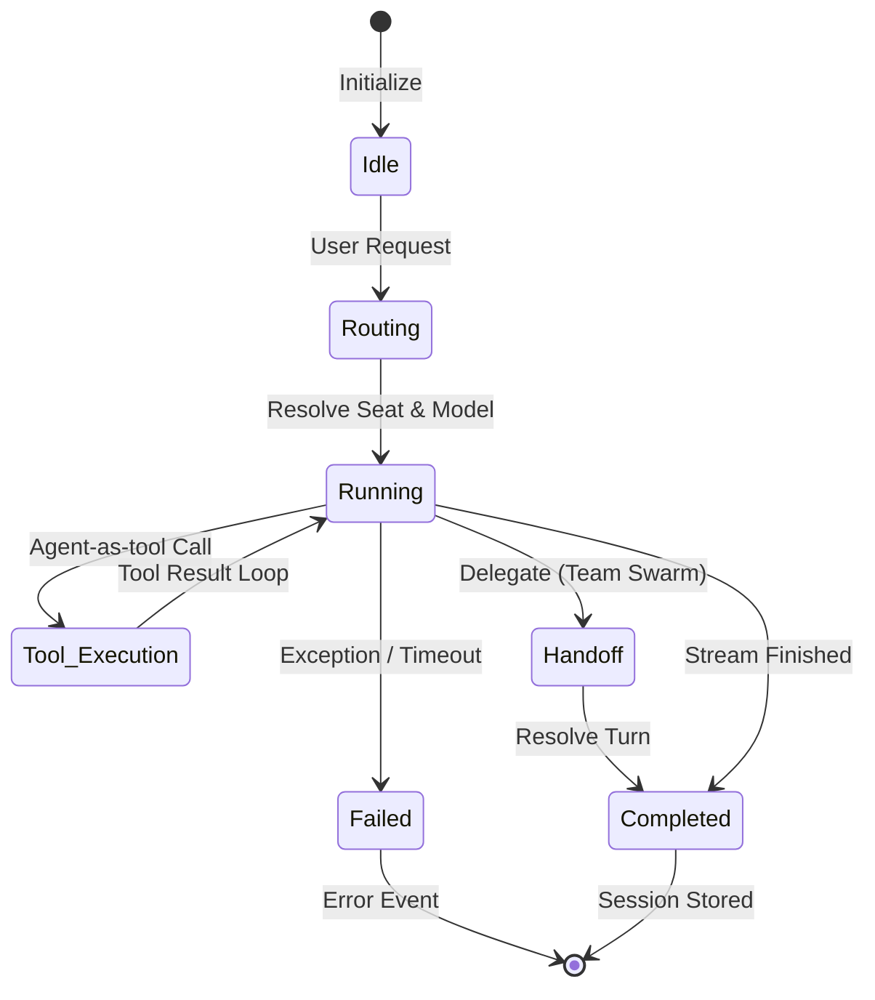
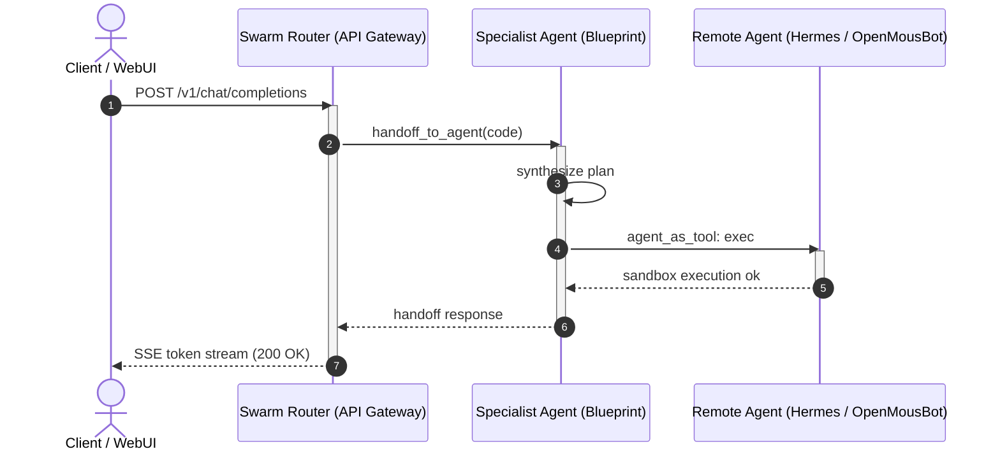
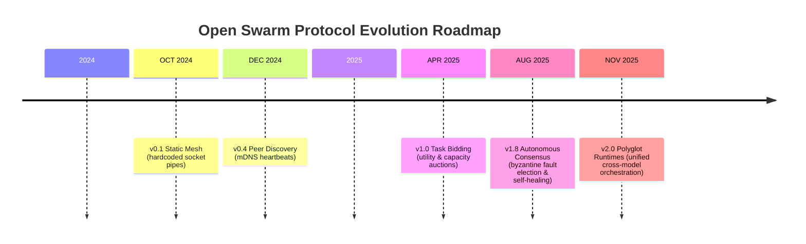

# Open Swarm Visual Architecture Diagrams

This directory contains visual architecture diagrams for the Open Swarm platform. Each diagram is available as both an interactive, typography-tuned standalone HTML/SVG document and an inlined GitHub-rendered Mermaid diagram below.

## Index of Diagrams

| Diagram | Type | Standalone Interactive Document |
|---|---|---|
| **High-Level Architecture Stack** | Layered System Flow | [architecture-diagram.html](./architecture-diagram.html) |
| **Four Agent Seats Architecture** | Taxonomy Tree | [agent-taxonomy-tree-diagram.html](./agent-taxonomy-tree-diagram.html) |
| **Agent Execution Lifecycle** | State Machine | [agent-lifecycle-state-diagram.html](./agent-lifecycle-state-diagram.html) |
| **Multi-Agent Handoff & Delegation** | Sequence Flow | [handoff-sequence-diagram.html](./handoff-sequence-diagram.html) |
| **Protocol Evolution Roadmap** | Milestone Timeline | [protocol-evolution-timeline-diagram.html](./protocol-evolution-timeline-diagram.html) |

---

## 1. High-Level Architecture Stack

Overview of client interfaces, edge API gateway, four agent execution seats, and persistence layers.

*Interactive Standalone:* [architecture-diagram.html](./architecture-diagram.html)

---

## 2. Four Agent Seats Architecture (Taxonomy)

Decomposition of Open Swarm's canonical execution seats (CLI, API, Blueprint, and Remote) and concrete adapter targets.

*Interactive Standalone:* [agent-taxonomy-tree-diagram.html](./agent-taxonomy-tree-diagram.html)

---

## 3. Agent Execution Lifecycle

State machine detailing agent turn progression from `Idle` through `Routing`, `Running`, `Tool Execution`, and `Handoff` to final resolution.

*Interactive Standalone:* [agent-lifecycle-state-diagram.html](./agent-lifecycle-state-diagram.html)

---

## 4. Multi-Agent Handoff & Delegation Flow

End-to-end request sequence showing an edge request handed off from the orchestrator to a specialist blueprint, invoking a remote containerized agent as a tool, and streaming response tokens back.

*Interactive Standalone:* [handoff-sequence-diagram.html](./handoff-sequence-diagram.html)

---

## 5. Autonomous Coordination Protocol Roadmap

Timeline of Open Swarm protocol evolution from early static socket meshes through decentralized discovery, task bidding auctions, and polyglot runtimes.

*Interactive Standalone:* [protocol-evolution-timeline-diagram.html](./protocol-evolution-timeline-diagram.html)

