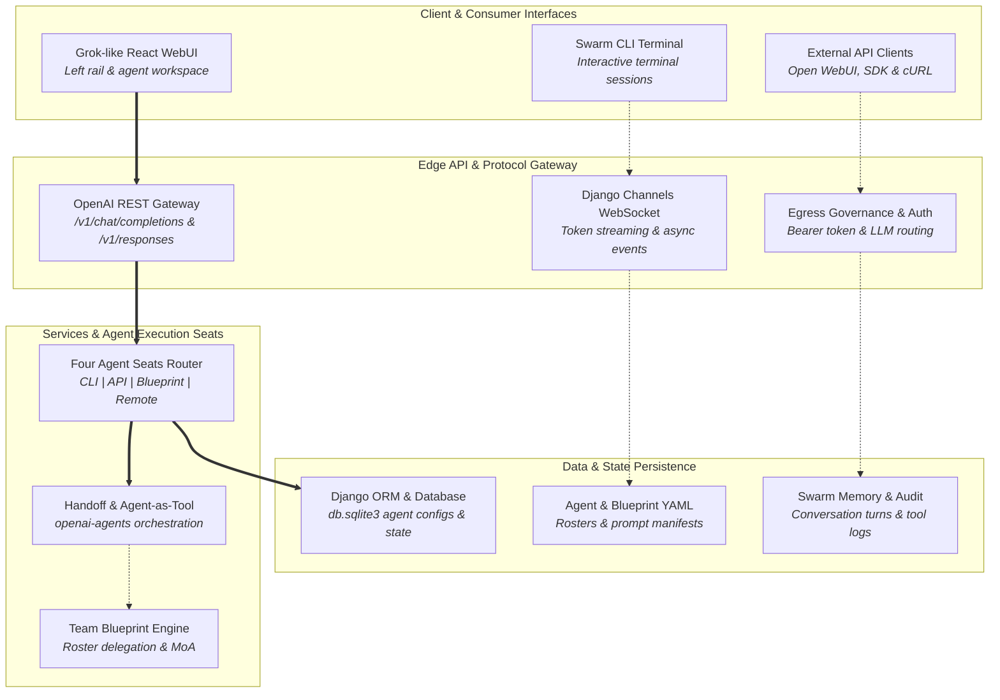
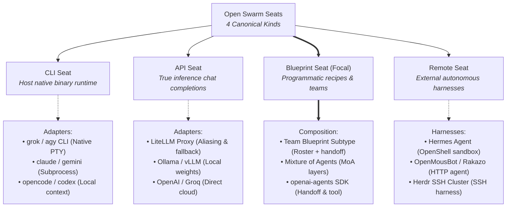
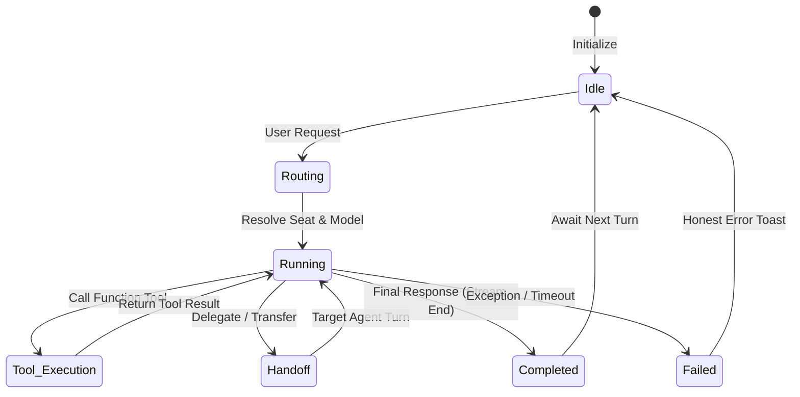
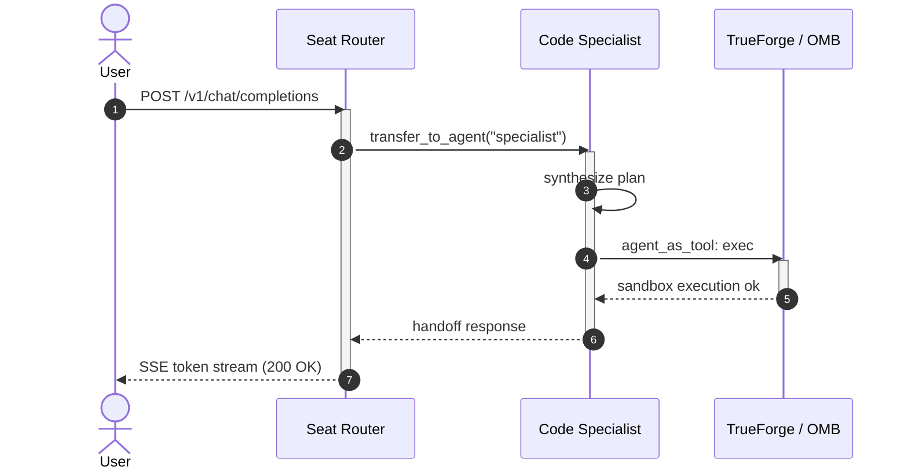
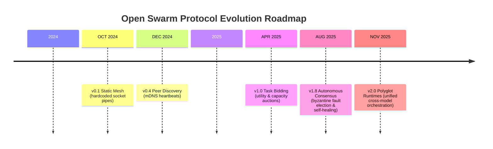
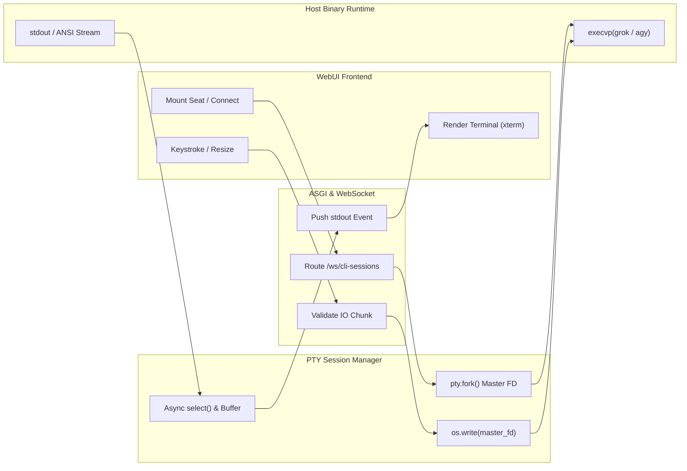
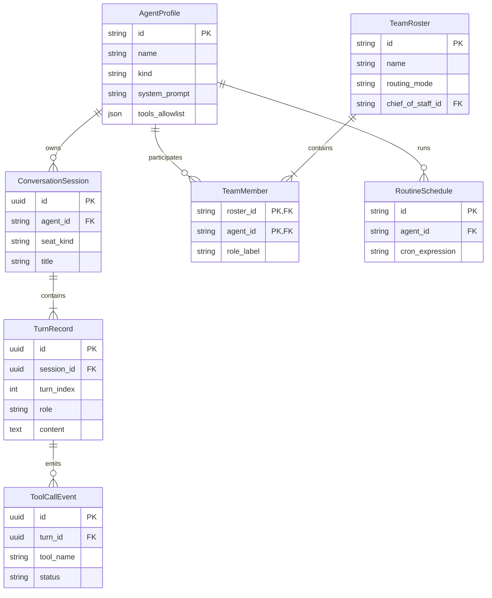
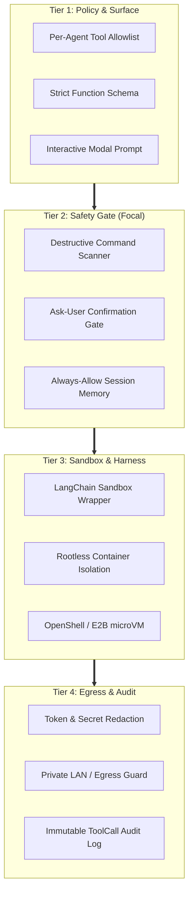

# Open Swarm Visual Architecture Diagrams

This directory contains visual architecture diagrams for the Open Swarm platform. Each diagram is available as both an interactive, typography-tuned standalone HTML/SVG document and an inlined GitHub-rendered Mermaid diagram below.

## Index of Diagrams

| Diagram | Type | Standalone Interactive Document |
|---|---|---|
| **High-Level Architecture Stack** | Layered System Flow | [architecture-diagram.html](./architecture-diagram.html) |
| **Four Agent Seats Architecture** | Taxonomy Tree | [agent-taxonomy-tree-diagram.html](./agent-taxonomy-tree-diagram.html) |
| **Agent Execution Lifecycle** | State Machine | [agent-lifecycle-state-diagram.html](./agent-lifecycle-state-diagram.html) |
| **Multi-Agent Handoff & Delegation** | Sequence Flow | [handoff-sequence-diagram.html](./handoff-sequence-diagram.html) |
| **Protocol Evolution Roadmap** | Milestone Timeline | [protocol-evolution-timeline-diagram.html](./protocol-evolution-timeline-diagram.html) |
| **CLI PTY Execution & Streaming** | Cross-Functional Swimlane | [cli-pty-execution-swimlane-diagram.html](./cli-pty-execution-swimlane-diagram.html) |
| **Domain Entity & Persistence Model** | ER Data Model | [domain-entity-er-diagram.html](./domain-entity-er-diagram.html) |
| **Safety & Sandbox Isolation Stack** | Compensating Layer Stack | [safety-sandbox-layer-stack-diagram.html](./safety-sandbox-layer-stack-diagram.html) |

---

## 1. High-Level Architecture Stack

Overview of client interfaces, edge API gateway, four agent execution seats, and persistence layers.

*Interactive Standalone:* [architecture-diagram.html](./architecture-diagram.html)

---

## 2. Four Agent Seats Architecture (Taxonomy)

Decomposition of Open Swarm's canonical execution seats (CLI, API, Blueprint, and Remote) and concrete adapter targets.

*Interactive Standalone:* [agent-taxonomy-tree-diagram.html](./agent-taxonomy-tree-diagram.html)

---

## 3. Agent Execution Lifecycle

State machine detailing agent turn progression from `Idle` through `Routing`, `Running`, `Tool Execution`, and `Handoff` to final resolution.

*Interactive Standalone:* [agent-lifecycle-state-diagram.html](./agent-lifecycle-state-diagram.html)

---

## 4. Multi-Agent Handoff & Delegation

Sequence diagram tracing the flow of a multi-turn delegation query from the WebUI through the Router to specialized API and Remote harness agents.

*Interactive Standalone:* [handoff-sequence-diagram.html](./handoff-sequence-diagram.html)

---

## 5. Autonomous Coordination Protocol Roadmap

Timeline of Open Swarm protocol evolution from early static socket meshes through decentralized discovery, task bidding auctions, and polyglot runtimes.

*Interactive Standalone:* [protocol-evolution-timeline-diagram.html](./protocol-evolution-timeline-diagram.html)

---

## 6. CLI PTY Execution & Bidirectional Stream Transport

Cross-functional swimlane tracking keystroke IO, pty fork lifecycle, asynchronous worker ring-buffers, and output rendering between React and host runtimes.

*Interactive Standalone:* [cli-pty-execution-swimlane-diagram.html](./cli-pty-execution-swimlane-diagram.html)

---

## 7. Core Domain Entity & Persistence Relationships

Entity-relationship diagram mapping agent profiles, team rosters, persisted conversation sessions, turn records, tool execution audit events, and routine schedules.

*Interactive Standalone:* [domain-entity-er-diagram.html](./domain-entity-er-diagram.html)

---

## 8. Multi-Tier Safety & Sandbox Isolation Stack

Compensating layer stack illustrating defense-in-depth from per-agent tool allowlists down through destructive command safety gates, LangChain sandbox harnesses, and egress controls.

*Interactive Standalone:* [safety-sandbox-layer-stack-diagram.html](./safety-sandbox-layer-stack-diagram.html)

