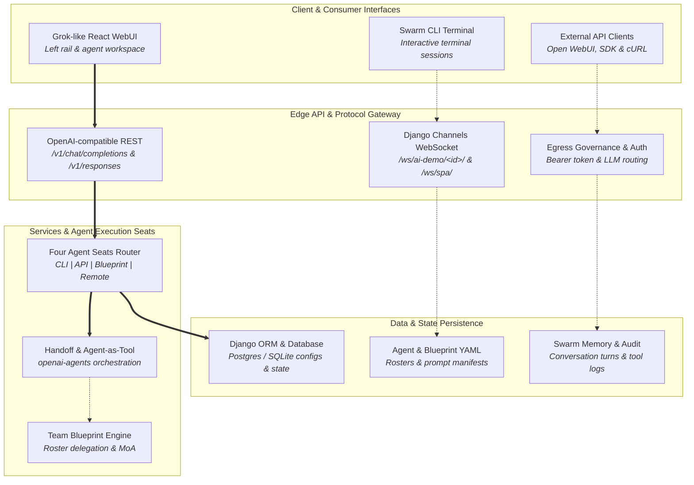
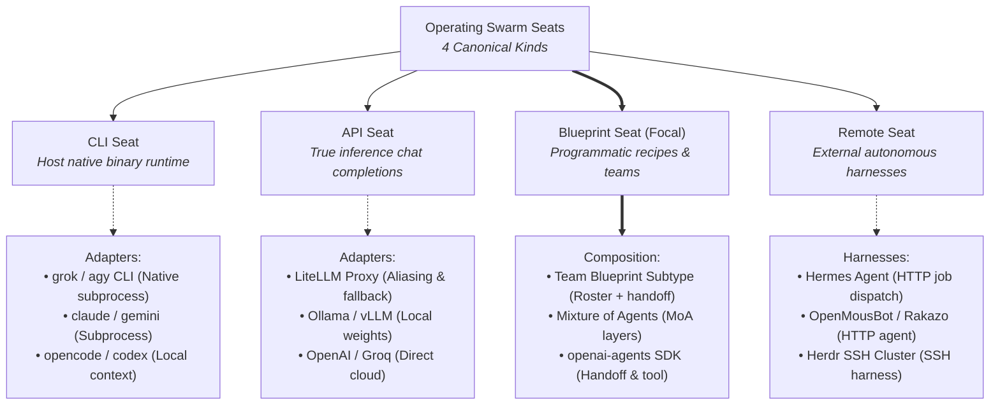
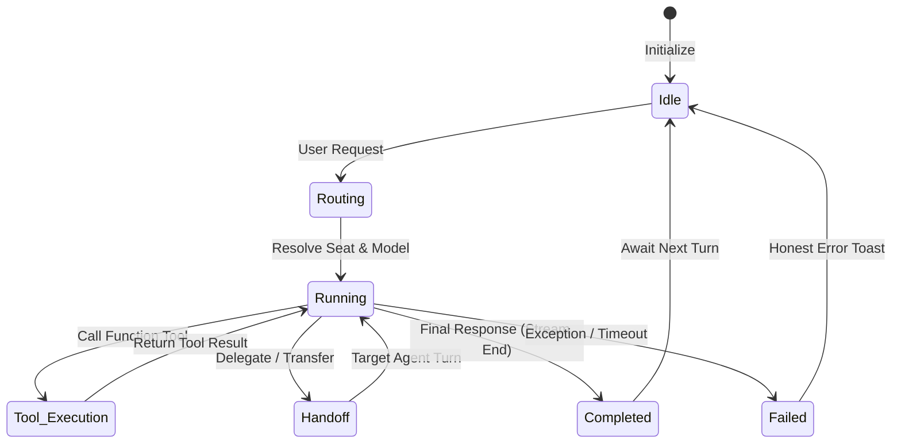
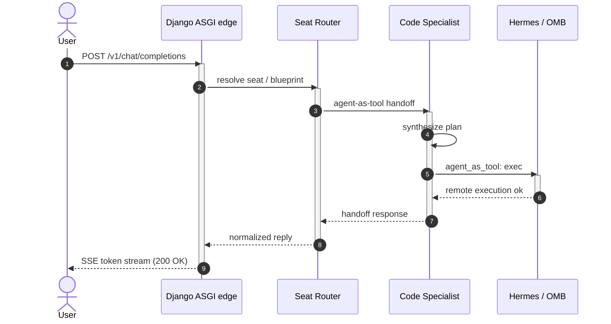
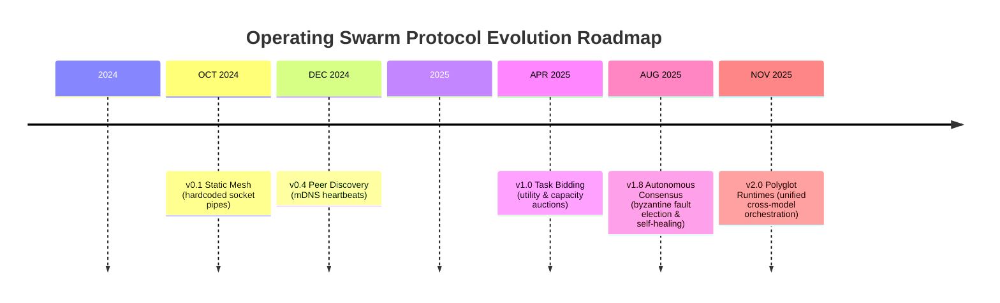
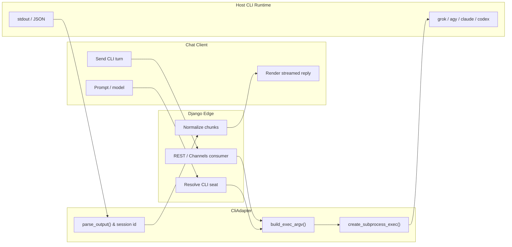
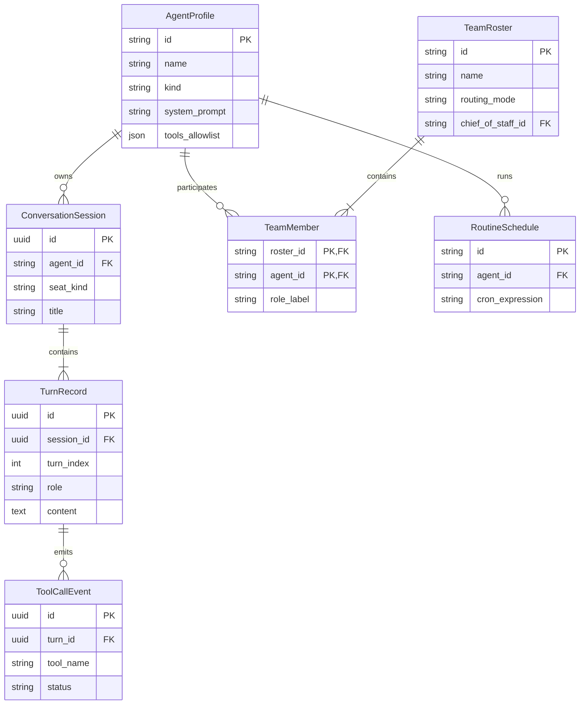
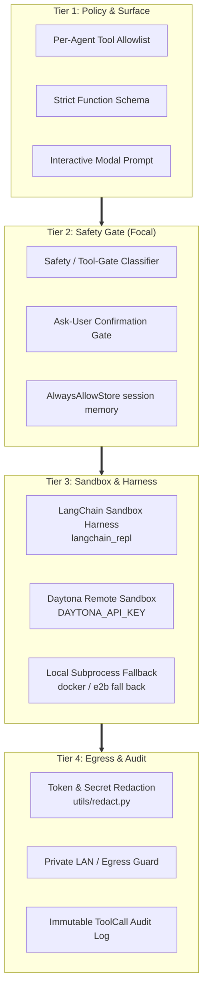

# Operating Swarm — Visual Documentation

Editable diagram **sources** plus rendered **previews** for Operating Swarm. Every
diagram is a single self-contained `.html` file with an inline, accessible SVG —
that HTML is the source of truth. PNGs in [`previews/`](./previews/) are always
generated *from* the source and are never hand-edited.

Two source generations coexist here:

- **Code-exact set (current)** — authored against the `diagram-design` skill, each
  carrying a `SOURCES:` line naming the files it was derived from and, where
  needed, an explicit `ASSUMPTION:` / `LIMITATION:` note. These are the diagrams
  to trust for implementation detail.
- **Legacy overview set** — the original conceptual diagrams (also mirrored as
  GitHub-native Mermaid below). Useful as orientation; some labels are
  conceptual rather than literal code symbols. Known mismatches have been
  corrected (see the inventory's *confidence* / *assumptions* columns).

---

## Quick start

```bash
# View: open any *.html in a browser, or the generated PNGs
ls previews/

# Regenerate every preview from its HTML source (needs Playwright + Chromium)
python docs/diagrams/render_previews.py
python docs/diagrams/render_previews.py hero-overview-diagram        # one diagram

# Validate: assert no <text> label escapes its SVG viewBox
python docs/diagrams/validate_diagrams.py
```

Playwright setup, once per environment:

```bash
uv run playwright install chromium     # or: python -m playwright install chromium
```

---

## Diagram index

### Overview

| Diagram | Type | File |
|---|---|---|
| System Overview (hero) | High-level architecture | [hero-overview-diagram.html](./hero-overview-diagram.html) |
| System Architecture & Trust Boundaries | Architecture | [system-architecture-boundaries-diagram.html](./system-architecture-boundaries-diagram.html) |

### Architecture & deployment

| Diagram | Type | File |
|---|---|---|
| Deployment & Containers | Deployment | [deployment-container-diagram.html](./deployment-container-diagram.html) |
| High-Level Architecture Stack *(legacy)* | Layer stack | [architecture-diagram.html](./architecture-diagram.html) |
| Four Agent Seats Architecture *(legacy)* | Taxonomy tree | [agent-taxonomy-tree-diagram.html](./agent-taxonomy-tree-diagram.html) |
| Safety & Sandbox Isolation Stack *(legacy)* | Compensating layer stack | [safety-sandbox-layer-stack-diagram.html](./safety-sandbox-layer-stack-diagram.html) |

### Sequences, flows & state

| Diagram | Type | File |
|---|---|---|
| Request Flow | Sequence | [request-flow-sequence-diagram.html](./request-flow-sequence-diagram.html) |
| Auth & Ownership | Sequence | [auth-sequence-diagram.html](./auth-sequence-diagram.html) |
| Async Responses Lifecycle | Sequence | [async-responses-sequence-diagram.html](./async-responses-sequence-diagram.html) |
| Async Response State Machine | State machine | [async-response-state-machine-diagram.html](./async-response-state-machine-diagram.html) |
| Failure, Retry & Recovery | Flowchart | [failure-retry-recovery-diagram.html](./failure-retry-recovery-diagram.html) |
| Routine Triggers & Execution | Workflow | [routines-trigger-workflow-diagram.html](./routines-trigger-workflow-diagram.html) |
| Agent Execution Lifecycle *(legacy)* | State machine | [agent-lifecycle-state-diagram.html](./agent-lifecycle-state-diagram.html) |
| Multi-Agent Handoff & Delegation *(legacy)* | Sequence | [handoff-sequence-diagram.html](./handoff-sequence-diagram.html) |
| CLI Seat Execution & Streaming *(legacy, redrawn)* | Swimlane | [cli-pty-execution-swimlane-diagram.html](./cli-pty-execution-swimlane-diagram.html) |

### Data, integrations & security

| Diagram | Type | File |
|---|---|---|
| Data Flow | Data flow | [data-flow-diagram.html](./data-flow-diagram.html) |
| Integration Topology | Integration topology | [integration-topology-diagram.html](./integration-topology-diagram.html) |
| Security & Trust Zones | Secure paved road (architecture) | [security-trust-zones-diagram.html](./security-trust-zones-diagram.html) |
| Domain Entity & State Model | ER / data model | [domain-entity-er-diagram.html](./domain-entity-er-diagram.html) |

### Operations

| Diagram | Type | File |
|---|---|---|
| Observability & Health | Operations / process | [observability-health-diagram.html](./observability-health-diagram.html) |
| Startup & Shutdown Lifecycle | Operations / process | [startup-shutdown-lifecycle-diagram.html](./startup-shutdown-lifecycle-diagram.html) |
| Deploy & Rollback Pipeline | Operations / pipeline | [deploy-rollback-diagram.html](./deploy-rollback-diagram.html) |

### Supporting abstraction notes

These are test-guarded markdown/mermaid diagrams (`tests/core/test_docs_diagrams.py`):

| Note | Covers | File |
|---|---|---|
| Abstraction map | How harness/behavior/context/presentation layers compose | [abstraction-map.md](./abstraction-map.md) |
| Kind bases | `BlueprintBase` → `KindBase` templates (`api` / `cli` / `remote`) | [kind-bases.md](./kind-bases.md) |
| Roles architecture | Role registry + hook override matrix | [roles.md](./roles.md) |
| Avatar themes | Installable identity packs | [avatar-themes.md](./avatar-themes.md) |
| Bubble themes | Message chrome abstraction | [bubble-themes.md](./bubble-themes.md) |

---

## How to edit & regenerate

1. **Edit the HTML source.** Each `<slug>-diagram.html` is standalone: embedded
   CSS (Google Fonts only) and an inline SVG. Keep the accessible-SVG contract
   (below) and the 4px grid.
2. **Regenerate the preview** — `python docs/diagrams/render_previews.py <slug>`
   (omit `<slug>` for all). The script screenshots the `<svg>` node at 2× into
   `previews/<slug>.png`.
3. **Validate geometry** — `python docs/diagrams/validate_diagrams.py` fails if
   any `<text>` node escapes the `viewBox` (catches clipped labels a screenshot
   can hide).
4. **Run the skill self-check** (optional but recommended) from the skill
   directory: `python3 scripts/self_check.py <path-to-html>` — verifies the
   accessible-SVG contract and single-file safety.

Naming: `<topic>-diagram.html` → `previews/<topic>-diagram.png`. New diagrams are
auto-discovered by both scripts (no manifest to update); add a row to the index
and inventory below when you add one.

### Conventions (from `~/.agents/skills/diagram-design/SKILL.md`)

- **Palette** — dark editorial skin: paper `#2d3142`, ink `#f5f5f5`, muted
  `#bfc0c0`, accent `#f08a59` (coral = 1–2 focal elements max).
- **Typography** — Instrument Serif (page title), Geist (node names), Geist Mono
  (ports, URLs, commands, sublabels). Human names are never monospace.
- **Shapes** — focal nodes get accent-tinted fill/stroke; stores, externals,
  inputs and async/optional nodes each have a distinct fill/stroke treatment.
  `rx` is 4–8px; no shadows.
- **Arrows** — accent for primary/highlighted paths, muted for internal calls,
  dashed for async/return; arrows drawn before boxes.
- **Legend** — horizontal strip at the bottom, never floating inside the canvas.
- **Accessibility** — `<svg role="img" aria-labelledby="<slug>-title <slug>-desc">`
  with prefixed `<title>`/`<desc>`; title first child of `<svg>`.
- **Grid** — coordinates, sizes and gaps are multiples of 4.

---

## Project diagram inventory

### Code-exact set

| Filename | Type | Audience | Question answered | Sources | Confidence | Assumptions / limitations |
|---|---|---|---|---|---|---|
| `hero-overview-diagram.html` | Architecture (high-level) | Everyone / newcomer | What is Operating Swarm end to end? | `README.md`, `src/swarm/asgi.py`, `src/swarm/core/kind_bases.py`, `src/swarm/core/agent_kind.py` | High | Interface aliases (`os-cli`, `os tui`) taken from docs; the hero summarizes, other diagrams drill down |
| `system-architecture-boundaries-diagram.html` | Architecture | Engineer / architect | Which runtime components exist and where are the trust boundaries? | `asgi.py`, `urls.py`, `routing.py`, `settings.py`, `docs/AUTH.md`, `docker-compose.yml` | High | — |
| `deployment-container-diagram.html` | Deployment | Ops / SRE | Where do containers/processes run; ports, volumes, networks across dev/compose/Fly/Oracle/native? | `docker-compose.yml`, `docker-compose.dev.yml`, `Dockerfile`, `deploy/systemd`, `deploy/oracle`, `fly.toml`, `docs/DEPLOYMENT.md`, `docs/DATABASE.md` | High | Compose DB credentials are dev placeholders; only `:8000` is published |
| `request-flow-sequence-diagram.html` | Sequence | Engineer | How does a normal chat completion stream to the caller? | `views/chat_views.py`, `views/utils.py`, `core/agent_kind.py`, `docs/DEPLOYMENT.md` | High | — |
| `auth-sequence-diagram.html` | Sequence | Engineer / security | How are requests authenticated and ownership enforced? | `src/swarm/auth.py`, `src/swarm/permissions.py`, `src/swarm/consumers.py`, `docs/AUTH.md` | High | Ownership store matches on an exact `token:<sha256[:24]>` principal |
| `async-responses-sequence-diagram.html` | Sequence | Engineer | How does the async `/v1/responses` lifecycle work? | `views/responses_views.py`, `core/responses_store.py`, `core/cancel_registry.py`, `docs/ASYNC_RESPONSES.md` | High | — |
| `async-response-state-machine-diagram.html` | State machine | Engineer | What states does a response record pass through? | same as above | High | `store:false` runs inline and returns `completed` directly (never enters `queued`) |
| `failure-retry-recovery-diagram.html` | Flowchart | Ops / engineer | How do timeouts, errors, failover and restarts behave? | `core/agent_run_timeout.py`, `core/moa/orchestrator.py`, `docs/ASYNC_RESPONSES.md`, `docs/RUNBOOK_NEON_QUOTA_CRASH_LOOP.md` | High | Default agent-run timeout is 600s |
| `integration-topology-diagram.html` | Integration topology | Engineer / integrator | Which external systems are integrated, over what protocol, with what auth, in which direction? | `remotes/registry.py`, `remotes/*.py`, `views/marketplace_api.py`, `mcp/provider.py`, `docs/REMOTE_HARNESSES.md`, `docs/HERDR.md` | High | Per-provider model ids/endpoints are operator-configured; no provider hostname is hard-coded in source |
| `data-flow-diagram.html` | Data flow | Engineer / security | Ingress → transform → storage/cache/queue → egress, plus sensitive-data handling and retention | `core/chat_store.py`, `core/chat_attachments.py`, `core/responses_store.py`, `docs/DATABASE.md` | High | Chat auto-age default 90d; per-attachment size caps are operator-configurable and not asserted |
| `security-trust-zones-diagram.html` | Secure paved road (architecture) | Security / engineer | Trust zones, credentials, sandboxing and privileged operations | `docs/AUTH.md`, `core/blueprint_sandbox.py`, `runtime_views.py`, `permissions.py`, `docs/REMOTE_HARNESSES.md` | High | The blueprint AST filter is a *static* gate, not OS process isolation; container isolation depends on runtime mode |
| `observability-health-diagram.html` | Operations / process | Ops / support | What health, diagnostics, telemetry, audit and logging surfaces exist? | `urls.py`, `views/system_views.py`, `views/telemetry_api.py`, `views/rate_limits_api.py`, `views/runtime_views.py` | High | `/health` is unauthenticated and zero-secret by design |
| `startup-shutdown-lifecycle-diagram.html` | Operations / process | Ops | What is the ordered startup/shutdown sequence and fail-fast behavior? | `asgi.py`, `mcp/provider.py`, `Dockerfile`, `docker-compose.yml`, `deploy/systemd/open-swarm-dev.service`, `docs/DEPLOYMENT.md`, `docs/DATABASE.md` | High | Unusable DB ⇒ exit 78 (`EX_CONFIG`); `RestartPreventExitStatus=78` prevents a crash loop |
| `deploy-rollback-diagram.html` | Operations / pipeline | Ops / release | CI gates → deploy → verify → rollback? | `.github/workflows/python-pytest.yml`, `.github/workflows/docker-io-fly-deploy.yml`, `.github/workflows/publish.yml`, `Dockerfile`, `docs/DEPLOYMENT.md`, `docs/SELF_UPDATE.md` | High | Rollback redeploys the previous image tag; migrations are treated as forward-only |
| `routines-trigger-workflow-diagram.html` | Workflow | Engineer | How do routine triggers fan in, dispatch and execute? | `core/routines.py`, `core/routine_jobs.py`, `views/routines_api.py`, `docs/routines.md` | Medium | GitHub-event delivery is webhook-driven (no live polling); mailbox triggers are local peer messages |
| `domain-entity-er-diagram.html` | ER / data model | Engineer | What domain entities exist and how do they relate? | ORM models / `docs/DATABASE.md` | Medium | Some keys are shown as hybrid `uuid / string`; the routine "calendar" annotation is illustrative |

### Legacy overview set

| Filename | Type | Audience | Question answered | Sources | Confidence | Assumptions / limitations |
|---|---|---|---|---|---|---|
| `architecture-diagram.html` | Layer stack | Mixed | What is the high-level architecture stack? | `README.md`, `docs/*` | Medium | "Swarm Memory & Audit" is a conceptual grouping, not a module |
| `agent-taxonomy-tree-diagram.html` | Taxonomy tree | Mixed | What are the four seat kinds and their adapters? | `core/kind_bases.py`, `src/swarm/remotes/*` | High | Adapter list verified; Hermes sublabel corrected to "Nous Hermes run dispatch" |
| `safety-sandbox-layer-stack-diagram.html` | Compensating layer stack | Security / engineer | What are the defense-in-depth tiers? | `core/safety.py`, `core/tool_gate.py`, `core/sandbox/*`, `utils/redact.py` | Medium | Corrected to real backends (`langchain_repl`, `daytona`, local-subprocess fallback); `docker`/`e2b` currently fall back to local |
| `agent-lifecycle-state-diagram.html` | State machine | Engineer | Conceptual turn lifecycle | `core/agent_kind.py`, `docs/AGENT_LIFECYCLE.md` | Medium | States are conceptual, not a literal code enum |
| `handoff-sequence-diagram.html` | Sequence | Engineer | How does multi-agent delegation flow? | `core/moa/*`, `core/kind_bases.py` | Medium | Edge label corrected to "Django ASGI edge" (no FastAPI in the repo); agent-as-tool lives in `core/moa` |
| `cli-pty-execution-swimlane-diagram.html` | Swimlane | Engineer | How does one CLI-seat turn execute and stream? | `core/cli_adapter.py`, `core/cli_driver.py`, `core/cli_sessions.py` | Medium | Redrawn from the real `subprocess` model; the repo has **no** PTY/`xterm.js` CLI path |
| `protocol-evolution-timeline-diagram.html` | Timeline | Executive | Roadmap of protocol versions | roadmap / `docs/VISION.md` | Low | Aspirational roadmap (e.g. "v2.0 polyglot runtimes"); not implemented |

---

## Assumptions & limitations (consolidated)

- **Boundary of truth.** Code-exact diagrams cite their sources in-file. Legacy
  diagrams predate the skill's source-citation convention and are conceptual.
- **Sandboxing.** The blueprint AST sandbox is a static validator, not an OS
  jail. `docker` / `e2b` sandbox backends are roadmap items and currently fall
  back to local bare-metal execution (`core/sandbox/manager.py`); Daytona and
  the LangChain harness are the implemented remote backends.
- **Runtime modes.** Trust posture depends on runtime mode (`bare-metal`,
  `sandbox-home`, `sandbox-isolated`) and on mounts; the diagrams describe the
  default Compose deployment plus the dev/native/Fly/Oracle variants.
- **Configuration.** Provider endpoints, model ids, attachment caps and some
  retention windows are operator-configurable and intentionally not hard-coded
  into diagrams.
- **Migrations.** Deploy/rollback assumes forward-only migrations; there is no
  claim of a destructive down-migration.

---

## GitHub-native Mermaid (legacy overview set)

The Mermaid sources below render directly on GitHub and mirror the legacy HTML
files. Where a label was found to diverge from the code it has been corrected
inline (Herdr/Hermes, sandbox backends, Django edge).

### 1. High-Level Architecture Stack

*Interactive:* [architecture-diagram.html](./architecture-diagram.html)


```mermaid
flowchart TB
    subgraph clients ["Client & Consumer Interfaces"]
        direction LR
        WebUI["Grok-like React WebUI<br/><em>Left rail & agent workspace</em>"]
        CLI["Swarm CLI Terminal<br/><em>Interactive terminal sessions</em>"]
        External["External API Clients<br/><em>Open WebUI, SDK & cURL</em>"]
    end

    subgraph edge ["Edge API & Protocol Gateway"]
        direction LR
        REST["OpenAI-compatible REST<br/><em>/v1/chat/completions & /v1/responses</em>"]
        WS["Django Channels WebSocket<br/><em>/ws/ai-demo/&lt;id&gt;/ & /ws/spa/</em>"]
        Auth["Egress Governance & Auth<br/><em>Bearer token & LLM routing</em>"]
    end

    subgraph services ["Services & Agent Execution Seats"]
        direction LR
        Router["Four Agent Seats Router<br/><em>CLI | API | Blueprint | Remote</em>"]
        Handoff["Handoff & Agent-as-Tool<br/><em>openai-agents orchestration</em>"]
        Team["Team Blueprint Engine<br/><em>Roster delegation & MoA</em>"]
    end

    subgraph data ["Data & State Persistence"]
        direction LR
        DB["Django ORM & Database<br/><em>Postgres / SQLite configs & state</em>"]
        YAML["Agent & Blueprint YAML<br/><em>Rosters & prompt manifests</em>"]
        Memory["Swarm Memory & Audit<br/><em>Conversation turns & tool logs</em>"]
    end

    WebUI ==> REST
    REST ==> Router
    Router ==> Handoff
    Router ==> DB

    CLI -.-> WS
    External -.-> Auth
    Handoff -.-> Team
    WS -.-> YAML
    Auth -.-> Memory
```

### 2. Four Agent Seats Architecture (Taxonomy)

*Interactive:* [agent-taxonomy-tree-diagram.html](./agent-taxonomy-tree-diagram.html)


```mermaid
flowchart TD
    Root["Operating Swarm Seats<br/><em>4 Canonical Kinds</em>"]

    Root --> CLI["CLI Seat<br/><em>Host native binary runtime</em>"]
    Root --> API["API Seat<br/><em>True inference chat completions</em>"]
    Root ==> BP["Blueprint Seat (Focal)<br/><em>Programmatic recipes & teams</em>"]
    Root --> Remote["Remote Seat<br/><em>External autonomous harnesses</em>"]

    CLI -.-> CLI_A["Adapters:<br/>• grok / agy CLI (Native subprocess)<br/>• claude / gemini (Subprocess)<br/>• opencode / codex (Local context)"]
    API -.-> API_A["Adapters:<br/>• LiteLLM Proxy (Aliasing & fallback)<br/>• Ollama / vLLM (Local weights)<br/>• OpenAI / Groq (Direct cloud)"]
    BP ==> BP_A["Composition:<br/>• Team Blueprint Subtype (Roster + handoff)<br/>• Mixture of Agents (MoA layers)<br/>• openai-agents SDK (Handoff & tool)"]
    Remote -.-> Remote_A["Harnesses:<br/>• Hermes Agent (HTTP job dispatch)<br/>• OpenMousBot / Rakazo (HTTP agent)<br/>• Herdr SSH Cluster (SSH harness)"]
```

### 3. Agent Execution Lifecycle

*Interactive:* [agent-lifecycle-state-diagram.html](./agent-lifecycle-state-diagram.html)


```mermaid
stateDiagram-v2
    [*] --> Idle: Initialize
    Idle --> Routing: User Request
    Routing --> Running: Resolve Seat & Model
    Running --> Tool_Execution: Call Function Tool
    Tool_Execution --> Running: Return Tool Result
    Running --> Handoff: Delegate / Transfer
    Handoff --> Running: Target Agent Turn
    Running --> Completed: Final Response (Stream End)
    Running --> Failed: Exception / Timeout
    Completed --> Idle: Await Next Turn
    Failed --> Idle: Honest Error Toast
```

### 4. Multi-Agent Handoff & Delegation

*Interactive:* [handoff-sequence-diagram.html](./handoff-sequence-diagram.html)


```mermaid
sequenceDiagram
    autonumber
    actor User
    participant Edge as Django ASGI edge
    participant Router as Seat Router
    participant Specialist as Code Specialist
    participant Remote as Hermes / OMB

    User->>Edge: POST /v1/chat/completions
    activate Edge
    Edge->>Router: resolve seat / blueprint
    activate Router
    Router->>Specialist: agent-as-tool handoff
    activate Specialist
    Specialist->>Specialist: synthesize plan
    Specialist->>Remote: agent_as_tool: exec
    activate Remote
    Remote-->>Specialist: remote execution ok
    deactivate Remote
    Specialist-->>Router: handoff response
    deactivate Specialist
    Router-->>Edge: normalized reply
    deactivate Router
    Edge-->>User: SSE token stream (200 OK)
    deactivate Edge
```

### 5. Autonomous Coordination Protocol Roadmap

*Interactive:* [protocol-evolution-timeline-diagram.html](./protocol-evolution-timeline-diagram.html)
— **aspirational roadmap, not implemented.**


```mermaid
timeline
    title Operating Swarm Protocol Evolution Roadmap
    2024
        OCT 2024 : v0.1 Static Mesh (hardcoded socket pipes)
        DEC 2024 : v0.4 Peer Discovery (mDNS heartbeats)
    2025
        APR 2025 : v1.0 Task Bidding (utility & capacity auctions)
        AUG 2025 : v1.8 Autonomous Consensus (byzantine fault election & self-healing)
        NOV 2025 : v2.0 Polyglot Runtimes (unified cross-model orchestration)
```

### 6. CLI Seat Execution & Streaming

*Interactive:* [cli-pty-execution-swimlane-diagram.html](./cli-pty-execution-swimlane-diagram.html)


```mermaid
flowchart LR
    subgraph UI ["Chat Client"]
        Mount["Send CLI turn"]
        Key["Prompt / model"]
        Render["Render streamed reply"]
    end
    subgraph ASGI ["Django Edge"]
        WS["REST / Channels consumer"]
        Frame["Resolve CLI seat"]
        Push["Normalize chunks"]
    end
    subgraph Driver ["CliAdapter"]
        Build["build_exec_argv()"]
        Spawn["create_subprocess_exec()"]
        Read["parse_output() & session id"]
    end
    subgraph CLI ["Host CLI Runtime"]
        Exec["grok / agy / claude / codex"]
        OUT["stdout / JSON"]
    end

    Mount --> WS --> Build --> Spawn --> Exec
    Key --> Frame --> Build
    OUT --> Read --> Push --> Render
```

### 7. Core Domain Entity & Persistence Relationships

*Interactive:* [domain-entity-er-diagram.html](./domain-entity-er-diagram.html)


```mermaid
erDiagram
    AgentProfile ||--o{ ConversationSession : owns
    AgentProfile ||--o{ TeamMember : participates
    TeamRoster ||--|{ TeamMember : contains
    ConversationSession ||--|{ TurnRecord : contains
    TurnRecord ||--o{ ToolCallEvent : emits
    AgentProfile ||--o{ RoutineSchedule : runs

    AgentProfile {
        string id PK
        string name
        string kind
        string system_prompt
        json tools_allowlist
    }
    TeamRoster {
        string id PK
        string name
        string routing_mode
        string chief_of_staff_id FK
    }
    TeamMember {
        string roster_id PK,FK
        string agent_id PK,FK
        string role_label
    }
    ConversationSession {
        uuid id PK
        string agent_id FK
        string seat_kind
        string title
    }
    TurnRecord {
        uuid id PK
        uuid session_id FK
        int turn_index
        string role
        text content
    }
    ToolCallEvent {
        uuid id PK
        uuid turn_id FK
        string tool_name
        string status
    }
    RoutineSchedule {
        string id PK
        string agent_id FK
        string cron_expression
    }
```

### 8. Multi-Tier Safety & Sandbox Isolation Stack

*Interactive:* [safety-sandbox-layer-stack-diagram.html](./safety-sandbox-layer-stack-diagram.html)


```mermaid
flowchart TD
    subgraph T1 ["Tier 1: Policy & Surface"]
        direction LR
        Allowlist["Per-Agent Tool Allowlist"]
        Schema["Strict Function Schema"]
        Approval["Interactive Modal Prompt"]
    end
    subgraph T2 ["Tier 2: Safety Gate (Focal)"]
        direction LR
        Classifier["Safety / Tool-Gate Classifier"]
        Confirm["Ask-User Confirmation Gate"]
        Cache["AlwaysAllowStore session memory"]
    end
    subgraph T3 ["Tier 3: Sandbox & Harness"]
        direction LR
        LangChain["LangChain Sandbox Harness<br/>langchain_repl"]
        Daytona["Daytona Remote Sandbox<br/>DAYTONA_API_KEY"]
        Local["Local Subprocess Fallback<br/>docker / e2b fall back"]
    end
    subgraph T4 ["Tier 4: Egress & Audit"]
        direction LR
        Redact["Token & Secret Redaction<br/>utils/redact.py"]
        Firewall["Private LAN / Egress Guard"]
        Audit["Immutable ToolCall Audit Log"]
    end

    T1 ==> T2 ==> T3 ==> T4
```

---

## Validation status

- `python docs/diagrams/validate_diagrams.py` — **23/23 diagrams: all labels
  inside their viewBox.**
- `python docs/diagrams/render_previews.py` — **23/23 rendered** to
  `previews/<slug>.png`.
- `diagram-design` skill `scripts/self_check.py` — passes for the code-exact set
  (accessible `role="img"` + prefixed `<title>`/`<desc>`, single-file safety).
- `tests/core/test_docs_diagrams.py` guards the five abstraction notes
  (`abstraction-map.md`, `kind-bases.md`, `roles.md`, `avatar-themes.md`,
  `bubble-themes.md`) — keep those in sync with the code.

## Recommended future diagrams

- **Sandbox backend selection** — `core/sandbox/manager.py` provider matrix
  (none / mock / langchain_repl / daytona / docker→local fallback).
- **MOA / fusion orchestrator** — `core/moa/orchestrator.py` layer + failover.
- **Team roster routing** — `core/team_rosters.py` + Chief-of-Staff topology.
- **Skill & consensus walkthrough** — `docs/SKILLS_AND_CONSENSUS_WALKTHROUGH.md`.
