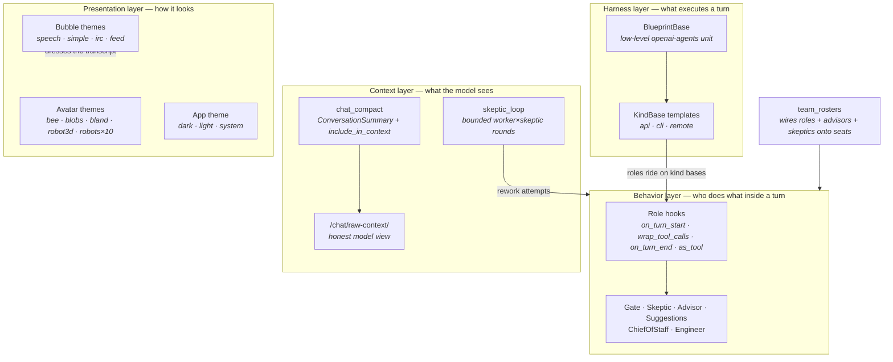

# Abstraction map — how Open Swarm's layers compose

> The one-picture version of the abstractions this repo defines, what subclasses
> typically override, and which layer each belongs to. Each box links to its
> detailed diagram. Planned abstractions are marked *(planned)* and name their
> tracking issue.

| Layer | Abstraction | Subclasses implement | Detail |
|---|---|---|---|
| Harness | `BlueprintBase` → `KindBase` | `run()`, `get_navbar_items()` | [kind-bases.md](./kind-bases.md) |
| Behavior | `Role` registry | `on_turn_start`, `wrap_tool_calls`, `on_turn_end`, `as_tool` | [roles.md](./roles.md) |
| Context | `ConversationSummary` spans | `include_in_context` archive policy, raw splice | `chat_compact.py` |
| Context | Skeptic rework loop | worker / skeptic closures, bounded rounds | `skeptic_loop.py` |
| Presentation | Bubble themes | user/agent bubble shape, chrome placement *(planned)* | [bubble-themes.md](./bubble-themes.md) |
| Presentation | Avatar themes | family install set, per-agent resolution | [avatar-themes.md](./avatar-themes.md) |
| Presentation | App theme | `dark` / `light` / `system` + navbar visibility | `theme.ts` |

## Planned (tracked, not yet abstractions)

- Bubble themes as an abstract class with overridable interface
  (datetimestamp placement: bottom for traditional chat, above/beside for IRC).
- Chief-of-Staff sections: topology tools so a CoS can bound which
  agents talk to which, creating teams of teams.
- Theme-gated optional streaming with markdown-safe partial render.

## Honesty

`tests/core/test_docs_diagrams.py` asserts the modules and exports named here
exist; each linked diagram carries its own honesty tests.
