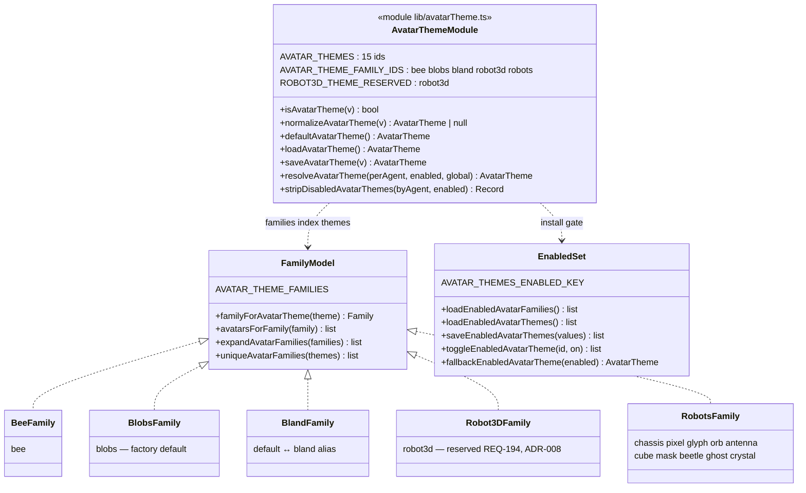

# Avatar themes — installable identity packs (REQ-155 / REQ-828 / REQ-194)

> An avatar theme is an **identity look** an agent wears, distinct from the
> bubble chrome that wraps its messages. Themes install in families; a picker
> enables/disables families, and per-agent selection degrades gracefully when
> a pack is uninstalled.

## The two-level model

1. **Theme ids** (`AVATAR_THEMES`) — 15 renderable avatars: 4 face themes
   (`blobs`, `bland`, `default`→`bland` alias, `bee`), the reserved `robot3d`
   (ADR-008), and the 10-avatar robot pack.
2. **Families** (`AVATAR_THEME_FAMILIES`) — installable sets. `Robots` holds ten
   avatars; the rest hold one. Pickers toggle families; `expandAvatarFamilies`
   flattens to themes, `uniqueAvatarFamilies` folds themes back.

## Resolution and degradation

- `resolveAvatarTheme`: per-agent (if still installed) → sole enabled theme →
  global (if installed) → first enabled.
- `stripDisabledAvatarThemes`: rewrites per-agent packs that are no longer
  installed (REQ-841) to the fallback — same object if nothing changed.
- Factory default is `blobs`: existing users are never auto-switched.
- Events: `AVATAR_THEME_SET_EVENT` / `AVATAR_THEMES_ENABLED_EVENT` keep
  listeners in sync; persistence is best-effort localStorage, same contract as
  the rail hostname override.

## Honesty

`tests/core/test_docs_diagrams.py` asserts the module and exports named here
exist — change `avatarTheme.ts`, update this diagram in the same PR.
