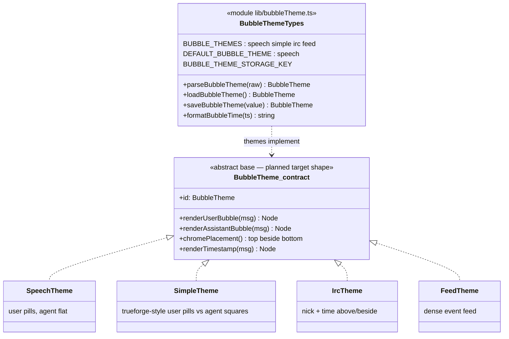

# Bubble themes — message chrome abstraction

> A bubble theme owns **how a message looks**, not what it says. Each theme
> decides placement of chrome (timestamp, status) and the shape of user vs
> assistant bubbles. The planned refactor promotes this to an abstract base with overridable
> hooks so a 'traditional chat' theme can put the datetimestamp at the bottom
> of every message while IRC keeps it above/beside — without forking the
> transcript renderer.

## Today vs the planned abstract-base target

| Concern | Today (`lib/bubbleTheme.ts` + `ChatMessageBubble.tsx`) | Planned target |
|---|---|---|
| Theme set | `BUBBLE_THEMES = ['speech', 'simple', 'irc', 'feed']` (closed tuple) | Each theme is a class implementing the base interface; registry grows by subclassing |
| Timestamp chrome | `formatBubbleTime()` shared; placement hard-coded per theme | `chromePlacement()` hook — `top` / `beside` / `bottom` |
| User vs agent shapes | Theme branches inside `ChatMessageBubble` | `renderUserBubble` / `renderAssistantBubble` overrides |
| Persistence | `localStorage` via `saveBubbleTheme`, `parseBubbleTheme` guards | unchanged |

## Honesty

`tests/core/test_docs_diagrams.py` asserts the modules and exports named here
exist — the abstract-base implementation must update this diagram in the same PR.
