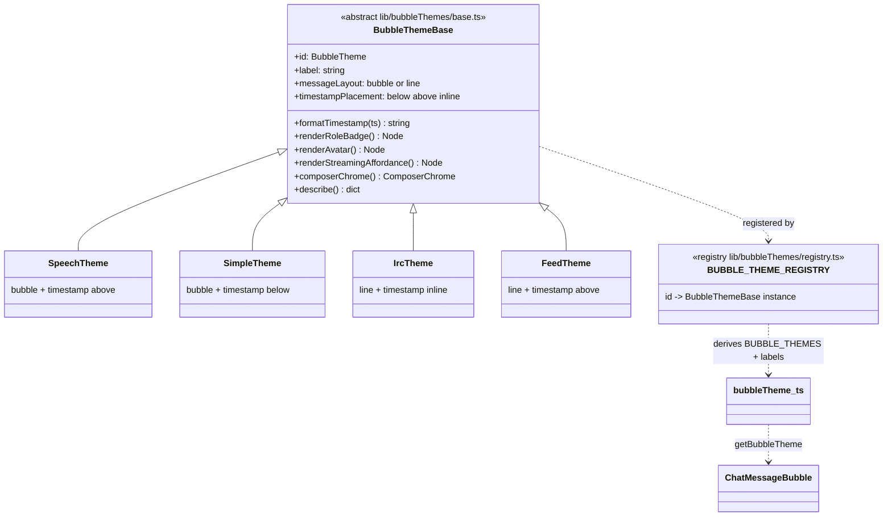

# Bubble themes — message chrome abstraction (REQ-852 / #217)

> A bubble theme owns **how a message looks**, not what it says. Each theme
> decides placement of chrome (timestamp, status) and the shape of user vs
> assistant bubbles. `#217` is an abstract base with overridable hooks so a
> 'traditional chat' theme can put the datetimestamp at the bottom of every
> message while IRC keeps it beside the line — without forking the transcript
> renderer.

## Override matrix

| Theme | `messageLayout` | `timestampPlacement` | Streaming (#220) |
|---|---|---|---|
| `speech` | `bubble` | `above` | `supportsStreaming` + caret |
| `simple` | `bubble` | `below` | `supportsStreaming` + caret |
| `irc` | `line` | `inline` | `supportsStreaming` + block |
| `feed` | `line` | `above` | no live prefix |

`formatTimestamp` defaults to `formatBubbleTime()`. `renderRoleBadge`,
`renderAvatar`, `renderStreamingAffordance`, and `composerChrome` default to
no-ops so a new theme is id + layout + placement.

Streaming display is opt-in (#220): `BUBBLE_THEME_STREAMING` is the theme gate;
a user toggle plus per-seat override sit on top. `renderMarkdownSafe` holds
unclosed `**` / `*` / `` ` `` / fences / links until they balance or the
stream ends.

Persistence (`os.bubbleTheme`, `parseBubbleTheme` / `loadBubbleTheme` /
`saveBubbleTheme`) is unchanged. `BUBBLE_THEMES` and `BUBBLE_THEME_LABELS`
derive from the registry.

## Sources

- `webui/frontend/src/lib/bubbleThemes/base.ts` — `BubbleThemeBase`, `formatBubbleTime`, `formatTimestamp`
- `webui/frontend/src/lib/bubbleThemes/registry.ts` — `registerBubbleTheme`, `allBubbleThemes`
- `webui/frontend/src/lib/bubbleThemes/themes.ts` — `SpeechTheme`, `SimpleTheme`, `IrcTheme`, `FeedTheme`
- `webui/frontend/src/lib/bubbleTheme.ts` — backward-compat facade (`DEFAULT_BUBBLE_THEME`, storage, `BUBBLE_THEME_STREAMING`)
- `webui/frontend/src/lib/markdownSafe.ts` — `renderMarkdownSafe` (#220)
- `webui/frontend/src/components/ChatMessageBubble.tsx` — renderer consults `getBubbleTheme`
- Tests: `webui/frontend/src/lib/__tests__/bubbleTheme.test.ts`

## Honesty

`tests/core/test_docs_diagrams.py` asserts the modules and exports named here
exist — change the code, update this diagram in the same PR.
