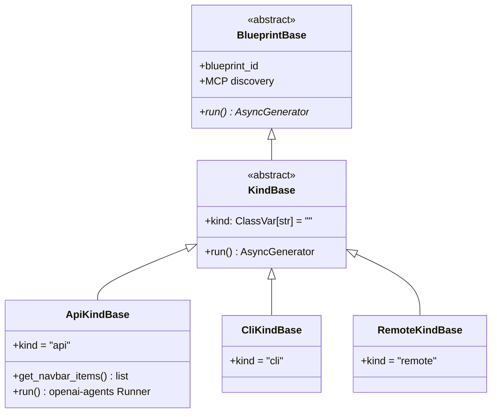

# Kind bases — harness templates (REQ-159 / ADR-005)

> One kind = one template class + one line in `KIND_BASE_NAMES`. `BlueprintBase`
> stays the low-level openai-agents unit; the three kind templates stamp `kind`
> and document the intended host. New work subclasses a template, never a fourth
> harness. Emission + migration live in `blueprint_spec.py` / `base_class_for_kind`.

## What each template adds over `KindBase`

| Template | `kind` | Overrides | Runs |
|---|---|---|---|
| `ApiKindBase` | `api` | `run()` (openai-agents `Runner`), `get_navbar_items()` | Programmatic agent graphs — the only kind that runs handoff / as-tool pipelines |
| `CliKindBase` | `cli` | *(none — documents the host)* | A native host CLI session (`grok`, `agy`, …), optionally wrapped behind the API |
| `RemoteKindBase` | `remote` | *(none — documents the host)* | An external harness (Hermes, OpenMousBot, Rakazo, Herdr, nested swarm) consulted natively |

`KindBase.run()` is a last-resort echo used in tests and as a safe default; every
real blueprint either overrides `run()` (api) or inherits the host session
semantics (cli / remote). Test mode short-circuits `ApiKindBase.run()` with a
`PONG` reply.

## Constants and helpers (`src/swarm/core/kind_bases.py`)

- `KIND_API` / `KIND_CLI` / `KIND_REMOTE` — canonical kind ids.
- `KIND_BASE_NAMES = ("ApiKindBase", "CliKindBase", "RemoteKindBase")`.
- `ALLOWED_BLUEPRINT_BASE_NAMES` — `KIND_BASE_NAMES` + `KindBase` + `BlueprintBase`;
  recipe validation accepts exactly these base classes.
- `base_class_for_kind(kind)` — maps a recipe's `kind` to its template class;
  used by the emitters and migrators that landed ADR-005 §4.

## Honesty

`tests/core/test_docs_diagrams.py` asserts every class and module named here
exists in the tree — change the code, update this diagram in the same PR.
