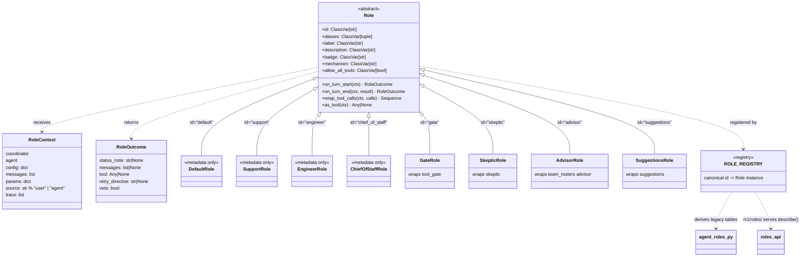

# Roles architecture (REQ-852)

> One role = one class + one registry line. The registry (`src/swarm/core/roles/registry.py`)
> is the single source of truth: `agent_roles.py` derives its legacy tables (badges, CSS
> classes, aliases, mechanisms, allow-all) from it, and `/v1/roles/` serves `describe()`.
> Metadata-only roles (default, support, engineer, chief_of_staff) override nothing and
> cost nothing; behavior roles override only the hooks they need.

## Hook override matrix

| Role | `on_turn_start` | `wrap_tool_calls` | `on_turn_end` | `as_tool` | Behavior module |
|---|---|---|---|---|---|
| `default` | — | — | — | — | metadata only |
| `support` | — | — | — | — | metadata only |
| `engineer` | — | — | — | — | metadata only |
| `chief_of_staff` | — | — | — | — | metadata only |
| `gate` | — | ✔ (veto via `tool_gate`) | — | — | `core/tool_gate.py` |
| `skeptic` | — | — | ✔ (verdict / retry via `skeptic`) | — | `core/skeptic.py` |
| `advisor` | — | — | — | — | `core/team_rosters.py` |
| `suggestions` | — | — | — | ✔ (specialist tool via `suggestions`) | `core/suggestions.py` |

Defaults are no-ops on the base (`Role.on_turn_start`, `Role.on_turn_end`,
`Role.wrap_tool_calls`, `Role.as_tool`), so a new metadata-only role is a class
with `id` + labels and no behavior code at all.

## Sources

- `src/swarm/core/roles/base.py` — `Role`, `RoleContext`, `RoleOutcome`, CSS prefix contract
- `src/swarm/core/roles/registry.py` — `ROLE_REGISTRY`, `register_role`, `all_roles`, `role_for_id`
- `src/swarm/core/roles/adapters.py` — the eight concrete roles
- `src/swarm/core/agent_roles.py` — backward-compat shim (re-exports + derived tables)
- `src/swarm/views/roles_api.py` — `/v1/roles/` descriptor endpoint
- Tests: `tests/core/test_roles_registry.py`
