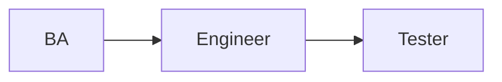
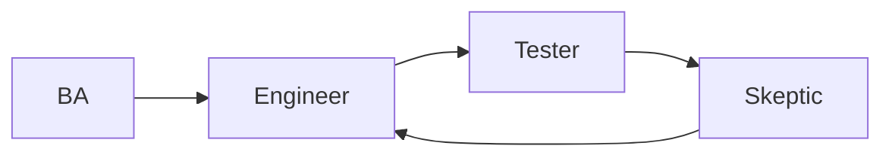
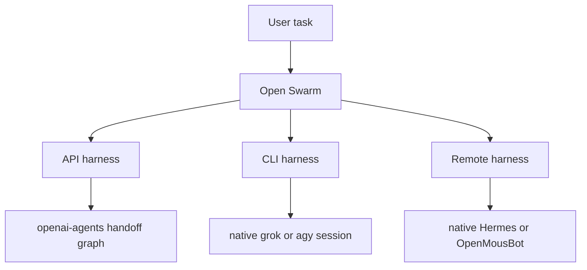
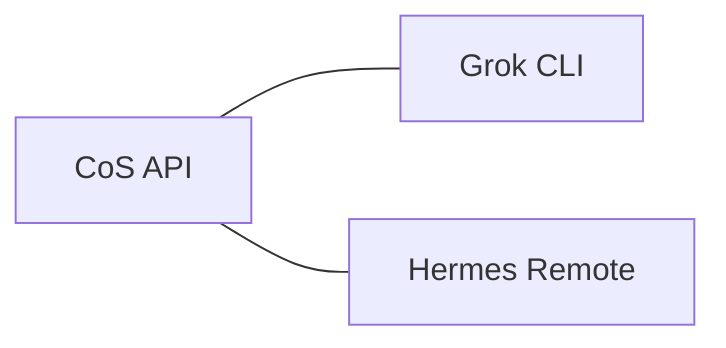

# Why openai-agents + three harness types (REQ-156)

Pitch pack for announce / README. Issue SoT:
[REQ-156 #564](https://github.com/matthewhand/open-swarm/issues/564).

**Intent:** Readers understand *why* programmatic graphs, *when* to pick API vs
CLI vs remote, and that mixed teams still work.

**Success:** Mermaid + prose for forced pipeline, circular skeptic, three
harness types, and a cross-type team; example blueprint/config; tests that
the declared handoff edges are the live edges; `:8001` seed steps with no
secrets.

**Constraints:** Docs + examples can ship before full UI. This pack does **not**
touch ChatPage / rail / SearchPalette (Antigravity owns that UI wave). Peer
mailbox tools (`list_agents` / `send_message`, #561) are a different surface
from this **handoff graph** ([ADR-009](../../adr/009-peer-mailbox.md)). GitHub then the engineer seeds `:8001`.
Kind-base templates Support should subclass:
[ADR-005](../../adr/005-kind-bases.md) (REQ-159 / #570).

Announce spiel SoT ([REQ-136 #529](https://github.com/matthewhand/open-swarm/issues/529)):
[docs/ANNOUNCE.md](../../ANNOUNCE.md). Short form: AI enthusiasts juggle many
frameworks; some combine CLIs and APIs, but still do not talk to **remote
harnesses** (Hermes, OpenMousBot as remote, …). Open Swarm is a
Grok-agnostic Grok-Bot-like UI **and** a bridge — task one place,
coordinate across CLI, API, remotes, and local blueprints. Hero clip:
[`docs/assets/readme/announce-bridge.gif`](../../assets/readme/announce-bridge.gif).

Demo names follow [REQ-135 #526](https://github.com/matthewhand/open-swarm/issues/526)
([SHOWOFF_DEMO_AGENTS.md](../../SHOWOFF_DEMO_AGENTS.md)): Mode A encodes
**kind + backend**; Mode B uses **role/persona**. Do not mix those modes in
one roster without intent.

---

## Why openai-agents (not “just let the LLM figure it out”)

Programmatic **handoff / as-tool** graphs let us **define any workflow**:

- **Forced sequence** — e.g. SDLC BA → Engineer → Tester by giving each agent
  **only one handoff** to the next. BA cannot skip to Tester.
- **Circular / punt-back** — e.g. the last skeptic can hand off back to
  Engineer.

LLM-only freestyle cannot reliably enforce that topology.

openai-agents (formerly “swarm”) is the engine for that **inside API /
blueprint agents**. We **cannot inject** that framework into **CLI** or
**remote** harnesses — those stay native sessions. Document that limit
**up front**.

### Forced pipeline (Mode B names)



Declared edges (this is the test lock):

| From | To | Missing on purpose |
|------|----|--------------------|
| `ba` | `engineer` | `ba` ↛ `tester` (no skip) |
| `engineer` | `tester` | `engineer` ↛ `ba` (no back) |
| `tester` | — | no outgoing hop |

Config: [`sdlc-pipeline.json`](./sdlc-pipeline.json). Blueprint:
`model: "sdlc_handoff"` with `params.variant: "pipeline"`.

### Circular skeptic (punt-back)



| From | To | Why |
|------|----|-----|
| `ba` | `engineer` | same forced start |
| `engineer` | `tester` | implement then verify |
| `tester` | `skeptic` | look-only review |
| `skeptic` | `engineer` | FAIL punts back; PASS stops |

Config: [`sdlc-skeptic-loop.json`](./sdlc-skeptic-loop.json).
`params.variant: "skeptic_loop"`.

Alternate Mode B names (funny; not the default seed): Requirements Nag,
Code Monkey, QA Hawk, Professional Doubter.

---

## Three harness types



| Type | What it is | Gets the programmatic graph? | Sell |
|------|------------|------------------------------|------|
| **API** | OpenAI-compatible / blueprints (`sdlc_handoff`, LiteLLM, …) | **Yes — only these** | Forced / circular workflows |
| **CLI** | Native `grok` / `agy` / … sessions | No — native session | Escape hatch, quota hop (#531) |
| **Remote** | Hermes / OpenMousBot / Herdr / … behind a pane of glass | No — native harness | Work that already lives on another box |

Mode A kind-clear names (seed roster [`demo-harness-kinds.json`](./demo-harness-kinds.json)):

- `Grok CLI` (`grok-cli`)
- `Antigravity CLI` (`antigravity-cli`)
- `LiteLLM API` (`litellm-api`)
- `Hermes Remote` (`hermes-remote`)
- `OpenMousBot Remote` (`openmousbot-remote`)

---

## Cross-type teams

Teams that **span types** still coordinate (CoS API + CLI + remote members)
even when **only API members** run the openai-agents graph. CLI and remote
members stay native; the CoS does not inject Swarm into `grok` or Hermes.



Roster: [`demo-bridge.json`](./demo-bridge.json). `wires.handoff` /
`wires.as_tool` are roster toggles (see [TEAM_ROSTERS.md](../../TEAM_ROSTERS.md));
the **edge list** that tests lock lives on the API blueprint graph, not on
CLI/remote members.

Not #561: the peer mailbox (`list_agents` / `send_message`) is tools, not
this topology. See [ADR-009](../../adr/009-peer-mailbox.md).

---

## Prove the edges (no LLM required)

```bash
uv run pytest tests/blueprints/test_sdlc_handoff.py tests/core/test_handoff_graph.py -q --timeout=60 --no-cov
uv run swarm-cli launch sdlc_handoff --message graph
uv run swarm-cli launch sdlc_handoff --message "variant skeptic_loop"
```

Under `SWARM_TEST_MODE` the blueprint prints the live `Handoff.agent_name`
edges. Tests load these JSON files and assert live == declared.

---

## :8001 seed (engineer, after merge)

Apply on dev-worker-gpu / preview **after this PR merges**. Additive Demo rosters
only — do **not** rename Matthew’s day-to-day agents. No secrets in the repo
or in the seed. Use the box’s existing LiteLLM profile (`${LITELLM_API_KEY}`
or whatever is already in `swarm_config.json`); do not paste keys.

Placeholders only. Do not commit hostnames, tokens, cookies, or LAN dumps.

### 1. Pull the merged main

```bash
cd /path/to/open-swarm
git fetch origin main
git checkout main
git pull origin main
```

### 2. Dry-run, then write Demo rosters

Default dest is XDG `…/swarm/team_rosters.json`. Override with
`--config-dir` if preview uses a non-default config tree.

`scripts/seed_req156_demo.py` is the same path as
`scripts/seed_demo_agents.py` (`--overwrite` = `--reset`).

```bash
# See what would be added (no write)
uv run python scripts/seed_demo_agents.py --dry-run

# Additive upsert of demo-* rosters only
uv run python scripts/seed_demo_agents.py

# If a previous Demo seed exists and you want to replace those four ids only
uv run python scripts/seed_demo_agents.py --reset
```

REST equivalent (preview listen URL; no personal hostname in this doc):

```bash
# $PREVIEW is http://<preview-host>:8001 — do not commit the real host
for f in \
  docs/examples/openai-agents-handoff-graphs/demo-sdlc-pipeline.json \
  docs/examples/openai-agents-handoff-graphs/demo-sdlc-skeptic-loop.json \
  docs/examples/openai-agents-handoff-graphs/demo-bridge.json \
  docs/examples/openai-agents-handoff-graphs/demo-harness-kinds.json
do
  curl -sS -X POST "$PREVIEW/v1/team-rosters/" \
    -H "Content-Type: application/json" \
    -H "Authorization: Bearer ${API_AUTH_TOKEN}" \
    --data @"$f"
done
```

`${API_AUTH_TOKEN}` is already on the box. Do not print it.

### 3. Point LiteLLM API at the existing profile

Do **not** add a new key. The Mode A `litellm-api` member is
`blueprint:sdlc_handoff`. Chat to `model: "sdlc_handoff"` uses the host
`DEFAULT_LLM` / existing LiteLLM `llm` profile. Confirm with:

```bash
# redacted view — should show ${…} placeholders, not raw keys
uv run swarm-cli config list
```

CLI members (`grok`, `agy`) and remotes (Hermes / OpenMousBot) stay
placeholders until those harnesses are already configured on the box.
`placeholder:remote:hermes` is intentional. Do not write API keys into
`team_rosters.json`.

### 4. Open and prove

1. Open the preview UI on port **8001**.
2. Find the labeled **Demo** teams: Demo SDLC Pipeline, Demo SDLC Skeptic
   Loop, Demo Bridge, Demo Harness Kinds.
3. Talk to `sdlc_handoff` (or send `graph` / `variant skeptic_loop`).
4. Confirm the printed edges match the tables above.
5. On Demo Bridge, confirm CoS is `kind=api` while Grok CLI and Hermes
   Remote stay `cli` / `remote` — only the API seat owns the graph.

If the rail does not yet show Demo teams, `GET $PREVIEW/v1/team-rosters/`
is enough to prove the seed. UI chrome is out of scope for this pack.

### 5. Rollback (optional)

Delete only the `demo-*` ids. Leave every other roster alone.

```bash
# file-backed
python - <<'PY'
import json
from pathlib import Path
p = Path.home() / ".config" / "swarm" / "team_rosters.json"
data = json.loads(p.read_text())
for key in list(data):
    if str(key).startswith("demo-"):
        data.pop(key)
p.write_text(json.dumps(data, indent=2) + "\n")
PY
```
