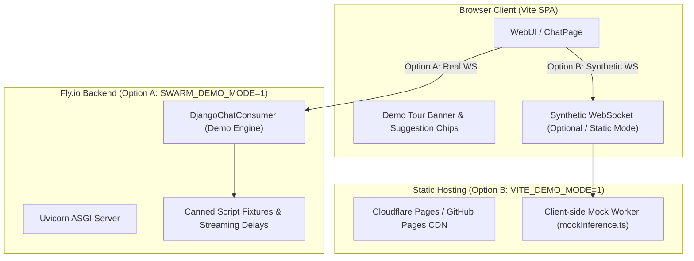

# REQ-882 — Public Demo Site with Mocked Inference and Scripted Demo Flows (#279)

> Defines the architecture, mock inference engine, scripted scenario catalog, and deployment strategy (Fly.io vs. Pure Static Jamstack) for hosting a zero-cost, safe, high-fidelity public demo site of **Operating Swarm**. Branding stays Operating Swarm (do not rename to Swarm Bot).

**Issue:** [#279](https://github.com/matthewhand/open-swarm-private/issues/279)

---

## 1. Context & Objectives

To showcase **Operating Swarm** to prospective users, contributors, and enterprise evaluators, a publicly accessible, interactive demonstration site is needed. 

However, exposing live inference with real LLM API keys (OpenAI, OpenRouter, Anthropic) or local CLI processes (`agy`, `qwen`, `omp`) on the public internet introduces severe risks:
1. **Unbounded Inference Costs**: Public internet traffic could exhaust API balances rapidly.
2. **Security & Sandbox Escape**: Exposing arbitrary tool execution or local terminal shells on public web endpoints is dangerous.
3. **Flaky Third-Party Dependencies**: External API rate limits, outages, or quota errors create a poor first-impression experience.

### Primary Objectives
1. **Mocked Inference Engine**: Deliver a rich, realistic, zero-cost streaming experience mimicking real multi-agent coordination without calling external LLMs or spawning local OS subprocesses.
2. **Scripted Demo Flows ("Forced / Guided Prompts")**: Guide visitors through curated showcase scenarios that highlight Operating Swarm's core differentiators (cross-framework agentic communication, dynamic blueprints with `openai-agents` handoffs, team communication via sections, and CLI/remote agent bridging).
3. **Hosting Feasibility Analysis**: Evaluate hosting via the existing Fly.io infrastructure (`fly.toml`) versus pure static client-side hosting (GitHub Pages, Cloudflare Pages, Vercel), outlining pros, cons, and recommendations.

---

## 2. Scripted Demo Scenarios & Prompt Steerage

In Demo Mode, the user experience is steered to showcase specific high-value workflows. The interface must provide guidance rather than a blank prompt that leaves users wondering what to test.

```
+-----------------------------------------------------------------------------------+
|  [DEMO MODE] Interactive Showcase: Explore Operating Swarm with zero setup |
|  [Scenario 1: Multi-Agent SDLC] [Scenario 2: CLI Shell] [Scenario 3: Team Sections] |
+-----------------------------------------------------------------------------------+
|  Chat Messages Stream (Realistic chunked typing, tool calls, and agent hops)      |
|  ...                                                                              |
+-----------------------------------------------------------------------------------+
|  [Composer: Select a scenario above or click a suggestion chip to trigger]       |
+-----------------------------------------------------------------------------------+
```

### 2.1 Showcase Scenario Catalog

The demo mode features four primary pre-scripted scenarios:

| Scenario | Target Agent / Team | Key Capabilities Showcased | Scripted Sequence / Stream |
| :--- | :--- | :--- | :--- |
| **1. Autonomous SDLC Handoff** | `sdlc-pipeline` (Blueprint using `openai-agents`) | Multi-agent handoff graph, sequential delegation, role specialization | 1. **Product Owner** digests user feature request into specs.<br>2. Handoff to **Engineer** who writes implementation code & diffs.<br>3. Handoff to **Skeptic Tester** who verifies edge cases and approves. |
| **2. CLI Agent Execution** | `qwen` / `agy` (CLI Agent simulation) | Bare-metal command execution, terminal diffing, subagent fan-out | Simulates local bash command invocation, running unit tests, inspecting git status, and returning formatted terminal output. |
| **3. Remote Worker Bridging** | `Hermes` / `TrueForge` (Remote Agent) | Telemetry streaming, remote worker coordination, status badges | Simulates WebSocket connection to remote node, telemetry ping/pong, and executing an offloaded compute task. |
| **4. Team Section Collaboration** | `Core Engineering` Team | Collapsible sidebar sections, Chief-of-Staff delegation, inter-agent wiring | Chief-of-Staff agent distributes tasks across Frontend and Backend sub-teams in real-time. |

### 2.2 User Steerage & Prompt Guidance Mechanisms

1. **Guided Scenario Bar**:
   - Pinned banner at the top of the composer displaying interactive scenario cards.
   - Clicking a card populates the prompt, selects the appropriate agent/team in the dropdown, and starts the simulated execution.
2. **Dynamic Suggestion Chips**:
   - High-contrast suggestion chips above the composer (e.g. `[Build a REST API with SDLC team]`, `[Simulate CLI git refactor]`, `[Review PR security with Skeptic]`).
3. **Arbitrary User Input Handling**:
   - If a visitor types an arbitrary custom prompt (e.g., *"Write a poem about rust"*), Demo Mode provides a graceful fallback:
     - An informational notice: *"In public demo mode, Operating Swarm uses curated mock inference to demonstrate agent orchestration. Here is how our multi-agent team coordinates on a sample task..."*
     - Followed by fuzzy-matching the query to the closest rich demo scenario or returning an engaging pre-canned multi-agent demonstration.

---

## 3. Hosting Architecture: Fly.io vs. Static Jamstack

We evaluate two distinct deployment models for hosting the demo:

### Option A: Fly.io Container Deployment (Existing Infrastructure)

Leverages the existing `fly.toml` configuration and Dockerfile (`python:3.12-slim` + built React SPA) deployed to a dedicated Fly app (e.g. `open-swarm-demo.fly.dev`).

- **Architecture**:
  - `SWARM_DEMO_MODE=true` and `SWARM_ALLOW_ANONYMOUS=true` set in Fly environment.
  - Django Channels ASGI consumer (`DjangoChatConsumer`) intercepts requests and yields simulated streaming chunks (`_oob_append_html` / token chunks) using `asyncio.sleep()` for realistic pacing.
  - SQLite runs in-memory or in ephemeral `/tmp` with periodic factory-reset on boot.
- **Pros**:
  - **Identical Technical Stack**: Uses the exact same ASGI uvicorn server, WebSocket protocol, and backend API routes as production.
  - **Zero Frontend Forking**: Requires zero modifications to WebSocket client code in `webui/frontend`.
  - **Rapid Time-to-Market**: Can be deployed immediately using existing `fly deploy` workflows.
- **Cons**:
  - **Cold Start Latency**: With `auto_stop_machines = 'stop'`, dormant machines incur a 2–4 second wake-up delay.
  - **Hosting Costs**: While minimal on Fly free/hobby allowance, running a persistent container has non-zero resource limits (256MB RAM VM).
  - **Session Isolation**: Requires careful in-memory session handling so public visitors do not see or overwrite each other’s chat history.

### Option B: Pure Static Jamstack Hosting (Cloudflare Pages / GitHub Pages / Vercel)

Compiles the frontend SPA (`webui/frontend`) with a mock client-side service worker and synthetic WebSocket layer, requiring no backend server.

- **Architecture**:
  - Built with `VITE_DEMO_MODE=true npm run build`.
  - Replaces `window.WebSocket` at application boot with a client-side synthetic WebSocket dispatcher (extending the battle-tested mock implementation in `webui/frontend/e2e/helpers/mockInference.ts`).
  - Stubs REST endpoints (`/v1/blueprints`, `/v1/models`, `/v1/teams`, `/health`) via Mock Service Worker (MSW) or Fetch interceptor.
  - Client state (conversations, messages, agent configs) stored entirely in browser `localStorage`.
- **Pros**:
  - **$0 Permanent Cost**: Can be hosted forever on Cloudflare Pages, GitHub Pages, or Vercel with zero compute or server bills.
  - **Global Edge Speed**: Instant sub-50ms load times worldwide via CDN, with zero cold starts.
  - **Infinite Scalability & Zero DoS Risk**: The site cannot crash, run out of memory, or be overwhelmed by traffic spikes.
  - **Perfect Privacy & Isolation**: Every visitor has an entirely private, client-side sandbox in their own browser.
- **Cons**:
  - **Client-Side Simulation**: Requires maintaining client-side mock fixtures and WebSocket response generators in TypeScript.

### Comparative Evaluation Matrix

| Metric | Option A: Fly.io Container | Option B: Pure Static (Cloudflare/GH Pages) |
| :--- | :--- | :--- |
| **Hosting Cost** | Low (~$0-$3/mo depending on machine idle) | **$0.00 / Free Forever** |
| **Cold Start** | 2–5 seconds on machine wake | **0 ms (Instant Edge CDN)** |
| **Operational Maintenance** | Docker updates, Fly machine health checks | **Zero maintenance (Git push to deploy)** |
| **Multi-Tenancy Isolation** | Requires ephemeral SQLite / session cleaning | **100% Isolated (Browser-local storage)** |
| **DoS Vulnerability** | Potential memory exhaustion (256MB) | **Immune (No backend server)** |
| **Fidelity to Real Stack** | 100% (Real Django ASGI + Channels) | High (Client-side WebSocket & REST stubs) |

---

## 4. Proposed Technical Design

To achieve both immediate availability and long-term zero-maintenance hosting, a **Dual-Mode Architecture** is recommended:



### 4.1 Backend Demo Mode Implementation (Fly.io)

1. **Environment Flag**: `SWARM_DEMO_MODE=1` (implies `SWARM_ALLOW_ANONYMOUS=1`).
2. **Consumer Hook**:
   - In `src/swarm/consumers.py`, enhance `DjangoChatConsumer.respond_with_blueprint()` and `respond_with_team_stub()`.
   - When `SWARM_DEMO_MODE=1`, bypass LLM callers and pass the incoming prompt to `DemoScriptEngine`.
   - `DemoScriptEngine` streams realistic HTMx OOB chunks (`<div class="assistant-message">...</div>`) with small `asyncio.sleep(0.04)` delays per token to simulate real streaming inference.
3. **Database Isolation**:
   - Configure SQLite to `:memory:` or ephemeral `/tmp/demo.sqlite3` initialized with pre-seeded blueprints (`jeeves`, `sdlc-pipeline`, `qwen`, `hermes`) and teams.

### 4.2 Static Demo Mode Implementation (Vite Frontend)

1. **Build Flag**: Add script `"build:demo": "vite build --mode demo"` to `webui/frontend/package.json`.
2. **Synthetic WebSocket Engine**:
   - Adapt `webui/frontend/e2e/helpers/mockInference.ts` into a runtime module `src/lib/demoMockInference.ts`.
   - In `main.tsx`, if `import.meta.env.VITE_DEMO_MODE === 'true'`, initialize the synthetic WebSocket provider and register route stubs for `/v1/blueprints`, `/v1/models`, `/v1/teams`, and `/health`.
3. **Guided UI Enhancements**:
   - Render the `DemoTourBanner` component at the top of the chat area, offering one-click triggers for the 4 core scenarios.

---

## 5. Rollout Strategy & Recommendation

1. **Recommended Short-Term (Immediate)**:
   - Deploy **Option A (Fly.io)** with `SWARM_DEMO_MODE=1` to an isolated app: `open-swarm-demo.fly.dev`.
   - Provides an immediate, live demo for stakeholders within existing deployment pipelines.
2. **Recommended Medium-Term (Sustainable / Zero Cost)**:
   - Build **Option B (Static Demo)** via `VITE_DEMO_MODE=true` and publish to **Cloudflare Pages** or **GitHub Pages** (`https://matthewhand.github.io/open-swarm/demo`).
   - Guarantees zero maintenance, zero ongoing costs, and instant global access.

---

## 6. Implementation (shipped in-repo)

Dual-mode, as designed:

| Path | Flag | Entry |
|------|------|--------|
| Fly.io / Django ASGI | `SWARM_DEMO_MODE=1` (implies anonymous unless `SWARM_ALLOW_ANONYMOUS=0`) | `src/swarm/demo/` + `DjangoChatConsumer.respond_with_demo` |
| Static SPA | `VITE_DEMO_MODE=true` (`npm run build:demo`) | `webui/frontend/src/lib/demo/demoMockInference.ts` installed from `main.tsx` |

Steerage: `DemoTourBanner`, suggestion chips, guided-tour prompt, fallback notice for arbitrary input.

**Hosting is operator-gated.** `scripts/deploy_demo_site.py` / `make demo-deploy` publishes to Fly (`fly.demo.toml`, app `open-swarm-demo`) or Cloudflare/GitHub Pages only when `FLY_API_TOKEN` / `flyctl auth whoami` / `CLOUDFLARE_API_TOKEN` / `GITHUB_PAGES_DEPLOY` is present. Missing credentials prints `SKIP:` and exits 0 — the mocked site still ships in-repo.

Lock tests: `tests/unit/test_req882_demo_site_mocked_inference.py`. Behaviour: `test_demo_script_engine.py`, `test_consumer_demo_mode.py`, `test_deploy_demo_site.py`, Vitest `src/lib/demo/__tests__/*`.

## 7. Acceptance Criteria

- [x] Issue ticket [#279](https://github.com/matthewhand/open-swarm-private/issues/279) created and linked to REQ-882.
- [x] Specification outlines the 4 primary showcase scenarios (SDLC handoff, CLI simulation, Remote harness, Team sections).
- [x] User steerage and prompt-forcing mechanisms (banner, suggestion chips, fallback handlers) are clearly defined.
- [x] Architectural trade-offs between Fly.io container deployment and Pure Static Jamstack hosting are analyzed with cost, latency, and isolation metrics.
- [x] Implementation blueprint covers both backend `SWARM_DEMO_MODE` and frontend `VITE_DEMO_MODE` paths.
- [x] Mocked site shipped in-repo; hosting deploy operator-gated when credentials are missing.
- [x] Operating Swarm branding unchanged (demo copy does not revert to Swarm Bot).
- [ ] REQ document committed and pushed to `origin/main`.
