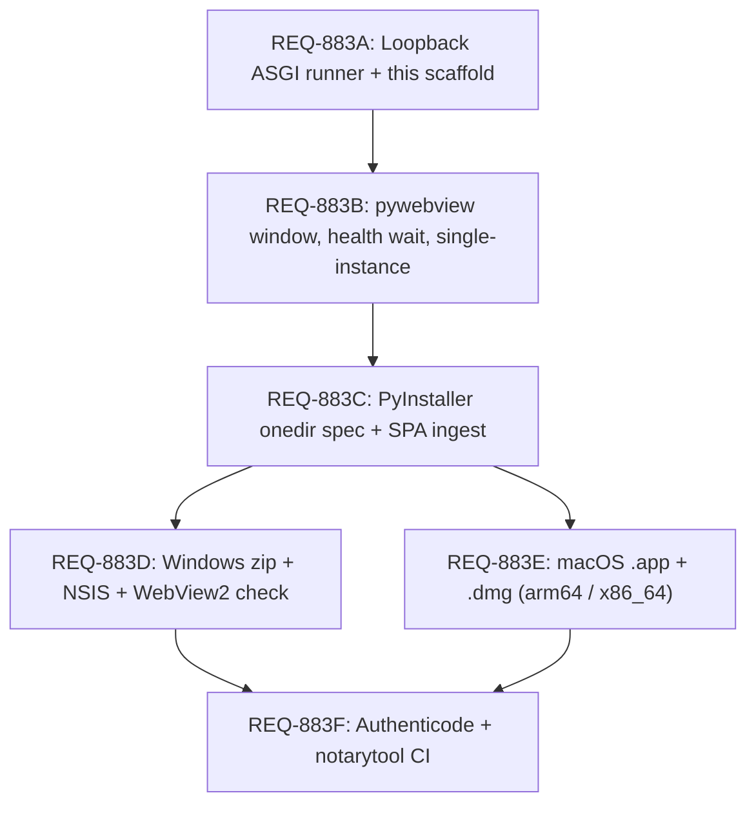

# REQ-883 — Self-contained desktop packaging for Windows and macOS (#280)

> Investigation and implementation plan: wrap **Operating Swarm** into a
> self-contained desktop app for **Windows** (portable zip / `.exe` NSIS /
> `.msi`) and **macOS** (`.app` / `.dmg` for Apple Silicon and Intel). No
> Docker, Python, or Node prerequisites for the end user.

**Issue:** [#280](https://github.com/matthewhand/open-swarm-private/issues/280)
**Status:** investigation + plan (this issue). Window, freeze, installers, and
signing are follow-up REQs 883B–F.
**Related:** [ADR-003](../adr/003-desktop-packaging.md) (REQ-151 / #554,
Windows-first pick), [ADR-002](../adr/002-config-ownership.md),
[ADR-001](../ADR-001-primary-ui.md), [REQ-862](./REQ-862-rebrand-swarm-bot.md)
(Operating Swarm brand — this ticket does not rebrand the rest of the tree).

| Artefact | Path |
| :--- | :--- |
| This plan | `docs/qa/REQ-883-desktop-app-packaging-windows-macos.md` |
| Source lock | `tests/unit/test_req883_desktop_app_packaging.py` |
| Boot scaffold | `src/swarm/desktop/` (`swarm-desktop --print-plan`) |
| Behaviour | `tests/unit/test_swarm_desktop_boot.py`, `tests/cli/test_desktop_command.py` |

---

## 1. Context & goals

Operating Swarm already runs as:

1. **Developer / CLI** — Python 3.12+, Node 22, virtualenv.
2. **Container** — Docker Compose / Pinokio on `:8000`.
3. **Cloud** — Fly.io / remote host.

Non-technical operators and local developers who will not run Docker still
need a one-click native window. Copy **OpenMausBot's product shape**, not its
toolkit (ADR-003): a local loopback ASGI server owns Django + the built SPA; a
desktop window **owns that process** and navigates to `http://127.0.0.1:<port>/`.
The window is a pane of glass. Host CLIs (`agy`, `qwen`, `grok`, `claude`,
`opencode`, …) stay installed on the machine.

This issue extends ADR-003 from Windows-first Phase 0 into a **Windows and
macOS** plan, and lands the thinnest boot scaffold (`swarm-desktop
--print-plan`) so the contracts cannot silently drift. It does **not** ship an
installer, a freeze, or a window.

---

## 2. Architecture (seven layers)

```
+---------------------------------------------------------------------------------+
|                              DESKTOP SHELL (pane of glass)                      |
|   Windows: pywebview → Microsoft Edge WebView2                                  |
|   macOS:   pywebview → Apple WebKit / WKWebView                                 |
+---------------------------------------------------------------------------------+
           | navigates to http://127.0.0.1:<port>/ (IPv4, never bare localhost)
           v
+---------------------------------------------------------------------------------+
|                       EMBEDDED LOOPBACK ASGI SERVER                             |
|   Entrypoint: swarm-desktop → uvicorn swarm.asgi:application (one worker)       |
|   Bundled CPython + Django + Channels + LiteLLM                                 |
|   Prebuilt Vite SPA (webui/frontend/dist)                                       |
+---------------------------------------------------------------------------------+
       |                                                    |
       v                                                    v
+--------------------------------------+   +--------------------------------------+
|       PERSISTENT LOCAL STORAGE       |   |       HOST ENVIRONMENT MERGE         |
| • Win: %LOCALAPPDATA%\OperatingSwarm |   | • Interactive shell PATH discovery   |
| • Mac: ~/Library/Application Support |   |   (discovers grok, agy, qwen, …)     |
|   /Operating Swarm                   |   | • Spawns host-native CLI subagents   |
| • SQLite + first-run secret          |   | • Do not vendor those binaries       |
+--------------------------------------+   +--------------------------------------+
```

| # | Layer | Requirement |
| :--- | :--- | :--- |
| **1** | **Python runtime freeze** | Bundle CPython 3.12 + deps (Django, Channels, Uvicorn, LiteLLM, `openai-agents`) via **PyInstaller onedir**. One-file mode extracts to `%TEMP%` every launch — avoid. Hidden imports are the implement risk. |
| **2** | **Frontend asset ingestion** | `make frontend` then freeze `webui/frontend/dist` so ASGI serves `/`, `/chat`, `/assets/*`. |
| **3** | **Process lifecycle** | Shell owns uvicorn: free loopback port (avoid `:8000` collisions), wait for `/health`, single-instance lock, terminate children on window close. Bind **`127.0.0.1` only** — never `0.0.0.0`. |
| **4** | **Native window** | OS webview (WebView2 / WKWebView). Reject Chromium. Navigate; do not iframe Django (`X_FRAME_OPTIONS` stays `DENY`). |
| **5** | **Profile isolation** | Relocate sqlite off `/tmp/db.sqlite3` into the OS user profile. First-run `DJANGO_SECRET_KEY` via `secrets.token_urlsafe` **outside the git tree**. `SWARM_SECURE_COOKIES=false` on loopback HTTP. |
| **6** | **Interactive PATH inheritance** | Finder / Start Menu launches get a sanitized PATH. Probe the login shell (macOS) / user+system Path registry (Windows) and merge so host CLIs resolve. |
| **7** | **Signing & notarization** | Authenticode (SmartScreen) on Windows; Developer ID + Hardened Runtime + `notarytool` + stapler on macOS. Unsigned is an honest Phase 3 fallback, documented, not silent. |

---

## 3. Shell & packaging options (builds on ADR-003)

| Feature | **A. pywebview + PyInstaller (pick)** | B. Tauri 2 + Python sidecar | C. Electron + Python sidecar |
| :--- | :--- | :--- | :--- |
| Shell | Native OS webview | Rust + Wry/Tao | Chromium + Node |
| Extra languages | None (Python already) | Rust + Cargo | Node + Python |
| Disk / RAM | Small shell; Python dominates | Small shell; Python dominates | ~150–200 MB Chromium extra |
| Windows | WebView2 | WebView2 | Bundled Chromium |
| macOS | WKWebView via PyObjC | WKWeb2 native | Chromium wrapper |
| Build CI | Lowest | Rust toolchain | Node + Python + native bindings |
| Verdict | **Primary for Phases 1–3** | Optional later shell swap if we want a first-class updater without growing pywebview. Frozen sidecar stays. | **Rejected.** Unnecessary Chromium when OS webviews are present; OMB can run its harness on Electron's Node — we cannot. |

**Also rejected:** browser-only zip as the recommended end state (orphaned uvicorn); Pinokio/Docker (out of audience); Briefcase / native UI rewrite (contradicts ADR-001); bundling Ollama / a GPU stack.

**Do not start Electron** for an updater.

---

## 4. Platform-specific requirements

### 4.1 Windows 10 & 11

- **Webview:** Edge WebView2 (present on current Win 10/11). If missing, fail with a link to Microsoft's evergreen runtime — do not silently fall back to IE. Installer may check `HKEY_LOCAL_MACHINE\SOFTWARE\WOW6432Node\Microsoft\EdgeUpdate\Clients\{F3017226-FE2A-4295-8BDF-00C3A9A7E4C5}` and run the bootstrapper.
- **Profile:** `%LOCALAPPDATA%\OperatingSwarm\` — `data/db.sqlite3`, `config/` (`.env` / `django_secret_key` + `swarm_config.json`), `logs/`.
- **Artifacts:** PyInstaller onedir **portable zip** first; then NSIS `.exe` (Start Menu, desktop shortcut, uninstaller). `.msi` optional.
- **Signing:** Authenticode. Unsigned → SmartScreen "Unknown Publisher" (document; OMB ships unsigned today).

### 4.2 macOS (Apple Silicon & Intel)

- **Webview:** `WKWebView` — built in, zero extra runtime.
- **Arch:** `arm64` (M1+) and `x86_64`. Two `.dmg`s or a `lipo` universal binary.
- **Profile:** `~/Library/Application Support/Operating Swarm/` for data+config; `~/Library/Logs/Operating Swarm/` for logs.
- **Bundle:**

```
Operating Swarm.app/
├── Contents/
│   ├── Info.plist
│   ├── MacOS/Operating Swarm
│   ├── Resources/app.icns + frontend_dist/
│   └── Frameworks/          (frozen Python)
```

- **Gatekeeper:** unsigned / un-notarized apps are blocked. Sign with Developer ID Application, Hardened Runtime (`--options runtime`), entitlements for unsigned-executable-memory (PyInstaller) plus network client/server. Notarize with `xcrun notarytool submit --wait` and `xcrun stapler staple`.

Linux is **out of this issue** (WebKitGTK later). CI on Linux still compiles/tests the Python scaffold.

---

## 5. Host CLI PATH (the GUI environment pitfall)

A Start Menu / Finder launch does **not** source `.zshrc` / `.zprofile` / user Path registry edits. `which agy` then fails.

**Fix (in `swarm-desktop` before uvicorn):**

1. **macOS / Linux:** `$SHELL -ilc 'printf %s "$PATH"'` (login shell), merge onto `os.environ["PATH"]`.
2. **Windows:** `HKCU\Environment\Path` + `HKLM\SYSTEM\CurrentControlSet\Control\Session Manager\Environment\Path`.

Do **not** vendor `agy` / `qwen` / `grok` / `claude` / `opencode` into the freeze. Compose already does not bake them.

---

## 6. First-run env (must-fix vs `swarm-api` defaults)

| Default today | Why it fails on a desktop box | Desktop contract |
| :--- | :--- | :--- |
| `HOST=0.0.0.0` | Publishes on every interface | `127.0.0.1` only |
| sqlite `/tmp/db.sqlite3` | Lost on reboot; missing on Windows | `{profile}/data/db.sqlite3` |
| Prod requires `${DJANGO_SECRET_KEY}` | Hostile to paste; forbidden to commit | `secrets.token_urlsafe` into `{profile}/config/django_secret_key`, chmod/ACL user-only, then load |
| `SWARM_SECURE_COOKIES` on when `DEBUG=False` | Loopback HTTP session never sticks | `SWARM_SECURE_COOKIES=false` |
| Bare `localhost` URL | Can resolve to `::1` (OMB black window) | `http://127.0.0.1:<port>/` |

Published build stays `DJANGO_DEBUG=false` with an explicit loopback allow-list. `SWARM_USER_DATA_DIR` is set so ADR-002 / `swarm.core.paths` share the same folder; this ticket does **not** change `APP_AUTHOR` (REQ-862).

---

## 7. Scaffold landed with this issue (REQ-883A slice)

Thinnest contract, TUI Wave 0 shaped:

- Package `src/swarm/desktop/` — loopback URL, free port, Operating Swarm profile paths, first-run secret file, PATH merge, PyInstaller hidden-import list.
- Console script `swarm-desktop` (`pyproject.toml`).
- `swarm-desktop --print-plan` → JSON boot plan for CI. **No secret values.**
- Default invocation exits **2**: window is REQ-883B. Optional extra `[desktop]` will pull `pywebview` when 883B lands; not required for `--print-plan`.
- No freeze, no NSIS, no `.dmg`, no GitHub Release artifact.

```
uv run swarm-desktop --print-plan
uv run pytest tests/unit/test_req883_desktop_app_packaging.py \
              tests/unit/test_swarm_desktop_boot.py \
              tests/cli/test_desktop_command.py
```

---

## 8. Follow-up implementation (not this PR)



| REQ | Work | Tests |
| :--- | :--- | :--- |
| **883A** (this scaffold + later) | Bind 127.0.0.1; profile sqlite; first-run secret; PATH merge; refuse `0.0.0.0`. | `--print-plan`; boot unit tests. Full uvicorn boot is the rest of 883A. |
| **883B** | pywebview window; splash until `/health`; single-instance; shutdown on close. | Headless skip without WebView2; URL builder never `localhost`. |
| **883C** | `.spec` + hiddenimports in `scripts/packaging/`; freeze `dist/`. | Import freeze list on Linux CI; Windows artifact is a later runner. |
| **883D** | Portable zip; NSIS `OperatingSwarm-Setup.exe`. | Artifact names; WebView2 bootstrapper branch. |
| **883E** | `Operating Swarm.app` + `.dmg`. | Info.plist; dual-arch or universal. |
| **883F** | Signing + notarization + GitHub Release. | No `publisherName` in an updater config without a cert. |

Do not claim a desktop app in FEATURE_STATUS as shipped until a zip actually boots. Do not add a README download button before an artifact exists.

---

## 9. Acceptance criteria

### This issue (#280) — investigation + plan + scaffold

- [x] Requirements for standalone packaging without Docker / Python / Node defined.
- [x] pywebview + PyInstaller onedir picked; Electron rejected; Tauri optional later.
- [x] Windows 10/11 (WebView2, `%LOCALAPPDATA%\OperatingSwarm`, NSIS) and macOS (WKWebView, Application Support, arm64+x86_64, `.app` / `.dmg`, `notarytool`) specified.
- [x] Host CLI PATH inheritance specified; binaries not vendored.
- [x] Authenticode + Apple notarization documented.
- [x] Phased roadmap REQ-883A–F.
- [x] Source lock `tests/unit/test_req883_desktop_app_packaging.py`.
- [x] `swarm-desktop --print-plan` scaffold; default launch exits 2 (no window).
- [x] Product name is **Operating Swarm**. REQ-862 still owns the rest of the rebrand.

### Follow-ups (do **not** close #280 waiting on these)

- [ ] pywebview window + single-instance (883B).
- [ ] PyInstaller onedir zip that boots Django+SPA (883C).
- [ ] NSIS / `.dmg` (883D/E).
- [ ] Signed GitHub Release (883F).
