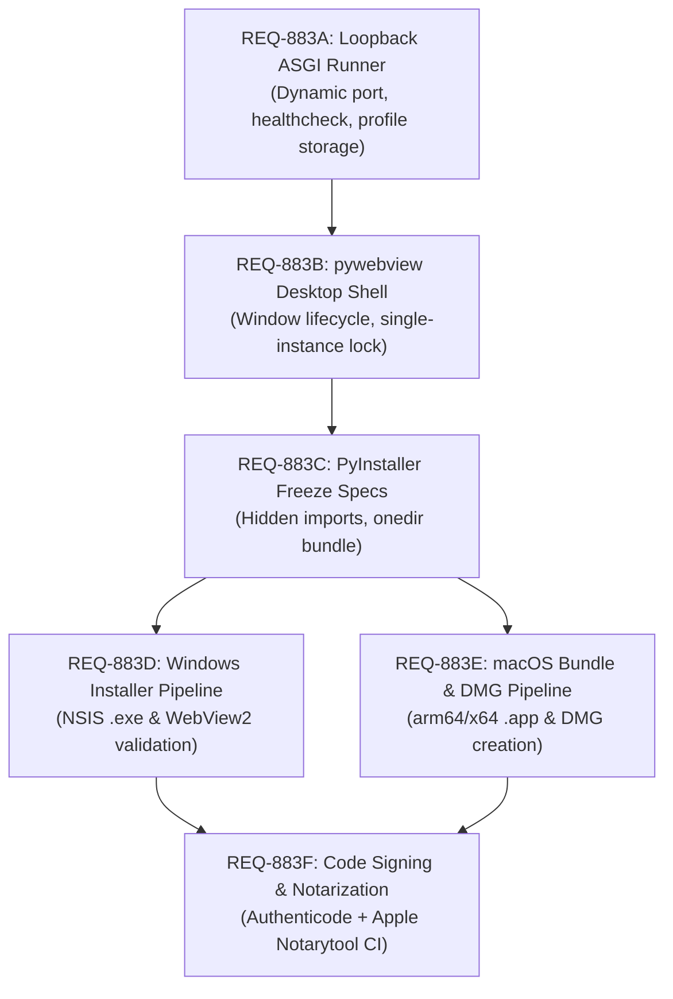

# REQ-883 — Self-Contained Desktop App Packaging for Windows and macOS (#280)

> Defines the technical requirements, architectural options, platform-specific constraints, and implementation roadmap for packaging **Swarm Bot** into self-contained, native desktop applications for **Windows** (`.exe` / `.msi`) and **macOS** (`.dmg` / `.app`).

**Issue:** [#280](https://github.com/matthewhand/open-swarm-private/issues/280)  
**Related Prior Work:** [ADR-003: Desktop Packaging (Windows First)](../adr/003-desktop-packaging.md) (`#554`), [ADR-002: Config Ownership](../adr/002-config-ownership.md), [ADR-001: Primary UI](../ADR-001-primary-ui.md).

---

## 1. Context & Motivation

Swarm Bot currently runs in three deployment modes:
1. **Developer / CLI mode**: Local terminal environment requiring Python 3.11+, Node 22, and virtualenvs.
2. **Container mode**: Docker Compose / Pinokio sideloading running on port `:8000`.
3. **Cloud mode**: Fly.io / remote server hosting.

For widespread adoption by non-technical operators and local developers who do not want to manage Docker, Python environments, or terminal daemons, Swarm Bot needs a **one-click, self-contained desktop application**.

The desktop application must:
- Require **zero prerequisites** (no Python, Node.js, or Docker installed on the host machine).
- Seamlessly host the full backend stack (Django ASGI + Channels WebSocket + SQLite).
- Render the high-performance Vite React SPA inside a native desktop window.
- Inherit the user's host environment so native CLI subagents (`agy`, `qwen`, `grok`, `claude`, etc.) execute out of the box.
- Ship signed, native installers for **Windows 10/11** and **macOS** (both Apple Silicon `arm64` and Intel `x86_64`).

---

## 2. Architectural Components & Requirements

To wrap Swarm Bot into a standalone desktop application, seven distinct layers must be addressed:

```
+---------------------------------------------------------------------------------+
|                                 DESKTOP SHELL                                   |
|   Windows: pywebview (Microsoft Edge WebView2)                                  |
|   macOS:   pywebview (Apple WebKit / WKWebView)                                 |
+---------------------------------------------------------------------------------+
           |                                                      ^
           | (Navigates to http://127.0.0.1:<port>)               | (Serves UI)
           v                                                      |
+---------------------------------------------------------------------------------+
|                       EMBEDDED LOOPBACK ASGI SERVER                             |
|   • Entrypoint: swarm-desktop (Uvicorn ASGI runner on dynamic loopback port)     |
|   • Bundled CPython runtime + dependencies (Django, Channels, LiteLLM)          |
|   • Built Vite SPA assets (webui/frontend/dist)                                 |
+---------------------------------------------------------------------------------+
       |                                                    |
       v                                                    v
+--------------------------------------+   +--------------------------------------+
|       PERSISTENT LOCAL STORAGE       |   |       HOST ENVIRONMENT MERGE         |
| • Win: %LOCALAPPDATA%\SwarmBot\data\ |   | • Interactive shell PATH discovery   |
| • Mac: ~/Library/Application Support |   |   (discovers grok, agy, qwen, etc.)  |
| • SQLite DB + .env Secret Key        |   | • Spawns host-native CLI subagents   |
+--------------------------------------+   +--------------------------------------+
```

### 2.1 The Seven Core Requirements

| # | Layer | Requirement & Technical Details |
| :--- | :--- | :--- |
| **1** | **Python Runtime Freezing** | Bundle CPython 3.12 and all Python dependencies into an executable distribution without requiring system Python. Must resolve dynamic/hidden imports for Django, Channels ASGI, Uvicorn, LiteLLM, and `openai-agents`. |
| **2** | **Frontend Asset Ingestion** | Compile Vite SPA (`npm run build` $\to$ `dist/`) and package static assets within the bundle so the local ASGI server can serve them at `/`, `/chat`, and `/assets/*`. |
| **3** | **Process Lifecycle Management** | Desktop shell owns the background server process: chooses a free loopback port (avoiding `:8000` conflicts), waits for `/health` readiness, enforces single-instance locks, and terminates all child processes cleanly on window close. |
| **4** | **Native Desktop Window** | Lightweight native webview window (WebView2 on Windows, WebKit on macOS) acting as a "pane of glass", avoiding heavy multi-process runtimes like Chromium. |
| **5** | **Profile & Storage Isolation** | Relocate storage from ephemeral `/tmp/db.sqlite3` to OS-standard user profile paths (`%LOCALAPPDATA%` on Windows, `~/Library/Application Support` on macOS). Auto-generate a secure `DJANGO_SECRET_KEY` on first launch. |
| **6** | **Interactive PATH Inheritance** | GUI apps launched from Windows Start Menu or macOS Finder do *not* inherit the user's interactive shell `$PATH`. The launcher must probe and merge the interactive shell environment to discover host-installed CLIs. |
| **7** | **Code Signing & Notarization** | Satisfy OS security gatekeepers: Microsoft Authenticode signing for Windows (SmartScreen), and Apple Developer ID signing + `notarytool` notarization for macOS (Gatekeeper). |

---

## 3. Technology Stack Comparison: Shell & Packaging

Building upon the analysis in [ADR-003](../adr/003-desktop-packaging.md), we compare the primary desktop packaging patterns for Windows and macOS:

| Feature / Metric | Option A: pywebview + PyInstaller (Recommended) | Option B: Tauri 2 + Python Sidecar | Option C: Electron + Python Sidecar |
| :--- | :--- | :--- | :--- |
| **Shell Technology** | Native OS Webview (`pywebview` Python library) | Rust + OS Webview (`Wry` / `Tao`) | Chromium + Node.js |
| **Runtime Dependencies** | Python only (already project language) | Rust + Cargo + Python | Node.js + Python |
| **Disk Size Overhead** | Minimal (~20–30 MB for shell; Python dominates) | Minimal (~15–25 MB for shell) | Heavy (~150–200 MB extra for Chromium) |
| **RAM Footprint** | Low (Single Python process + native OS webview) | Low (Rust shell + Python sidecar) | High (Chromium GPU/Renderer + Node + Python) |
| **macOS Native Fit** | Excellent (Native Cocoa / WebKit via PyObjC) | Excellent (Native Cocoa / WebKit) | Good (Chromium wrapper) |
| **Windows Native Fit** | Excellent (Native Microsoft Edge WebView2) | Excellent (Native WebView2) | Good (Bundled Chromium) |
| **Build Pipeline Complexity**| **Lowest**: 100% Python + standard Vite build | **Medium**: Requires Rust toolchain in CI | **High**: Requires Node + Python + native bindings |
| **Recommended Verdict** | **Primary pick for Phase 1 & 2**: Unified language, minimal overhead, builds directly on ADR-003. | Strong long-term candidate if system tray or advanced multi-window features are needed. | Rejected: Unnecessary 200MB Chromium bloat when OS webviews are already installed. |

---

## 4. Platform-Specific Requirements & Deep Dive

### 4.1 Windows 10 & 11

1. **Webview Engine**:
   - **Microsoft Edge WebView2 Runtime**: Pre-installed on all Windows 11 and modern Windows 10 machines.
   - If missing on older Windows 10 builds, installer must check registry `HKEY_LOCAL_MACHINE\SOFTWARE\WOW6432Node\Microsoft\EdgeUpdate\Clients\{F3017226-FE2A-4295-8BDF-00C3A9A7E4C5}` and trigger the Microsoft Evergreen bootstrapper.
2. **Directory & Path Standards**:
   - Application data & DB: `%LOCALAPPDATA%\SwarmBot\data\db.sqlite3`
   - Config & Secrets: `%LOCALAPPDATA%\SwarmBot\config\` (`.env` and `swarm_config.json`)
   - Logs: `%LOCALAPPDATA%\SwarmBot\logs\`
3. **Packaging Formats**:
   - **Portable Zip**: PyInstaller `onedir` folder zipped for zero-install evaluation.
   - **One-Click Installer**: NSIS (`.exe`) or Inno Setup installer creating Start Menu shortcuts, desktop icons, and uninstaller.
4. **Code Signing**:
   - Microsoft Authenticode certificate. Without signing, Windows Defender SmartScreen displays an "Unknown Publisher" warning.

### 4.2 macOS (Apple Silicon & Intel)

1. **Webview Engine**:
   - **Apple WebKit (`WKWebView`)**: Built into macOS, zero external dependencies.
2. **Architecture Strategy**:
   - Support both **Apple Silicon (`arm64`)** (M1/M2/M3/M4) and **Intel (`x86_64`)**.
   - Produce two architecture-specific `.dmg` releases or a Universal binary bundle via `lipo`.
3. **Directory & Path Standards**:
   - Application data & DB: `~/Library/Application Support/SwarmBot/data/db.sqlite3`
   - Config & Secrets: `~/Library/Application Support/SwarmBot/config/`
   - Logs: `~/Library/Logs/SwarmBot/`
4. **Bundle Structure**:
   - Standard macOS Application bundle (`SwarmBot.app`):
     ```
     SwarmBot.app/
     ├── Contents/
     │   ├── Info.plist            (Bundle ID, version, icons, high-DPI flags)
     │   ├── MacOS/
     │   │   └── SwarmBot          (Executable launcher)
     │   ├── Resources/
     │   │   ├── app.icns          (macOS icon asset)
     │   │   └── frontend_dist/    (Prebuilt Vite SPA)
     │   └── Frameworks/           (Bundled Python dylibs and packages)
     ```
5. **Apple Code Signing & Notarization (Crucial)**:
   - macOS Gatekeeper strictly blocks unsigned or un-notarized applications with *"SwarmBot cannot be opened because Apple cannot check it for malicious software"*.
   - **Signing**: Requires Apple Developer ID Application certificate. Must enable **Hardened Runtime** (`--options runtime`) and specify entitlements (`com.apple.security.cs.allow-unsigned-executable-memory`, network client/server).
   - **Notarization**: Submit `.dmg` to Apple notary service using `xcrun notarytool submit --keychain-profile ... --wait` and staple the notarization ticket with `xcrun stapler staple`.

---

## 5. Host CLI Inheritance: The GUI Environment Pitfall

A central differentiator of Swarm Bot is orchestrating host-native CLI agents (`agy`, `qwen`, `grok`, `claude`, etc.).

### The Problem
When a user launches an application by double-clicking an `.exe` on Windows or a `.app` on macOS, the operating system spawns the process with a **sanitized, minimal system PATH**. It does **NOT** execute the user's shell profile (`.zshrc`, `.bashrc`, `.zprofile`, or user registry PATH modifications). Consequently, commands like `which agy` or `which qwen` fail, causing CLI agents to report missing binaries.

### The Solution
The `swarm-desktop` launcher must implement an **Interactive Shell Probe** before initializing the Django ASGI server:
1. **macOS**:
   - Probe the user's default login shell (`echo $SHELL` or `dscl . -read /Users/$USER UserShell`).
   - Execute a non-interactive login shell command: `$SHELL -ilc 'env'` to extract the real user environment.
   - Extract and merge `PATH`, `HOME`, and user variables into `os.environ`.
2. **Windows**:
   - Read the User Environment registry key `HKEY_CURRENT_USER\Environment\Path` and System `HKEY_LOCAL_MACHINE\SYSTEM\CurrentControlSet\Control\Session Manager\Environment\Path`.
   - Ensure user-installed paths (e.g. `%USERPROFILE%\AppData\Local\Programs\...`, `%USERPROFILE%\.local\bin`, `%USERPROFILE%\go\bin`) are merged into `os.environ["PATH"]`.

---

## 6. Implementation Roadmap & Sub-REQ Breakdown

To deliver the self-contained desktop application systematically, the work is divided into six follow-up REQs:



### Phase 1: Core Engine & Desktop Shell
- **REQ-883A — Loopback Desktop ASGI Runner (`swarm-desktop`)**:
  - Implement loopback-only ASGI bootstrapper (`127.0.0.1`, dynamic free port selection).
  - First-run profile generation (`%LOCALAPPDATA%` on Windows, `~/Library/Application Support` on macOS).
  - First-run `DJANGO_SECRET_KEY` generation and SQLite database initialization.
  - Interactive shell PATH environment merge for CLI subagents.
- **REQ-883B — Cross-Platform `pywebview` Shell & Lifecycle Controller**:
  - Python-based desktop window runner wrapping `pywebview`.
  - Splash/loading screen while polling `http://127.0.0.1:<port>/health`.
  - Single-instance lock (mutex on Windows, socket/file lock on macOS) to bring existing window to focus on duplicate launch.
  - Graceful teardown of Uvicorn server and child CLI processes on window close.

### Phase 2: Freezing & Asset Bundling
- **REQ-883C — PyInstaller Spec & Hidden Imports Audit**:
  - Author comprehensive PyInstaller `.spec` for `swarm-desktop`.
  - Audit and declare all dynamic hidden imports (`channels`, `daphne`/`uvicorn`, `litellm`, `openai`, `pydantic`, `django.template.loaders`).
  - Incorporate prebuilt Vite SPA assets (`webui/frontend/dist`) into frozen directory.

### Phase 3: Platform Packaging & Installers
- **REQ-883D — Windows Packaging & NSIS Installer Pipeline**:
  - Build onedir portable `.zip` artifact.
  - Author NSIS script to generate `SwarmBot-Setup.exe` with desktop shortcut, uninstaller, and WebView2 bootstrapper check.
- **REQ-883E — macOS Application Bundle & DMG Pipeline**:
  - Construct signed `.app` bundle structure with `Info.plist` and `app.icns`.
  - Build universal binary or dual `arm64` + `x86_64` `.dmg` installers with drag-and-drop `/Applications` symlink.

### Phase 4: Security & Release Automation
- **REQ-883F — Code Signing, Apple Notarization & GitHub Releases CI**:
  - GitHub Actions workflow matrix for Windows and macOS runners.
  - Windows Authenticode signing integration.
  - Apple Developer ID signing, hardened runtime flags, and `notarytool` automated notarization with stapling.
  - Publish signed installer artifacts directly to GitHub Releases.

---

## 7. Acceptance Criteria

- [ ] Investigation and planning issue [#280](https://github.com/matthewhand/open-swarm-private/issues/280) raised and linked.
- [ ] Requirements for standalone packaging without Docker, Python, or Node prerequisites are comprehensively defined.
- [ ] Architectural choices between `pywebview`, `Tauri 2`, and `Electron` evaluated with concrete trade-off matrix; `pywebview` selected as the primary path.
- [ ] Platform requirements detailed for both Windows 10/11 (WebView2, `%LOCALAPPDATA%`, NSIS) and macOS (WebKit, `Application Support`, Apple Silicon/Intel, `.app` bundle, `.dmg`).
- [ ] Critical host CLI `$PATH` inheritance problem and solution specified.
- [ ] Apple Code Signing + Notarization (`notarytool`) and Windows Authenticode signing requirements documented.
- [ ] Phased implementation roadmap broken down into 6 actionable sub-REQs (REQ-883A through REQ-883F).
- [ ] REQ document committed and pushed to `origin/main`.
